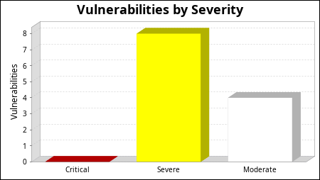
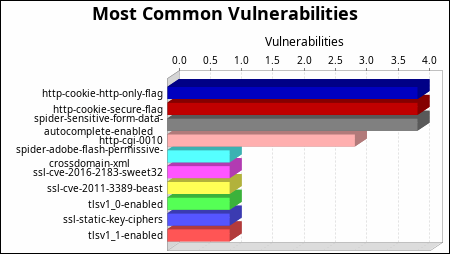
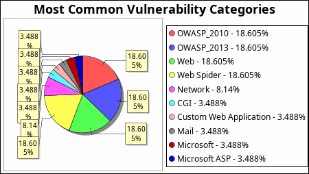
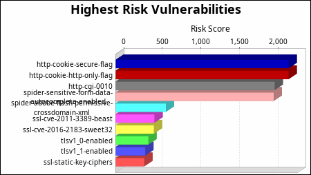
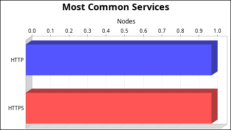

<HTML>
<HEAD>
</HEAD>
<BODY>
<H1 CLASS="coverPage"></H1>

Audit Report

imgur

Audited on April 17, 2019

Reported on April 18, 2019

<H1 CLASS="execSummaryTitle"><A NAME="ExecutiveSummary">1 Executive Summary</A></H1>

This report represents a security audit performed by Nexpose from Rapid7 LLC. It contains confidential information about the state of your network. Access to this information by unauthorized personnel may allow them to compromise your network.

<TABLE>
<TR>
<TH CLASS="tableheadercell">

Site Name
</TH>
<TH CLASS="tableheadercell">

Start Time
</TH>
<TH CLASS="tableheadercell">

End Time
</TH>
<TH CLASS="tableheadercell">

Total Time
</TH>
<TH CLASS="tableheadercell">

Status
</TH></TR>
<TR CLASS="OddLegacy">
<TD>

imgur_full
</TD>
<TD>

April 17, 2019 17:38, EDT
</TD>
<TD>

April 17, 2019 18:17, EDT
</TD>
<TD>

38 minutes
</TD>
<TD>

Success
</TD></TR></TABLE>

There is not enough historical data to display risk trend.

The audit was performed on one system which was found to be active and was scanned.

<TABLE CLASS="chartTable">
<TR>
<TD>

</TD>
<TD>

</TD></TR></TABLE>

There were 12 vulnerabilities found during this scan. No critical vulnerabilities were found.  Critical vulnerabilities require immediate attention. They are relatively easy for attackers to exploit and may provide them with full control of the affected systems. 8 vulnerabilities were severe. Severe vulnerabilities are often harder to exploit and may not provide the same access to affected systems. There were 4 moderate vulnerabilities discovered. These often provide information to attackers that may assist them in mounting subsequent attacks on your network. These should also be fixed in a timely manner, but are not as urgent as the other vulnerabilities. 

<TABLE CLASS="chartTable">
<TR>
<TD>

</TD>
<TD>

</TD></TR></TABLE>

There were 4 occurrences of the http-cookie-http-only-flag, http-cookie-secure-flag and spider-sensitive-form-data-autocomplete-enabled vulnerabilities, making them the most common vulnerabilities. There were 16 vulnerability instances in the OWASP_2010, OWASP_2013, Web and Web Spider categories, making them the most common vulnerability categories. 

<TABLE CLASS="chartTable">
<TR>
<TD>

</TD>
<TD>

</TD></TR></TABLE>

The http-cookie-secure-flag and http-cookie-http-only-flag vulnerabilities pose the highest risk to the organization with a risk score of 2,240. Risk scores are based on the types and numbers of vulnerabilities on affected assets. 

One operating system was identified during this scan.

There were 2 services found to be running during this scan.

<TABLE CLASS="chartTable">
<TR>
<TD>

</TD>
<TD>

</TD></TR></TABLE>

The HTTP and HTTPS services were found on 1 systems, making them the most common services. 

<H1 CLASS="sectionTitle"><A NAME="SystemOverview">2 Discovered Systems</A></H1>

<TABLE>
<TR CLASS="Even">
<TH width="34%" CLASS="tableheadercell">

Node
</TH>
<TH width="26%" CLASS="tableheadercell">

Operating System
</TH>
<TH width="14%" CLASS="tableheadercell">

Risk
</TH>
<TH width="26%" CLASS="tableheadercell">

Aliases
</TH></TR>
<TR CLASS="OddLegacy">
<TD>

151.101.84.193
</TD>
<TD>

Crestron 2-Series
</TD>
<TD>

5,159
</TD>
<TD>

<UL CLASS="compactList">
<LI>imgur.com</LI></UL>
</TD></TR></TABLE>

<H1 CLASS="sectionTitle"><A NAME="VulnDetails">3 Discovered and Potential Vulnerabilities</A></H1>

<H2 CLASS="sectionSubtitle"><A NAME="VulnDetailsCritical">3.1 Critical Vulnerabilities</A></H2>

No critical vulnerabilities were reported.

<H2 CLASS="sectionSubtitle"><A NAME="VulnDetailsSevere">3.2 Severe Vulnerabilities</A></H2>

<H3 CLASS="Section3"><A NAME="vulnerabilitydetaillisting_http-cgi-0010">3.2.1 Cross Site Scripting Vulnerability (http-cgi-0010)</A></H3>

<H4 CLASS="vulnDesc">Description:</H4>

    

The Web application is vulnerable to cross-site scripting (XSS), which allows attackers to take advantage of
 Web server scripts to inject JavaScript or HTML code that is executed on the client-side browser.
 
This vulnerability is often caused by server-side scripts written in languages such as PHP, ASP, .NET, Perl or Java,
 which do not adequately filter data sent along with page requests or by vulnerable HTTP servers.

This malicious code appears to come from your Web application when it runs in the browser of an unsuspecting user.

An attacker can do the following damage with an expoloit script:

<UL>
<LI>access other sites inside another client&#39;s private intranet</LI>
<LI>steal another client&#39;s cookie(s)</LI>
<LI>modify another client&#39;s cookie(s)</LI>
<LI>steal another client&#39;s submitted form data</LI>
<LI>modify another client&#39;s submitted form data before it reaches the server</LI>
<LI>submit a form to your Web application on the user&#39;s behalf that modifies passwords or other application data</LI></UL>

The two most common methods of attack are:

<UL>
<LI>Having a user click a URL link sent in an e-mail</LI>
<LI>Having a user click  a URL link while visiting a Web site</LI></UL>

In both scenarios, the URL will generally link to the trusted site, but will contain additional data that is used to
 trigger the XSS attack.

Note that SSL connectivity does not protect against this issue.

  

<H4 CLASS="vulnNodes">Affected Nodes:</H4>

<TABLE>
<TR CLASS="Even">
<TH width="40%" CLASS="tableheadercell">

Affected Nodes:
</TH>
<TH width="60%" CLASS="tableheadercell">

Additional Information:
</TH></TR>
<TR CLASS="OddLegacy">
<TD>

151.101.84.193:443
</TD>
<TD>

Injected into the &quot;q_type&quot; form parameter (Using method GET) on 
<A HREF="https://imgur.com/search/time" TITLE="https://imgur.com/search/time">https://imgur.com/search/time</A> ( https://imgur.com/search/time ) : 

<PRE>733:             maxPage     : 3028,
734:             showPast    : true,
735:             searchQuery : &#39;&#39;,
736:             inSearch    : true,
737: ...&quot;,&quot;q_type&quot;:&quot;\\
\&quot;&gt;&lt;script&gt;361195600
&quot;},</PRE>

</TD></TR>
<TR CLASS="Even">
<TD>

151.101.84.193:443
</TD>
<TD>

Injected into the &quot;q_type&quot; form parameter (Using method GET) on 
<A HREF="https://imgur.com/search/score" TITLE="https://imgur.com/search/score">https://imgur.com/search/score</A> ( https://imgur.com/search/score ) : 

<PRE>770:             maxPage     : 3028,
771:             showPast    : true,
772:             searchQuery : &#39;&#39;,
773:             inSearch    : true,
774: ...&quot;,&quot;q_type&quot;:&quot;\\
\&quot;&gt;&lt;script&gt;361195600
&quot;},</PRE>

</TD></TR>
<TR CLASS="OddLegacy">
<TD>

151.101.84.193:443
</TD>
<TD>

Injected into the &quot;q_type&quot; form parameter (Using method GET) on 
<A HREF="https://imgur.com/search/relevance" TITLE="https://imgur.com/search/relevance">https://imgur.com/search/relevance</A> ( https://imgur.com/search/relevance ) : 

<PRE>770:             maxPage     : 3028,
771:             showPast    : true,
772:             searchQuery : &#39;&#39;,
773:             inSearch    : true,
774: ...&quot;,&quot;q_type&quot;:&quot;\\
\&quot;&gt;&lt;script&gt;361195600
&quot;},</PRE>

</TD></TR></TABLE>

<H4 CLASS="vulnRefs">References:</H4>

<TABLE>
<TR CLASS="Even">
<TH width="20%" CLASS="tableheadercell">

Source
</TH>
<TH width="80%" CLASS="tableheadercell">

Reference
</TH></TR>
<TR CLASS="OddLegacy">
<TD>

CERT
</TD>
<TD>
<A HREF="http://www.us-cert.gov/cas/techalerts/CA-2000-02.html" TITLE="CA-2000-02">CA-2000-02</A> ( http://www.us-cert.gov/cas/techalerts/CA-2000-02.html ) </TD></TR>
<TR CLASS="Even">
<TD>

OWASP-2010
</TD>
<TD>
<A HREF="https://www.owasp.org/index.php/Top_10_2010-A2" TITLE="A2">A2</A> ( https://www.owasp.org/index.php/Top_10_2010-A2 ) </TD></TR>
<TR CLASS="OddLegacy">
<TD>

OWASP-2013
</TD>
<TD>
<A HREF="https://www.owasp.org/index.php/Top_10_2013-A3" TITLE="A3">A3</A> ( https://www.owasp.org/index.php/Top_10_2013-A3 ) </TD></TR>
<TR CLASS="Even">
<TD>

URL
</TD>
<TD>
<A HREF="http://en.wikipedia.org/wiki/Cross_site_scripting" TITLE="http://en.wikipedia.org/wiki/Cross_site_scripting">http://en.wikipedia.org/wiki/Cross_site_scripting</A> ( http://en.wikipedia.org/wiki/Cross_site_scripting ) </TD></TR></TABLE>

<H4 CLASS="vulnSolution">Vulnerability Solution:</H4>

Audit the affected url and other similar dynamic pages or scripts that could
      be relaying untrusted malicious data from the user input. In general, the
      following practices should be followed while developing dynamic web content:

<UL>
<LI>Explicitly set the character set encoding for each page generated by the web server</LI>
<LI>Identify special characters</LI>
<LI>Encode dynamic output elements</LI>
<LI>Filter specific characters in dynamic elements</LI>
<LI>Examine cookies</LI></UL>

 For more information on the above practices, read the following CERT advisory:
         
<A HREF="http://www.cert.org/tech_tips/malicious_code_mitigation.html" TITLE="http://www.cert.org/tech_tips/malicious_code_mitigation.html">CERT Advisory CA-2000-02</A> ( http://www.cert.org/tech_tips/malicious_code_mitigation.html ) 

<UL>
<LI>

For ASP.NET applications, the validateRequest attribute can be added
      to the page or the web.config. For example:

<PRE>
        &lt;%@ Page ... validateRequest=&quot;true&quot; %&gt;

        OR

        &lt;system.web&gt;
         &lt;pages validateRequest=&quot;true&quot; /&gt;
        &lt;/system.web&gt;
      </PRE>

In addition, all dynamic content should be HTML encoded using HTTPUtility.HTMLEncode.
</LI>
<LI>

For PHP applications, input data should be validated using functions such as
      strip_tags and utf8_decode. Dynamic content should be HTML encoded using htmlentities.
</LI>
<LI>

For Perl applications, input data should be validated whenever possible using
      regular expressions. Dynamic content should be HTML encoded using HTML::Entities::encode
      or Apache::Util::html_encode (when using mod_perl).
</LI></UL>

<H3 CLASS="Section3"><A NAME="vulnerabilitydetaillisting_spider-adobe-flash-permissive-crossdomain-xml">3.2.2 Adobe Flash permissive crossdomain.xml policy (spider-adobe-flash-permissive-crossdomain-xml)</A></H3>

<H4 CLASS="vulnDesc">Description:</H4>

    

Permissive crossdomain.xml policy files allow external Adobe Flash (SWF) scripts to interact with your website.

    

Depending on how authorization is restricted on your website, this could inadvertently expose data to other domains or allow invocation of functionality across domains. The cross-domain policy file should permit only domains that can be trusted to make requests that include the user&#39;s domain-specific cookies.

    

See 
<A HREF="http://www.adobe.com/devnet/flashplayer/articles/cross_domain_policy.html" TITLE="http://www.adobe.com/devnet/flashplayer/articles/cross_domain_policy.html">Cross-domain policy file usage recommendations for Flash Player</A> ( http://www.adobe.com/devnet/flashplayer/articles/cross_domain_policy.html ) 

  

<H4 CLASS="vulnNodes">Affected Nodes:</H4>

<TABLE>
<TR CLASS="Even">
<TH width="40%" CLASS="tableheadercell">

Affected Nodes:
</TH>
<TH width="60%" CLASS="tableheadercell">

Additional Information:
</TH></TR>
<TR CLASS="OddLegacy">
<TD>

151.101.84.193:443
</TD>
<TD>

<UL>
<LI>Running HTTPS service</LI></UL>

HTTP GET request to 
<A HREF="https://imgur.com/crossdomain.xml" TITLE="https://imgur.com/crossdomain.xml">https://imgur.com/crossdomain.xml</A> ( https://imgur.com/crossdomain.xml ) 

<PRE>1: &lt;?xml version=&quot;1.0&quot;?&gt;
2: &lt;!DOCTYPE cross-domain-policy SYSTEM &quot;http://www.macromedia.com/xml...
3: &lt;cross-domain-policy&gt;
4:     &lt;
allow-access-from domain=&quot;imgur.com&quot; secure=&quot;false&quot;
 /&gt;</PRE>

</TD></TR></TABLE>

<H4 CLASS="vulnRefs">References:</H4>

<TABLE>
<TR CLASS="Even">
<TH width="20%" CLASS="tableheadercell">

Source
</TH>
<TH width="80%" CLASS="tableheadercell">

Reference
</TH></TR>
<TR CLASS="OddLegacy">
<TD>

OWASP-2010
</TD>
<TD>
<A HREF="https://www.owasp.org/index.php/Top_10_2010-A3" TITLE="A3">A3</A> ( https://www.owasp.org/index.php/Top_10_2010-A3 ) </TD></TR>
<TR CLASS="Even">
<TD>

OWASP-2013
</TD>
<TD>
<A HREF="https://www.owasp.org/index.php/Top_10_2013-A2" TITLE="A2">A2</A> ( https://www.owasp.org/index.php/Top_10_2013-A2 ) </TD></TR>
<TR CLASS="OddLegacy">
<TD>

URL
</TD>
<TD>
<A HREF="http://www.adobe.com/devnet/flashplayer/articles/cross_domain_policy.html" TITLE="http://www.adobe.com/devnet/flashplayer/articles/cross_domain_policy.html">http://www.adobe.com/devnet/flashplayer/articles/cross_domain_policy.html</A> ( http://www.adobe.com/devnet/flashplayer/articles/cross_domain_policy.html ) </TD></TR></TABLE>

<H4 CLASS="vulnSolution">Vulnerability Solution:</H4>

Edit the crossdomain.xml file, ensuring:

<UL>
<LI>No &#39;site-control&#39; tags have the &quot;permitted-cross-domain-policies&quot; set to &quot;all&quot;</LI>
<LI>No &#39;allow-access-from&#39; tags have the &#39;domain&#39; attribute set to &#39;*&#39; or &#39;*.TLD&#39;</LI>
<LI>No &#39;allow-access-from&#39; tags have the &#39;secure&#39; attribute set to &#39;false&#39;</LI>
<LI>No &#39;allow-http-headers-from&#39; tags have the &#39;domain&#39; attribute set to &#39;*&#39; or &#39;*.TLD&#39;</LI>
<LI>No &#39;allow-http-headers-from&#39; tags have the &#39;secure&#39; attribute set to &#39;false&#39;</LI></UL>

<H3 CLASS="Section3"><A NAME="vulnerabilitydetaillisting_http-cookie-http-only-flag">3.2.3 Missing HttpOnly Flag From Cookie (http-cookie-http-only-flag)</A></H3>

<H4 CLASS="vulnDesc">Description:</H4>

    

HttpOnly is an additional flag included in a Set-Cookie HTTP response header. If supported by the browser, using 
the HttpOnly flag when generating a cookie helps mitigate the risk of client side script accessing the protected 
cookie. If a browser that supports HttpOnly detects a cookie containing the HttpOnly flag, and client side script 
code attempts to read the cookie, the browser returns an empty string as the result. This causes the attack to fail 
by preventing the malicious (usually XSS) code from sending the data to an attacker&#39;s website.

  

<H4 CLASS="vulnNodes">Affected Nodes:</H4>

<TABLE>
<TR CLASS="Even">
<TH width="40%" CLASS="tableheadercell">

Affected Nodes:
</TH>
<TH width="60%" CLASS="tableheadercell">

Additional Information:
</TH></TR>
<TR CLASS="OddLegacy">
<TD>

151.101.84.193:443
</TD>
<TD>

Cookie is not marked as HttpOnly: &#39;auth_invoked_by=regularSignIn; expires=Wed, 17-Apr-2019 22:02:51 GMT; path=/; domain=imgur.com&#39;

URL: 
<A HREF="https://imgur.com/signin?invokedBy=regularSignIn" TITLE="https://imgur.com/signin?invokedBy=regularSignIn">https://imgur.com/signin?invokedBy=regularSignIn</A> ( https://imgur.com/signin?invokedBy=regularSignIn ) 

</TD></TR>
<TR CLASS="Even">
<TD>

151.101.84.193:443
</TD>
<TD>

Cookie is not marked as HttpOnly: &#39;IMGURSESSION=f223a20e752a125c728d6eb0bca22199; path=/; domain=.imgur.com&#39;

URL: 
<A HREF="https://imgur.com/signin/facebook" TITLE="https://imgur.com/signin/facebook">https://imgur.com/signin/facebook</A> ( https://imgur.com/signin/facebook ) 

</TD></TR>
<TR CLASS="OddLegacy">
<TD>

151.101.84.193:443
</TD>
<TD>

Cookie is not marked as HttpOnly: &#39;frontpagebetav2=1; path=/; domain=.imgur.com&#39;

URL: 
<A HREF="https://imgur.com/" TITLE="https://imgur.com/">https://imgur.com/</A> ( https://imgur.com/ ) 

</TD></TR>
<TR CLASS="Even">
<TD>

151.101.84.193:443
</TD>
<TD>

Cookie is not marked as HttpOnly: &#39;fp=1591127690088603; path=/; domain=.imgur.com&#39;

URL: 
<A HREF="https://imgur.com/?P=+ADw-script+AD4-alert(42)+ADw-/script+AD4-" TITLE="https://imgur.com/?P=+ADw-script+AD4-alert(42)+ADw-/script+AD4-">https://imgur.com/?P=+ADw-script+AD4-alert(42)+ADw-/script+AD4-</A> ( https://imgur.com/?P=+ADw-script+AD4-alert(42)+ADw-/script+AD4- ) 

</TD></TR></TABLE>

<H4 CLASS="vulnRefs">References:</H4>

<TABLE>
<TR CLASS="Even">
<TH width="20%" CLASS="tableheadercell">

Source
</TH>
<TH width="80%" CLASS="tableheadercell">

Reference
</TH></TR>
<TR CLASS="OddLegacy">
<TD>

OWASP-2010
</TD>
<TD>
<A HREF="https://www.owasp.org/index.php/Top_10_2010-A3" TITLE="A3">A3</A> ( https://www.owasp.org/index.php/Top_10_2010-A3 ) </TD></TR>
<TR CLASS="Even">
<TD>

OWASP-2013
</TD>
<TD>
<A HREF="https://www.owasp.org/index.php/Top_10_2013-A2" TITLE="A2">A2</A> ( https://www.owasp.org/index.php/Top_10_2013-A2 ) </TD></TR>
<TR CLASS="OddLegacy">
<TD>

URL
</TD>
<TD>
<A HREF="http://msdn.microsoft.com/en-us/library/ms533046.aspx" TITLE="http://msdn.microsoft.com/en-us/library/ms533046.aspx">http://msdn.microsoft.com/en-us/library/ms533046.aspx</A> ( http://msdn.microsoft.com/en-us/library/ms533046.aspx ) </TD></TR>
<TR CLASS="Even">
<TD>

URL
</TD>
<TD>
<A HREF="https://www.owasp.org/index.php/HttpOnly" TITLE="https://www.owasp.org/index.php/HttpOnly">https://www.owasp.org/index.php/HttpOnly</A> ( https://www.owasp.org/index.php/HttpOnly ) </TD></TR></TABLE>

<H4 CLASS="vulnSolution">Vulnerability Solution:</H4>

For each cookie generated by your web-site, add the &quot;HttpOnly&quot; flag to the cookie.
         For example:

<PRE>

<PRE>
            Set-Cookie: &lt;name&gt;=&lt;value&gt;[; &lt;Max-Age&gt;=&lt;age&gt;] 
            [; expires=&lt;date&gt;][; domain=&lt;domain_name&gt;] 
            [; path=&lt;some_path&gt;][; secure][; HttpOnly] 
            </PRE>
</PRE>

<H3 CLASS="Section3"><A NAME="vulnerabilitydetaillisting_http-cookie-secure-flag">3.2.4 Missing Secure Flag From SSL Cookie (http-cookie-secure-flag)</A></H3>

<H4 CLASS="vulnDesc">Description:</H4>

    

The Secure attribute tells the browser to only send the cookie if the request is being sent over a secure channel such as HTTPS. 
This will help protect the cookie from being passed over unencrypted requests. 

If the application can be accessed over both HTTP and HTTPS, then there is the potential that the cookie can be sent in clear text.

  

<H4 CLASS="vulnNodes">Affected Nodes:</H4>

<TABLE>
<TR CLASS="Even">
<TH width="40%" CLASS="tableheadercell">

Affected Nodes:
</TH>
<TH width="60%" CLASS="tableheadercell">

Additional Information:
</TH></TR>
<TR CLASS="OddLegacy">
<TD>

151.101.84.193:443
</TD>
<TD>

Cookie is not marked as secure: &#39;fp=1591127690088603; path=/; domain=.imgur.com&#39;

URL: 
<A HREF="https://imgur.com/?P=+ADw-script+AD4-alert(42)+ADw-/script+AD4-" TITLE="https://imgur.com/?P=+ADw-script+AD4-alert(42)+ADw-/script+AD4-">https://imgur.com/?P=+ADw-script+AD4-alert(42)+ADw-/script+AD4-</A> ( https://imgur.com/?P=+ADw-script+AD4-alert(42)+ADw-/script+AD4- ) 

</TD></TR>
<TR CLASS="Even">
<TD>

151.101.84.193:443
</TD>
<TD>

Cookie is not marked as secure: &#39;auth_invoked_by=regularSignIn; expires=Wed, 17-Apr-2019 22:02:51 GMT; path=/; domain=imgur.com&#39;

URL: 
<A HREF="https://imgur.com/signin?invokedBy=regularSignIn" TITLE="https://imgur.com/signin?invokedBy=regularSignIn">https://imgur.com/signin?invokedBy=regularSignIn</A> ( https://imgur.com/signin?invokedBy=regularSignIn ) 

</TD></TR>
<TR CLASS="OddLegacy">
<TD>

151.101.84.193:443
</TD>
<TD>

Cookie is not marked as secure: &#39;IMGURSESSION=f223a20e752a125c728d6eb0bca22199; path=/; domain=.imgur.com&#39;

URL: 
<A HREF="https://imgur.com/signin/facebook" TITLE="https://imgur.com/signin/facebook">https://imgur.com/signin/facebook</A> ( https://imgur.com/signin/facebook ) 

</TD></TR>
<TR CLASS="Even">
<TD>

151.101.84.193:443
</TD>
<TD>

Cookie is not marked as secure: &#39;frontpagebetav2=1; path=/; domain=.imgur.com&#39;

URL: 
<A HREF="https://imgur.com/" TITLE="https://imgur.com/">https://imgur.com/</A> ( https://imgur.com/ ) 

</TD></TR></TABLE>

<H4 CLASS="vulnRefs">References:</H4>

<TABLE>
<TR CLASS="Even">
<TH width="20%" CLASS="tableheadercell">

Source
</TH>
<TH width="80%" CLASS="tableheadercell">

Reference
</TH></TR>
<TR CLASS="OddLegacy">
<TD>

OWASP-2010
</TD>
<TD>
<A HREF="https://www.owasp.org/index.php/Top_10_2010-A3" TITLE="A3">A3</A> ( https://www.owasp.org/index.php/Top_10_2010-A3 ) </TD></TR>
<TR CLASS="Even">
<TD>

OWASP-2013
</TD>
<TD>
<A HREF="https://www.owasp.org/index.php/Top_10_2013-A2" TITLE="A2">A2</A> ( https://www.owasp.org/index.php/Top_10_2013-A2 ) </TD></TR>
<TR CLASS="OddLegacy">
<TD>

URL
</TD>
<TD>
<A HREF="http://www.ietf.org/rfc/rfc2965.txt" TITLE="http://www.ietf.org/rfc/rfc2965.txt">http://www.ietf.org/rfc/rfc2965.txt</A> ( http://www.ietf.org/rfc/rfc2965.txt ) </TD></TR>
<TR CLASS="Even">
<TD>

URL
</TD>
<TD>
<A HREF="https://www.owasp.org/index.php/Testing_for_cookies_attributes_%28OWASP-SM-002%29" TITLE="https://www.owasp.org/index.php/Testing_for_cookies_attributes_%28OWASP-SM-002%29">https://www.owasp.org/index.php/Testing_for_cookies_attributes_%28OWASP-SM-002%29</A> ( https://www.owasp.org/index.php/Testing_for_cookies_attributes_%28OWASP-SM-002%29 ) </TD></TR></TABLE>

<H4 CLASS="vulnSolution">Vulnerability Solution:</H4>

For each cookie sent over SSL in your web-site, add the &quot;Secure&quot; flag to the cookie.
         For example:

<PRE>

<PRE>Set-Cookie: &lt;name&gt;=&lt;value&gt;[; &lt;Max-Age&gt;=&lt;age&gt;] 
            [; expires=&lt;date&gt;][; domain=&lt;domain_name&gt;] 
            [; path=&lt;some_path&gt;][; secure][; HttpOnly] 
            </PRE>
</PRE>

<H3 CLASS="Section3"><A NAME="vulnerabilitydetaillisting_ssl-cve-2016-2183-sweet32">3.2.5 TLS/SSL Birthday attacks on 64-bit block ciphers (SWEET32) (ssl-cve-2016-2183-sweet32)</A></H3>

<H4 CLASS="vulnDesc">Description:</H4>

    

      Legacy block ciphers having a block size of 64 bits are vulnerable to a practical collision attack when used in CBC
      mode. All versions of the SSL/TLS protocols that support cipher suites which use 3DES as the symmetric encryption
      cipher are affected. The security of a block cipher is often reduced to the key size k: the best attack should
      be the exhaustive search of the key, with complexity 2 to the power of k. However, the block size n is also an
      important security parameter, defining the amount of data that can be encrypted under the same key. This is
      particularly important when using common modes of operation: we require block ciphers to be secure with up to 2 to
      the power of n queries, but most modes of operation (e.g. CBC, CTR, GCM, OCB, etc.) are unsafe with more than 2
      to the power of half n blocks of message (the birthday bound). With a modern block cipher with 128-bit blocks such
      as AES, the birthday bound corresponds to 256 exabytes. However, for a block cipher with 64-bit blocks, the birthday
      bound corresponds to only 32 GB, which is easily reached in practice. Once a collision between two cipher blocks
      occurs it is possible to use the collision to extract the plain text data.
    

  

<H4 CLASS="vulnNodes">Affected Nodes:</H4>

<TABLE>
<TR CLASS="Even">
<TH width="40%" CLASS="tableheadercell">

Affected Nodes:
</TH>
<TH width="60%" CLASS="tableheadercell">

Additional Information:
</TH></TR>
<TR CLASS="OddLegacy">
<TD>

151.101.84.193:443
</TD>
<TD>

<UL>
<LI>

Negotiated with the following insecure cipher suites: 

<UL>
<LI>TLS 1.0 ciphers: 

<UL>
<LI>TLS_RSA_WITH_3DES_EDE_CBC_SHA</LI></UL>
</LI>
<LI>TLS 1.1 ciphers: 

<UL>
<LI>TLS_RSA_WITH_3DES_EDE_CBC_SHA</LI></UL>
</LI>
<LI>TLS 1.2 ciphers: 

<UL>
<LI>TLS_RSA_WITH_3DES_EDE_CBC_SHA</LI></UL>
</LI></UL>

</LI></UL>

</TD></TR></TABLE>

<H4 CLASS="vulnRefs">References:</H4>

<TABLE>
<TR CLASS="Even">
<TH width="20%" CLASS="tableheadercell">

Source
</TH>
<TH width="80%" CLASS="tableheadercell">

Reference
</TH></TR>
<TR CLASS="OddLegacy">
<TD>

CVE
</TD>
<TD>
<A HREF="http://nvd.nist.gov/vuln/detail/CVE-2016-2183" TITLE="CVE-2016-2183">CVE-2016-2183</A> ( http://nvd.nist.gov/vuln/detail/CVE-2016-2183 ) </TD></TR>
<TR CLASS="Even">
<TD>

URL
</TD>
<TD>
<A HREF="https://sweet32.info/" TITLE="https://sweet32.info/">https://sweet32.info/</A> ( https://sweet32.info/ ) </TD></TR>
<TR CLASS="OddLegacy">
<TD>

URL
</TD>
<TD>
<A HREF="https://www.openssl.org/blog/blog/2016/08/24/sweet32" TITLE="https://www.openssl.org/blog/blog/2016/08/24/sweet32">https://www.openssl.org/blog/blog/2016/08/24/sweet32</A> ( https://www.openssl.org/blog/blog/2016/08/24/sweet32 ) </TD></TR>
<TR CLASS="Even">
<TD>

URL
</TD>
<TD>
<A HREF="https://access.redhat.com/articles/2548661" TITLE="https://access.redhat.com/articles/2548661">https://access.redhat.com/articles/2548661</A> ( https://access.redhat.com/articles/2548661 ) </TD></TR></TABLE>

<H4 CLASS="vulnSolution">Vulnerability Solution:</H4>

Configure the server to disable support for 3DES suite.

For Microsoft IIS web servers, see Microsoft Knowledgebase article
         
<A HREF="http://support.microsoft.com/kb/245030/" TITLE="http://support.microsoft.com/kb/245030/">245030</A> ( http://support.microsoft.com/kb/245030/ )  for instructions on disabling 3DES cipher suite.
      

The following recommended configuration provides a higher level of security. This configuration is compatible with Firefox 27, Chrome 22, IE 11, Opera 14 and Safari 7. SSLv2, SSLv3, and TLSv1 protocols are not recommended in this configuration. Instead, use TLSv1.1 and TLSv1.2 protocols.

Refer to your server vendor documentation to apply the recommended cipher configuration:

ECDHE-RSA-AES128-GCM-SHA256:ECDHE-ECDSA-AES128-GCM-SHA256:ECDHE-RSA-AES256-GCM-SHA384:ECDHE-ECDSA-AES256-GCM-SHA384:DHE-RSA-AES128-GCM-SHA256:DHE-DSS-AES128-GCM-SHA256:kEDH+AESGCM:ECDHE-RSA-AES128-SHA256:ECDHE-ECDSA-AES128-SHA256:ECDHE-RSA-AES128-SHA:ECDHE-ECDSA-AES128-SHA:ECDHE-RSA-AES256-SHA384:ECDHE-ECDSA-AES256-SHA384:ECDHE-RSA-AES256-SHA:ECDHE-ECDSA-AES256-SHA:DHE-RSA-AES128-SHA256:DHE-RSA-AES128-SHA:DHE-DSS-AES128-SHA256:DHE-RSA-AES256-SHA256:DHE-DSS-AES256-SHA:DHE-RSA-AES256-SHA:!aNULL:!eNULL:!EXPORT:!DES:!RC4:!3DES:!MD5:!PSK

<H3 CLASS="Section3"><A NAME="vulnerabilitydetaillisting_spider-sensitive-form-data-autocomplete-enabled">3.2.6 Autocomplete enabled for sensitive HTML form fields (spider-sensitive-form-data-autocomplete-enabled)</A></H3>

<H4 CLASS="vulnDesc">Description:</H4>

    

The Web form contains passwords or other sensitive text fields for which the browser auto-complete feature is enabled. 
   Auto-complete stores completed form field and passwords locally in the browser, so that these fields are filled 
   automatically when the user visits the site again.

	
   

Sensitive data and passwords can be stolen if the user&#39;s system is compromised.

	
   

Note, however, that form auto-complete is a non-standard, browser-side feature that each browser handles differently. 
   Opera, for example, disregards the feature, requiring the user to enter credentials for each Web site visit.

  

<H4 CLASS="vulnNodes">Affected Nodes:</H4>

<TABLE>
<TR CLASS="Even">
<TH width="40%" CLASS="tableheadercell">

Affected Nodes:
</TH>
<TH width="60%" CLASS="tableheadercell">

Additional Information:
</TH></TR>
<TR CLASS="OddLegacy">
<TD>

151.101.84.193:443
</TD>
<TD>

Form with action https://imgur.com/signin/ does not explicitly disable autocomplete for the following sensitive fields: password

</TD></TR>
<TR CLASS="Even">
<TD>

151.101.84.193:443
</TD>
<TD>

Form with action https://imgur.com/register/ does not explicitly disable autocomplete for the following sensitive fields: password,confirm_password

</TD></TR>
<TR CLASS="OddLegacy">
<TD>

151.101.84.193:443
</TD>
<TD>

Form with action https://imgur.com/register does not explicitly disable autocomplete for the following sensitive fields: password,confirm_password

</TD></TR>
<TR CLASS="Even">
<TD>

151.101.84.193:443
</TD>
<TD>

Form with action https://imgur.com/signin does not explicitly disable autocomplete for the following sensitive fields: password

</TD></TR></TABLE>

<H4 CLASS="vulnRefs">References:</H4>

<TABLE>
<TR CLASS="Even">
<TH width="20%" CLASS="tableheadercell">

Source
</TH>
<TH width="80%" CLASS="tableheadercell">

Reference
</TH></TR>
<TR CLASS="OddLegacy">
<TD>

OWASP-2010
</TD>
<TD>
<A HREF="https://www.owasp.org/index.php/Top_10_2010-A7" TITLE="A7">A7</A> ( https://www.owasp.org/index.php/Top_10_2010-A7 ) </TD></TR>
<TR CLASS="Even">
<TD>

OWASP-2013
</TD>
<TD>
<A HREF="https://www.owasp.org/index.php/Top_10_2013-A6" TITLE="A6">A6</A> ( https://www.owasp.org/index.php/Top_10_2013-A6 ) </TD></TR></TABLE>

<H4 CLASS="vulnSolution">Vulnerability Solution:</H4>

For each sensitive field in the HTML, set the &quot;autocomplete&quot; 
         attribute to &quot;off&quot;. For example:

<PRE>
            &lt;input type=&quot;password&quot; autocomplete=&quot;off&quot; name=&quot;pw&quot;&gt;
         </PRE>

If there are many fields, it may be faster to set the &quot;autocomplete&quot; attribute
         to &quot;off&quot; in the outer &lt;form&gt; tag. For example:

<PRE>
            &lt;form action=&quot;/login.jsp&quot; autocomplete=&quot;off&quot; name=&quot;pw&quot;&gt;
               &lt;input type=&quot;password&quot; name=&quot;pw&quot;&gt;
            &lt;/form&gt;
         </PRE>

<H3 CLASS="Section3"><A NAME="vulnerabilitydetaillisting_ssl-cve-2011-3389-beast">3.2.7 TLS/SSL Server is enabling the BEAST attack (ssl-cve-2011-3389-beast)</A></H3>

<H4 CLASS="vulnDesc">Description:</H4>

    

       The SSL protocol, as used in certain configurations of Microsoft Windows and browsers such as Microsoft Internet Explorer, Mozilla Firefox, Google Chrome, Opera (and other products negotiating SSL connections) encrypts data by using CBC mode with chained initialization vectors. This potentially allows man-in-the-middle attackers to obtain plaintext HTTP headers via a blockwise chosen-boundary attack (BCBA) on an HTTPS session, in conjunction with JavaScript code that uses (1) the HTML5 WebSocket API, (2) the Java URLConnection API, or (3) the Silverlight WebClient API, aka a &quot;BEAST&quot; attack. By supporting the affected protocols and ciphers, the server is enabling the clients in to being exploited.
    

  

<H4 CLASS="vulnNodes">Affected Nodes:</H4>

<TABLE>
<TR CLASS="Even">
<TH width="40%" CLASS="tableheadercell">

Affected Nodes:
</TH>
<TH width="60%" CLASS="tableheadercell">

Additional Information:
</TH></TR>
<TR CLASS="OddLegacy">
<TD>

151.101.84.193:443
</TD>
<TD>

<UL>
<LI>

Negotiated with the following insecure cipher suites: 

<UL>
<LI>TLS 1.0 ciphers: 

<UL>
<LI>TLS_ECDHE_RSA_WITH_AES_128_CBC_SHA</LI>
<LI>TLS_ECDHE_RSA_WITH_AES_256_CBC_SHA</LI>
<LI>TLS_RSA_WITH_3DES_EDE_CBC_SHA</LI>
<LI>TLS_RSA_WITH_AES_128_CBC_SHA</LI>
<LI>TLS_RSA_WITH_AES_256_CBC_SHA</LI></UL>
</LI></UL>

</LI></UL>

</TD></TR></TABLE>

<H4 CLASS="vulnRefs">References:</H4>

<TABLE>
<TR CLASS="Even">
<TH width="20%" CLASS="tableheadercell">

Source
</TH>
<TH width="80%" CLASS="tableheadercell">

Reference
</TH></TR>
<TR CLASS="OddLegacy">
<TD>

CVE
</TD>
<TD>
<A HREF="http://nvd.nist.gov/vuln/detail/CVE-2011-3389" TITLE="CVE-2011-3389">CVE-2011-3389</A> ( http://nvd.nist.gov/vuln/detail/CVE-2011-3389 ) </TD></TR>
<TR CLASS="Even">
<TD>

URL
</TD>
<TD>
<A HREF="http://vnhacker.blogspot.co.uk/2011/09/beast.html" TITLE="http://vnhacker.blogspot.co.uk/2011/09/beast.html">http://vnhacker.blogspot.co.uk/2011/09/beast.html</A> ( http://vnhacker.blogspot.co.uk/2011/09/beast.html ) </TD></TR></TABLE>

<H4 CLASS="vulnSolution">Vulnerability Solution:</H4>

         There is no server-side mitigation available against the BEAST attack. The only option is to disable the affected
         protocols (SSLv3 and TLS 1.0). The only fully safe configuration is to use Authenticated Encryption with Associated Data (AEAD),
         e.g. AES-GCM, AES-CCM in TLS 1.2.
      

<H3 CLASS="Section3"><A NAME="vulnerabilitydetaillisting_tlsv1_0-enabled">3.2.8 TLS Server Supports TLS version 1.0 (tlsv1_0-enabled)</A></H3>

<H4 CLASS="vulnDesc">Description:</H4>

    

The PCI (Payment Card Industry) Data Security Standard requires a minimum of TLS v1.1
    and recommends TLS v1.2. In addition, FIPS 140-2 standard requires a minimum of
    TLS v1.1 and recommends TLS v1.2.

  

<H4 CLASS="vulnNodes">Affected Nodes:</H4>

<TABLE>
<TR CLASS="Even">
<TH width="40%" CLASS="tableheadercell">

Affected Nodes:
</TH>
<TH width="60%" CLASS="tableheadercell">

Additional Information:
</TH></TR>
<TR CLASS="OddLegacy">
<TD>

151.101.84.193:443
</TD>
<TD>

Successfully connected over TLSv1.0

</TD></TR></TABLE>

<H4 CLASS="vulnRefs">References:</H4>

<TABLE>
<TR CLASS="Even">
<TH width="20%" CLASS="tableheadercell">

Source
</TH>
<TH width="80%" CLASS="tableheadercell">

Reference
</TH></TR>
<TR CLASS="OddLegacy">
<TD>

URL
</TD>
<TD>
<A HREF="https://www.pcisecuritystandards.org/documents/Migrating_from_SSL_Early_TLS_Information%20Supplement_v1.pdf" TITLE="https://www.pcisecuritystandards.org/documents/Migrating_from_SSL_Early_TLS_Information%20Supplement_v1.pdf">https://www.pcisecuritystandards.org/documents/Migrating_from_SSL_Early_TLS_Information%20Supplement_v1.pdf</A> ( https://www.pcisecuritystandards.org/documents/Migrating_from_SSL_Early_TLS_Information%20Supplement_v1.pdf ) </TD></TR>
<TR CLASS="Even">
<TD>

URL
</TD>
<TD>
<A HREF="http://nvlpubs.nist.gov/nistpubs/SpecialPublications/NIST.SP.800-52r1.pdf" TITLE="http://nvlpubs.nist.gov/nistpubs/SpecialPublications/NIST.SP.800-52r1.pdf">http://nvlpubs.nist.gov/nistpubs/SpecialPublications/NIST.SP.800-52r1.pdf</A> ( http://nvlpubs.nist.gov/nistpubs/SpecialPublications/NIST.SP.800-52r1.pdf ) </TD></TR></TABLE>

<H4 CLASS="vulnSolution">Vulnerability Solution:</H4>

Configure the server to require clients to use TLS version 1.2 using Authenticated Encryption with Associated Data (AEAD) capable ciphers.

<H2 CLASS="sectionSubtitle"><A NAME="VulnDetailsModerate">3.3 Moderate Vulnerabilities</A></H2>

<H3 CLASS="Section3"><A NAME="vulnerabilitydetaillisting_ssl-static-key-ciphers">3.3.1 TLS/SSL Server Supports The Use of Static Key Ciphers (ssl-static-key-ciphers)</A></H3>

<H4 CLASS="vulnDesc">Description:</H4>

    

        The server is configured to support ciphers known as static key ciphers. These ciphers don&#39;t support
        &quot;Forward Secrecy&quot;. In the new specification for HTTP/2, these ciphers have been blacklisted.
    

  

<H4 CLASS="vulnNodes">Affected Nodes:</H4>

<TABLE>
<TR CLASS="Even">
<TH width="40%" CLASS="tableheadercell">

Affected Nodes:
</TH>
<TH width="60%" CLASS="tableheadercell">

Additional Information:
</TH></TR>
<TR CLASS="OddLegacy">
<TD>

151.101.84.193:443
</TD>
<TD>

<UL>
<LI>

Negotiated with the following insecure cipher suites: 

<UL>
<LI>TLS 1.0 ciphers: 

<UL>
<LI>TLS_RSA_WITH_3DES_EDE_CBC_SHA</LI>
<LI>TLS_RSA_WITH_AES_128_CBC_SHA</LI>
<LI>TLS_RSA_WITH_AES_256_CBC_SHA</LI></UL>
</LI>
<LI>TLS 1.1 ciphers: 

<UL>
<LI>TLS_RSA_WITH_3DES_EDE_CBC_SHA</LI>
<LI>TLS_RSA_WITH_AES_128_CBC_SHA</LI>
<LI>TLS_RSA_WITH_AES_256_CBC_SHA</LI></UL>
</LI>
<LI>TLS 1.2 ciphers: 

<UL>
<LI>TLS_RSA_WITH_3DES_EDE_CBC_SHA</LI>
<LI>TLS_RSA_WITH_AES_128_CBC_SHA</LI>
<LI>TLS_RSA_WITH_AES_128_GCM_SHA256</LI>
<LI>TLS_RSA_WITH_AES_256_CBC_SHA</LI></UL>
</LI></UL>

</LI></UL>

</TD></TR></TABLE>

<H4 CLASS="vulnRefs">References:</H4>

<TABLE>
<TR CLASS="Even">
<TH width="20%" CLASS="tableheadercell">

Source
</TH>
<TH width="80%" CLASS="tableheadercell">

Reference
</TH></TR>
<TR CLASS="OddLegacy">
<TD>

URL
</TD>
<TD>
<A HREF="http://www.nist.gov/manuscript-publication-search.cfm?pub_id=915295" TITLE="http://www.nist.gov/manuscript-publication-search.cfm?pub_id=915295">http://www.nist.gov/manuscript-publication-search.cfm?pub_id=915295</A> ( http://www.nist.gov/manuscript-publication-search.cfm?pub_id=915295 ) </TD></TR>
<TR CLASS="Even">
<TD>

URL
</TD>
<TD>
<A HREF="https://wiki.mozilla.org/Security/Server_Side_TLS" TITLE="https://wiki.mozilla.org/Security/Server_Side_TLS">https://wiki.mozilla.org/Security/Server_Side_TLS</A> ( https://wiki.mozilla.org/Security/Server_Side_TLS ) </TD></TR>
<TR CLASS="OddLegacy">
<TD>

URL
</TD>
<TD>
<A HREF="https://www.owasp.org/index.php/Transport_Layer_Protection_Cheat_Sheet#Rule_-_Only_Support_Strong_Cryptographic_Ciphers" TITLE="https://www.owasp.org/index.php/Transport_Layer_Protection_Cheat_Sheet#Rule_-_Only_Support_Strong_Cryptographic_Ciphers">https://www.owasp.org/index.php/Transport_Layer_Protection_Cheat_Sheet#Rule_-_Only_Support_Strong_Cryptographic_Ciphers</A> ( https://www.owasp.org/index.php/Transport_Layer_Protection_Cheat_Sheet#Rule_-_Only_Support_Strong_Cryptographic_Ciphers ) </TD></TR>
<TR CLASS="Even">
<TD>

URL
</TD>
<TD>
<A HREF="http://support.microsoft.com/kb/245030/" TITLE="http://support.microsoft.com/kb/245030/">http://support.microsoft.com/kb/245030/</A> ( http://support.microsoft.com/kb/245030/ ) </TD></TR>
<TR CLASS="OddLegacy">
<TD>

URL
</TD>
<TD>
<A HREF="https://tools.ietf.org/html/rfc7540/" TITLE="https://tools.ietf.org/html/rfc7540/">https://tools.ietf.org/html/rfc7540/</A> ( https://tools.ietf.org/html/rfc7540/ ) </TD></TR></TABLE>

<H4 CLASS="vulnSolution">Vulnerability Solution:</H4>

Configure the server to disable support for static key cipher suites.

For Microsoft IIS web servers, see Microsoft Knowledgebase article
         
<A HREF="http://support.microsoft.com/kb/245030/" TITLE="http://support.microsoft.com/kb/245030/">245030</A> ( http://support.microsoft.com/kb/245030/ )  for instructions on disabling static key cipher suites.
      

The following recommended configuration provides a higher level of security. This configuration is compatible with Firefox 27, Chrome 22, IE 11, Opera 14 and Safari 7. SSLv2, SSLv3, and TLSv1 protocols are not recommended in this configuration. Instead, use TLSv1.1 and TLSv1.2 protocols.

Refer to your server vendor documentation to apply the recommended cipher configuration:

ECDHE-RSA-AES128-GCM-SHA256:ECDHE-ECDSA-AES128-GCM-SHA256:ECDHE-RSA-AES256-GCM-SHA384:ECDHE-ECDSA-AES256-GCM-SHA384:DHE-RSA-AES128-GCM-SHA256:DHE-DSS-AES128-GCM-SHA256:kEDH+AESGCM:ECDHE-RSA-AES128-SHA256:ECDHE-ECDSA-AES128-SHA256:ECDHE-RSA-AES128-SHA:ECDHE-ECDSA-AES128-SHA:ECDHE-RSA-AES256-SHA384:ECDHE-ECDSA-AES256-SHA384:ECDHE-RSA-AES256-SHA:ECDHE-ECDSA-AES256-SHA:DHE-RSA-AES128-SHA256:DHE-RSA-AES128-SHA:DHE-DSS-AES128-SHA256:DHE-RSA-AES256-SHA256:DHE-DSS-AES256-SHA:DHE-RSA-AES256-SHA:!aNULL:!eNULL:!EXPORT:!DES:!RC4:!3DES:!MD5:!PSK

<H3 CLASS="Section3"><A NAME="vulnerabilitydetaillisting_tlsv1_1-enabled">3.3.2 TLS Server Supports TLS version 1.1 (tlsv1_1-enabled)</A></H3>

<H4 CLASS="vulnDesc">Description:</H4>

    

The PCI (Payment Card Industry) Data Security Standard requires a minimum of TLS v1.1
    and recommends TLS v1.2. In addition, FIPS 140-2 standard requires a minimum of
    TLS v1.1 and recommends TLS v1.2.

  

<H4 CLASS="vulnNodes">Affected Nodes:</H4>

<TABLE>
<TR CLASS="Even">
<TH width="40%" CLASS="tableheadercell">

Affected Nodes:
</TH>
<TH width="60%" CLASS="tableheadercell">

Additional Information:
</TH></TR>
<TR CLASS="OddLegacy">
<TD>

151.101.84.193:443
</TD>
<TD>

Successfully connected over TLSv1.1

</TD></TR></TABLE>

<H4 CLASS="vulnRefs">References:</H4>

<TABLE>
<TR CLASS="Even">
<TH width="20%" CLASS="tableheadercell">

Source
</TH>
<TH width="80%" CLASS="tableheadercell">

Reference
</TH></TR>
<TR CLASS="OddLegacy">
<TD>

URL
</TD>
<TD>
<A HREF="https://www.pcisecuritystandards.org/documents/Migrating_from_SSL_Early_TLS_Information%20Supplement_v1.pdf" TITLE="https://www.pcisecuritystandards.org/documents/Migrating_from_SSL_Early_TLS_Information%20Supplement_v1.pdf">https://www.pcisecuritystandards.org/documents/Migrating_from_SSL_Early_TLS_Information%20Supplement_v1.pdf</A> ( https://www.pcisecuritystandards.org/documents/Migrating_from_SSL_Early_TLS_Information%20Supplement_v1.pdf ) </TD></TR>
<TR CLASS="Even">
<TD>

URL
</TD>
<TD>
<A HREF="http://nvlpubs.nist.gov/nistpubs/SpecialPublications/NIST.SP.800-52r1.pdf" TITLE="http://nvlpubs.nist.gov/nistpubs/SpecialPublications/NIST.SP.800-52r1.pdf">http://nvlpubs.nist.gov/nistpubs/SpecialPublications/NIST.SP.800-52r1.pdf</A> ( http://nvlpubs.nist.gov/nistpubs/SpecialPublications/NIST.SP.800-52r1.pdf ) </TD></TR></TABLE>

<H4 CLASS="vulnSolution">Vulnerability Solution:</H4>

Configure the server to require clients to use TLS version 1.2 using Authenticated Encryption with Associated Data (AEAD) capable ciphers.

<H3 CLASS="Section3"><A NAME="vulnerabilitydetaillisting_generic-icmp-timestamp">3.3.3 ICMP timestamp response (generic-icmp-timestamp)</A></H3>

<H4 CLASS="vulnDesc">Description:</H4>

    

The remote host responded to an ICMP timestamp request.  The ICMP timestamp response
      contains the remote host&#39;s date and time.  This information could theoretically be
      used against some systems to exploit weak time-based random number generators in
      other services.

    

In addition, the versions of some operating systems can be accurately fingerprinted
      by analyzing their responses to invalid ICMP timestamp requests.

  

<H4 CLASS="vulnNodes">Affected Nodes:</H4>

<TABLE>
<TR CLASS="Even">
<TH width="40%" CLASS="tableheadercell">

Affected Nodes:
</TH>
<TH width="60%" CLASS="tableheadercell">

Additional Information:
</TH></TR>
<TR CLASS="OddLegacy">
<TD>

151.101.84.193
</TD>
<TD>

Able to determine remote system time.

</TD></TR></TABLE>

<H4 CLASS="vulnRefs">References:</H4>

<TABLE>
<TR CLASS="Even">
<TH width="20%" CLASS="tableheadercell">

Source
</TH>
<TH width="80%" CLASS="tableheadercell">

Reference
</TH></TR>
<TR CLASS="OddLegacy">
<TD>

CVE
</TD>
<TD>
<A HREF="http://nvd.nist.gov/vuln/detail/CVE-1999-0524" TITLE="CVE-1999-0524">CVE-1999-0524</A> ( http://nvd.nist.gov/vuln/detail/CVE-1999-0524 ) </TD></TR>
<TR CLASS="Even">
<TD>

OSVDB
</TD>
<TD>
<A HREF="http://www.osvdb.org/95" TITLE="95">95</A> ( http://www.osvdb.org/95 ) </TD></TR>
<TR CLASS="OddLegacy">
<TD>

XF
</TD>
<TD>
<A HREF="https://exchange.xforce.ibmcloud.com/vulnerabilities/306" TITLE="306">306</A> ( https://exchange.xforce.ibmcloud.com/vulnerabilities/306 ) </TD></TR>
<TR CLASS="Even">
<TD>

XF
</TD>
<TD>
<A HREF="https://exchange.xforce.ibmcloud.com/vulnerabilities/322" TITLE="322">322</A> ( https://exchange.xforce.ibmcloud.com/vulnerabilities/322 ) </TD></TR></TABLE>

<H4 CLASS="vulnSolution">Vulnerability Solution:</H4>

<UL>
<LI>

HP-UX

Disable ICMP timestamp responses on HP/UX

Execute the following command:

   ndd -set /dev/ip ip_respond_to_timestamp_broadcast 0

The easiest and most effective solution is to configure your
    firewall to block incoming and outgoing ICMP packets with ICMP
    types 13 (timestamp request) and 14 (timestamp response).

</LI>
<LI>

Cisco IOS

Disable ICMP timestamp responses on Cisco IOS

Use ACLs to block ICMP types 13 and 14.  For example:

<PRE>   deny icmp any any 13</PRE>

<PRE>   deny icmp any any 14</PRE>

Note that it is generally preferable to use ACLs that block everything
    by default and then selectively allow certain types of traffic in.  For
    example, block everything and then only allow ICMP unreachable, ICMP
    echo reply, ICMP time exceeded, and ICMP source quench:

<PRE>   permit icmp any any unreachable</PRE>

<PRE>   permit icmp any any echo-reply</PRE>

<PRE>   permit icmp any any time-exceeded</PRE>

<PRE>   permit icmp any any source-quench</PRE>

The easiest and most effective solution is to configure your
    firewall to block incoming and outgoing ICMP packets with ICMP
    types 13 (timestamp request) and 14 (timestamp response).

</LI>
<LI>

SGI Irix

Disable ICMP timestamp responses on SGI Irix

IRIX does not offer a way to disable ICMP timestamp responses.
    Therefore, you should block ICMP on the affected host using ipfilterd,
    and/or block it at any external firewalls.

The easiest and most effective solution is to configure your
    firewall to block incoming and outgoing ICMP packets with ICMP
    types 13 (timestamp request) and 14 (timestamp response).

</LI>
<LI>

Linux

Disable ICMP timestamp responses on Linux

Linux offers neither a sysctl nor a /proc/sys/net/ipv4 interface
    to disable ICMP timestamp responses.  Therefore, you should block
    ICMP on the affected host using iptables, and/or block it at the
    firewall. For example:

<PRE>   ipchains -A input -p icmp --icmp-type timestamp-request -j DROP</PRE>

<PRE>   ipchains -A output -p icmp --icmp-type timestamp-reply -j DROP</PRE>

The easiest and most effective solution is to configure your
    firewall to block incoming and outgoing ICMP packets with ICMP
    types 13 (timestamp request) and 14 (timestamp response).

</LI>
<LI>

Microsoft Windows NT, Microsoft Windows NT Workstation, Microsoft Windows NT Server, Microsoft Windows NT Advanced Server, Microsoft Windows NT Server, Enterprise Edition, Microsoft Windows NT Server, Terminal Server Edition

Disable ICMP timestamp responses on Windows NT 4

Windows NT 4 does not provide a way to block ICMP packets.
    Therefore, you should block them at the firewall.

The easiest and most effective solution is to configure your
    firewall to block incoming and outgoing ICMP packets with ICMP
    types 13 (timestamp request) and 14 (timestamp response).

</LI>
<LI>

OpenBSD

Disable ICMP timestamp responses on OpenBSD

Set the &quot;net.inet.icmp.tstamprepl&quot; sysctl variable to 0.

<PRE>   sysctl -w net.inet.icmp.tstamprepl=0</PRE>

The easiest and most effective solution is to configure your
    firewall to block incoming and outgoing ICMP packets with ICMP
    types 13 (timestamp request) and 14 (timestamp response).

</LI>
<LI>

Cisco PIX

Disable ICMP timestamp responses on Cisco PIX

A properly configured PIX firewall should never respond to ICMP
    packets on its external interface.  In PIX Software versions 4.1(6)
    until 5.2.1, ICMP traffic to the PIX&#39;s internal interface is
    permitted; the PIX cannot be configured to NOT respond.  Beginning in
    PIX Software version 5.2.1, ICMP is still permitted on the internal
    interface by default, but ICMP responses from its internal interfaces
    can be disabled with the icmp command, as follows, where &lt;inside&gt;
    is the name of the internal interface:

<PRE>   icmp deny any 13 &lt;inside&gt;</PRE>

<PRE>   icmp deny any 14 &lt;inside&gt;</PRE>

Don&#39;t forget to save the configuration when you are finished.

See Cisco&#39;s support document
    
<A HREF="http://www.cisco.com/warp/public/110/31.html" TITLE="http://www.cisco.com/warp/public/110/31.html">Handling ICMP Pings with the PIX Firewall</A> ( http://www.cisco.com/warp/public/110/31.html ) 
    for more information.

The easiest and most effective solution is to configure your
    firewall to block incoming and outgoing ICMP packets with ICMP
    types 13 (timestamp request) and 14 (timestamp response).

</LI>
<LI>

Sun Solaris

Disable ICMP timestamp responses on Solaris

Execute the following commands:

<PRE>   /usr/sbin/ndd -set /dev/ip ip_respond_to_timestamp 0</PRE>

<PRE>   /usr/sbin/ndd -set /dev/ip ip_respond_to_timestamp_broadcast 0</PRE>

The easiest and most effective solution is to configure your
    firewall to block incoming and outgoing ICMP packets with ICMP
    types 13 (timestamp request) and 14 (timestamp response).

</LI>
<LI>

Microsoft Windows 2000, Microsoft Windows 2000 Professional, Microsoft Windows 2000 Server, Microsoft Windows 2000 Advanced Server, Microsoft Windows 2000 Datacenter Server

Disable ICMP timestamp responses on Windows 2000

Use the IPSec filter feature to define and apply an IP filter list
    that blocks ICMP types 13 and 14.  Note that the standard TCP/IP
    blocking capability under the &quot;Networking and Dialup
    Connections&quot; control panel is NOT capable of blocking ICMP (only
    TCP and UDP). The IPSec filter features, while they may seem strictly
    related to the IPSec standards, will allow you to selectively block
    these ICMP packets.  See
    
<A HREF="http://support.microsoft.com/kb/313190" TITLE="http://support.microsoft.com/kb/313190">http://support.microsoft.com/kb/313190</A> ( http://support.microsoft.com/kb/313190 ) 
    for more information.

The easiest and most effective solution is to configure your
    firewall to block incoming and outgoing ICMP packets with ICMP
    types 13 (timestamp request) and 14 (timestamp response).

</LI>
<LI>

Microsoft Windows XP, Microsoft Windows XP Home, Microsoft Windows XP Professional, Microsoft Windows Server 2003, Microsoft Windows Server 2003, Standard Edition, Microsoft Windows Server 2003, Enterprise Edition, Microsoft Windows Server 2003, Datacenter Edition, Microsoft Windows Server 2003, Web Edition, Microsoft Windows Small Business Server 2003

Disable ICMP timestamp responses on Windows XP/2K3

ICMP timestamp responses can be disabled by deselecting the &quot;allow incoming timestamp request&quot;
       option in the ICMP configuration panel of Windows Firewall.

<OL>
<LI>Go to the Network Connections control panel.</LI>
<LI>Right click on the network adapter and select &quot;properties&quot;, or select the internet adapter and select File-&gt;Properties.</LI>
<LI>Select the &quot;Advanced&quot; tab.</LI>
<LI>In the Windows Firewall box, select &quot;Settings&quot;.</LI>
<LI>Select the &quot;General&quot; tab.</LI>
<LI>Enable the firewall by selecting the &quot;on (recommended)&quot; option.</LI>
<LI>Select the &quot;Advanced&quot; tab.</LI>
<LI>In the ICMP box, select &quot;Settings&quot;.</LI>
<LI>Deselect (uncheck) the &quot;Allow incoming timestamp request&quot; option.</LI>
<LI>Select &quot;OK&quot; to exit the ICMP Settings dialog and save the settings.</LI>
<LI>Select &quot;OK&quot; to exit the Windows Firewall dialog and save the settings.</LI>
<LI>Select &quot;OK&quot; to exit the internet adapter dialog.</LI></OL>

For more information, see:
    
<A HREF="http://www.microsoft.com/resources/documentation/windows/xp/all/proddocs/en-us/hnw_understanding_firewall.mspx?mfr=true" TITLE="http://www.microsoft.com/resources/documentation/windows/xp/all/proddocs/en-us/hnw_understanding_firewall.mspx?mfr=true">http://www.microsoft.com/resources/documentation/windows/xp/all/proddocs/en-us/hnw_understanding_firewall.mspx?mfr=true</A> ( http://www.microsoft.com/resources/documentation/windows/xp/all/proddocs/en-us/hnw_understanding_firewall.mspx?mfr=true ) 

</LI>
<LI>

Microsoft Windows Vista, Microsoft Windows Vista Home, Basic Edition, Microsoft Windows Vista Home, Basic N Edition, Microsoft Windows Vista Home, Premium Edition, Microsoft Windows Vista Ultimate Edition, Microsoft Windows Vista Enterprise Edition, Microsoft Windows Vista Business Edition, Microsoft Windows Vista Business N Edition, Microsoft Windows Vista Starter Edition, Microsoft Windows Server 2008, Microsoft Windows Server 2008 Standard Edition, Microsoft Windows Server 2008 Enterprise Edition, Microsoft Windows Server 2008 Datacenter Edition, Microsoft Windows Server 2008 HPC Edition, Microsoft Windows Server 2008 Web Edition, Microsoft Windows Server 2008 Storage Edition, Microsoft Windows Small Business Server 2008, Microsoft Windows Essential Business Server 2008

Disable ICMP timestamp responses on Windows Vista/2008

ICMP timestamp responses can be disabled via the netsh command line utility.

<OL>
<LI>Go to the Windows Control Panel.</LI>
<LI>Select &quot;Windows Firewall&quot;.</LI>
<LI>In the Windows Firewall box, select &quot;Change Settings&quot;.</LI>
<LI>Enable the firewall by selecting the &quot;on (recommended)&quot; option.</LI>
<LI>Open a Command Prompt.</LI>
<LI>Enter &quot;netsh firewall set icmpsetting 13 disable&quot;</LI></OL>

For more information, see:
    
<A HREF="http://www.microsoft.com/resources/documentation/windows/xp/all/proddocs/en-us/hnw_understanding_firewall.mspx?mfr=true" TITLE="http://www.microsoft.com/resources/documentation/windows/xp/all/proddocs/en-us/hnw_understanding_firewall.mspx?mfr=true">http://www.microsoft.com/resources/documentation/windows/xp/all/proddocs/en-us/hnw_understanding_firewall.mspx?mfr=true</A> ( http://www.microsoft.com/resources/documentation/windows/xp/all/proddocs/en-us/hnw_understanding_firewall.mspx?mfr=true ) 

</LI>
<LI>

Disable ICMP timestamp responses

Disable ICMP timestamp replies for the device. If the device does not support
    this level of configuration, the easiest and most effective solution is to
    configure your firewall to block incoming and outgoing ICMP packets with ICMP
    types 13 (timestamp request) and 14 (timestamp response).

</LI></UL>

<H3 CLASS="Section3"><A NAME="vulnerabilitydetaillisting_ssl-3des-ciphers">3.3.4 TLS/SSL Server Supports 3DES Cipher Suite (ssl-3des-ciphers)</A></H3>

<H4 CLASS="vulnDesc">Description:</H4>

    

      Transport Layer Security (TLS) versions 1.0 (RFC 2246) and 1.1 (RFC 4346) include cipher suites based on the
      3DES (Triple Data Encryption Standard) algorithm.
      Since 3DES only provides an effective security of 112 bits, it is considered close to end of life by some agencies. Consequently, the 3DES algorithm is not included in the specifications for TLS version 1.3.
      ECRYPT II (from 2012) recommends for generic application independent long-term protection at least 128 bits security. The same recommendation has also been reported by BSI Germany (from 2015) and ANSSI France (from 2014), 128 bit is the recommended symmetric size and should be mandatory after 2020. While NIST (from 2012) still considers 3DES being appropriate to use until the end of 2030.
    

  

<H4 CLASS="vulnNodes">Affected Nodes:</H4>

<TABLE>
<TR CLASS="Even">
<TH width="40%" CLASS="tableheadercell">

Affected Nodes:
</TH>
<TH width="60%" CLASS="tableheadercell">

Additional Information:
</TH></TR>
<TR CLASS="OddLegacy">
<TD>

151.101.84.193:443
</TD>
<TD>

<UL>
<LI>

Negotiated with the following insecure cipher suites: 

<UL>
<LI>TLS 1.0 ciphers: 

<UL>
<LI>TLS_RSA_WITH_3DES_EDE_CBC_SHA</LI></UL>
</LI>
<LI>TLS 1.1 ciphers: 

<UL>
<LI>TLS_RSA_WITH_3DES_EDE_CBC_SHA</LI></UL>
</LI>
<LI>TLS 1.2 ciphers: 

<UL>
<LI>TLS_RSA_WITH_3DES_EDE_CBC_SHA</LI></UL>
</LI></UL>

</LI></UL>

</TD></TR></TABLE>

<H4 CLASS="vulnRefs">References:</H4>

<TABLE>
<TR CLASS="Even">
<TH width="20%" CLASS="tableheadercell">

Source
</TH>
<TH width="80%" CLASS="tableheadercell">

Reference
</TH></TR>
<TR CLASS="OddLegacy">
<TD>

URL
</TD>
<TD>
<A HREF="http://www.nist.gov/manuscript-publication-search.cfm?pub_id=915295" TITLE="http://www.nist.gov/manuscript-publication-search.cfm?pub_id=915295">http://www.nist.gov/manuscript-publication-search.cfm?pub_id=915295</A> ( http://www.nist.gov/manuscript-publication-search.cfm?pub_id=915295 ) </TD></TR>
<TR CLASS="Even">
<TD>

URL
</TD>
<TD>
<A HREF="http://www.ecrypt.eu.org/ecrypt2/documents/D.SPA.20.pdf" TITLE="http://www.ecrypt.eu.org/ecrypt2/documents/D.SPA.20.pdf">http://www.ecrypt.eu.org/ecrypt2/documents/D.SPA.20.pdf</A> ( http://www.ecrypt.eu.org/ecrypt2/documents/D.SPA.20.pdf ) </TD></TR>
<TR CLASS="OddLegacy">
<TD>

URL
</TD>
<TD>
<A HREF="http://nvlpubs.nist.gov/nistpubs/SpecialPublications/NIST.SP.800-52r1.pdf" TITLE="http://nvlpubs.nist.gov/nistpubs/SpecialPublications/NIST.SP.800-52r1.pdf">http://nvlpubs.nist.gov/nistpubs/SpecialPublications/NIST.SP.800-52r1.pdf</A> ( http://nvlpubs.nist.gov/nistpubs/SpecialPublications/NIST.SP.800-52r1.pdf ) </TD></TR>
<TR CLASS="Even">
<TD>

URL
</TD>
<TD>
<A HREF="https://wiki.mozilla.org/Security/Server_Side_TLS" TITLE="https://wiki.mozilla.org/Security/Server_Side_TLS">https://wiki.mozilla.org/Security/Server_Side_TLS</A> ( https://wiki.mozilla.org/Security/Server_Side_TLS ) </TD></TR>
<TR CLASS="OddLegacy">
<TD>

URL
</TD>
<TD>
<A HREF="https://www.owasp.org/index.php/Transport_Layer_Protection_Cheat_Sheet#Rule_-_Only_Support_Strong_Cryptographic_Ciphers" TITLE="https://www.owasp.org/index.php/Transport_Layer_Protection_Cheat_Sheet#Rule_-_Only_Support_Strong_Cryptographic_Ciphers">https://www.owasp.org/index.php/Transport_Layer_Protection_Cheat_Sheet#Rule_-_Only_Support_Strong_Cryptographic_Ciphers</A> ( https://www.owasp.org/index.php/Transport_Layer_Protection_Cheat_Sheet#Rule_-_Only_Support_Strong_Cryptographic_Ciphers ) </TD></TR>
<TR CLASS="Even">
<TD>

URL
</TD>
<TD>
<A HREF="http://support.microsoft.com/kb/245030/" TITLE="http://support.microsoft.com/kb/245030/">http://support.microsoft.com/kb/245030/</A> ( http://support.microsoft.com/kb/245030/ ) </TD></TR></TABLE>

<H4 CLASS="vulnSolution">Vulnerability Solution:</H4>

Configure the server to disable support for 3DES suite.

For Microsoft IIS web servers, see Microsoft Knowledgebase article
         
<A HREF="http://support.microsoft.com/kb/245030/" TITLE="http://support.microsoft.com/kb/245030/">245030</A> ( http://support.microsoft.com/kb/245030/ )  for instructions on disabling 3DES cipher suite.
      

The following recommended configuration provides a higher level of security. This configuration is compatible with Firefox 27, Chrome 22, IE 11, Opera 14 and Safari 7. SSLv2, SSLv3, and TLSv1 protocols are not recommended in this configuration. Instead, use TLSv1.1 and TLSv1.2 protocols.

Refer to your server vendor documentation to apply the recommended cipher configuration:

ECDHE-RSA-AES128-GCM-SHA256:ECDHE-ECDSA-AES128-GCM-SHA256:ECDHE-RSA-AES256-GCM-SHA384:ECDHE-ECDSA-AES256-GCM-SHA384:DHE-RSA-AES128-GCM-SHA256:DHE-DSS-AES128-GCM-SHA256:kEDH+AESGCM:ECDHE-RSA-AES128-SHA256:ECDHE-ECDSA-AES128-SHA256:ECDHE-RSA-AES128-SHA:ECDHE-ECDSA-AES128-SHA:ECDHE-RSA-AES256-SHA384:ECDHE-ECDSA-AES256-SHA384:ECDHE-RSA-AES256-SHA:ECDHE-ECDSA-AES256-SHA:DHE-RSA-AES128-SHA256:DHE-RSA-AES128-SHA:DHE-DSS-AES128-SHA256:DHE-RSA-AES256-SHA256:DHE-DSS-AES256-SHA:DHE-RSA-AES256-SHA:!aNULL:!eNULL:!EXPORT:!DES:!RC4:!3DES:!MD5:!PSK

<H1 CLASS="sectionTitle"><A NAME="ServiceListing">4 Discovered Services</A></H1>

<H2 CLASS="sectionSubtitle">4.1 HTTP</H2>

HTTP, the HyperText Transfer Protocol, is used to exchange multimedia content on the World Wide Web. The multimedia files commonly used with HTTP include text, sound, images and video.
   

<H3 CLASS="Section3">4.1.1 General Security Issues</H3>

<H4 CLASS="Section4">4.1.1.1 Simple authentication scheme</H4>

Many HTTP servers use BASIC as their primary mechanism for user authentication. This is a very simple scheme that uses base 64 to encode the cleartext user id and password. If a malicious user is in a position to monitor HTTP traffic, user ids and passwords can be stolen by decoding the base 64 authentication data.
         
To secure the authentication process, use HTTPS (HTTP over TLS/SSL) connections to transmit the authentication data.
      

<H3 CLASS="Section3">4.1.2 Discovered Instances of this Service</H3>

<TABLE>
<TR CLASS="Even">
<TH width="35%" CLASS="tableheadercell">

Device
</TH>
<TH width="10%" CLASS="tableheadercell">

Protocol
</TH>
<TH width="10%" CLASS="tableheadercell">

Port
</TH>
<TH width="15%" CLASS="tableheadercell">

Vulnerabilities
</TH>
<TH width="30%" CLASS="tableheadercell">

Additional Information
</TH></TR>
<TR CLASS="OddLegacy">
<TD>

151.101.84.193
</TD>
<TD>

tcp
</TD>
<TD>

80
</TD>
<TD>

0
</TD>
<TD>

<UL CLASS="compactList">
<LI>cat factory 1.0</LI>
<LI>http.banner: cat factory 1.0</LI>
<LI>http.banner.server: cat factory 1.0</LI></UL>
</TD></TR></TABLE>

<H2 CLASS="sectionSubtitle">4.2 HTTPS</H2>

HTTPS, the HyperText Transfer Protocol over TLS/SSL, is used to exchange multimedia content on the World Wide Web using encrypted (TLS/SSL) connections. Once the TLS/SSL connection is established, the standard HTTP protocol is used. The multimedia files commonly used with HTTP include text, sound, images and video.
   

<H3 CLASS="Section3">4.2.1 Discovered Instances of this Service</H3>

<TABLE>
<TR CLASS="Even">
<TH width="35%" CLASS="tableheadercell">

Device
</TH>
<TH width="10%" CLASS="tableheadercell">

Protocol
</TH>
<TH width="10%" CLASS="tableheadercell">

Port
</TH>
<TH width="15%" CLASS="tableheadercell">

Vulnerabilities
</TH>
<TH width="30%" CLASS="tableheadercell">

Additional Information
</TH></TR>
<TR CLASS="OddLegacy">
<TD>

151.101.84.193
</TD>
<TD>

tcp
</TD>
<TD>

443
</TD>
<TD>

5
</TD>
<TD>

<UL CLASS="compactList">
<LI>cat factory 1.0</LI>
<LI>http.banner: cat factory 1.0</LI>
<LI>http.banner.server: cat factory 1.0</LI>
<LI>ssl: true</LI>
<LI>ssl.cert.issuer.dn: CN=DigiCert SHA2 Secure Server CA, O=DigiCert Inc, C=US</LI>
<LI>ssl.cert.key.alg.name: RSA</LI>
<LI>ssl.cert.key.rsa.modulusBits: 2048</LI>
<LI>ssl.cert.not.valid.after: Wed, 12 Feb 2020 13:00:00 CET</LI>
<LI>ssl.cert.not.valid.before: Fri, 14 Dec 2018 01:00:00 CET</LI>
<LI>ssl.cert.selfsigned: false</LI>
<LI>ssl.cert.serial.number: 5443247923608923165444578046157646084</LI>
<LI>ssl.cert.sha1.fingerprint: 522656dbad591cf49b8785cacb0f04f52c24c2b7</LI>
<LI>ssl.cert.sig.alg.name: SHA256withRSA</LI>
<LI>ssl.cert.subject.alt.name-1: *.imgur.com</LI>
<LI>ssl.cert.subject.alt.name-2: imgur.com</LI>
<LI>ssl.cert.subject.alt.name-count: 2</LI>
<LI>ssl.cert.subject.dn: CN=*.imgur.com, O=&quot;Imgur, Inc.&quot;, L=San Francisco, ST=California, C=US</LI>
<LI>ssl.cert.validchain: true</LI>
<LI>ssl.cert.version: 3</LI>
<LI>ssl.protocols: tlsv1_0,tlsv1_1,tlsv1_2</LI>
<LI>sslv2: false</LI>
<LI>sslv3: false</LI>
<LI>tlsv1_0: true</LI>
<LI>tlsv1_0.ciphers: TLS_ECDHE_RSA_WITH_AES_128_CBC_SHA,TLS_ECDHE_RSA_WITH_AES_256_CBC_SHA,TLS_RSA_WITH_AES_128_CBC_SHA,TLS_RSA_WITH_AES_256_CBC_SHA,TLS_RSA_WITH_3DES_EDE_CBC_SHA</LI>
<LI>tlsv1_0.extensions: RENEGOTIATION_INFO,EC_POINT_FORMATS</LI>
<LI>tlsv1_1: true</LI>
<LI>tlsv1_1.ciphers: TLS_ECDHE_RSA_WITH_AES_128_CBC_SHA,TLS_ECDHE_RSA_WITH_AES_256_CBC_SHA,TLS_RSA_WITH_AES_128_CBC_SHA,TLS_RSA_WITH_AES_256_CBC_SHA,TLS_RSA_WITH_3DES_EDE_CBC_SHA</LI>
<LI>tlsv1_1.extensions: RENEGOTIATION_INFO,EC_POINT_FORMATS</LI>
<LI>tlsv1_2: true</LI>
<LI>tlsv1_2.ciphers: TLS_ECDHE_RSA_WITH_AES_128_GCM_SHA256,TLS_ECDHE_RSA_WITH_AES_256_GCM_SHA384,TLS_ECDHE_RSA_WITH_AES_128_CBC_SHA256,TLS_ECDHE_RSA_WITH_AES_256_CBC_SHA384,TLS_ECDHE_RSA_WITH_AES_128_CBC_SHA,TLS_ECDHE_RSA_WITH_AES_256_CBC_SHA,TLS_RSA_WITH_AES_128_GCM_SHA256,TLS_RSA_WITH_AES_128_CBC_SHA,TLS_RSA_WITH_AES_256_CBC_SHA,TLS_RSA_WITH_3DES_EDE_CBC_SHA</LI>
<LI>tlsv1_2.extensions: RENEGOTIATION_INFO,EC_POINT_FORMATS</LI></UL>
</TD></TR></TABLE>

<H1 CLASS="sectionTitle"><A NAME="Discovered Users and Groups">5 Discovered Users and Groups</A></H1>

No user or group information was discovered during the scan.

<H1 CLASS="sectionTitle"><A NAME="Discovered Databases">6 Discovered Databases</A></H1>

No database information was discovered during the scan.

<H1 CLASS="sectionTitle"><A NAME="Discovered Files and Directories">7 Discovered Files and Directories</A></H1>

No file or directory information was discovered during the scan.

<H1 CLASS="Section1"><A NAME="PolicyEvaluation">8 Policy Evaluations</A></H1>

No policy evaluations were performed.

<H1 CLASS="sectionTitle"><A NAME="Spidered Web Sites">9 Spidered Web Sites</A></H1>

<H2 CLASS="sectionSubtitle">9.1 http://151.101.84.193:80</H2>

<H3 CLASS="sectionSubtitle"><A NAME="http://151.101.84.193:80_Common Default URLs">9.1.1 Common Default URLs</A></H3>

The following URLs were guessed. They are often included with default web server or web server add-on installations.

<H4 CLASS="sectionSubtitle">9.1.1.1 Redirect (301)</H4>

<UL>
<LI>
<A HREF="http://151.101.84.193:80/Phone Book Service" TITLE="Phone Book Service">Phone Book Service</A> ( http://151.101.84.193:80/Phone Book Service ) </LI>
<LI>
<A HREF="http://151.101.84.193:80/ScriptResource.axd?d=test" TITLE="ScriptResource.axd?d=test">ScriptResource.axd?d=test</A> ( http://151.101.84.193:80/ScriptResource.axd?d=test ) </LI>
<LI>
<A HREF="http://151.101.84.193:80/WebResource.axd?d=test" TITLE="WebResource.axd?d=test">WebResource.axd?d=test</A> ( http://151.101.84.193:80/WebResource.axd?d=test ) </LI>
<LI>exchange

<UL>
<LI>
<A HREF="http://151.101.84.193:80/exchange/default.asp" TITLE="default.asp">default.asp</A> ( http://151.101.84.193:80/exchange/default.asp ) </LI></UL>
</LI></UL>

<H3 CLASS="sectionSubtitle"><A NAME="http://151.101.84.193:80_Guessed URLs">9.1.2 Guessed URLs</A></H3>

The following URLs were guessed using various tricks based on the discovered web site content.

<H4 CLASS="sectionSubtitle">9.1.2.1 Redirect (301)</H4>

<UL>
<LI>&quot;&lt;script&gt;TestScriptValueHere&lt;

<UL>
<LI>
<A HREF="http://151.101.84.193:80/&quot;&lt;script&gt;TestScriptValueHere&lt;/script&gt;&quot;" TITLE="script&gt;&quot;">script&gt;&quot;</A> ( http://151.101.84.193:80/&quot;&lt;script&gt;TestScriptValueHere&lt;/script&gt;&quot; ) </LI></UL>
</LI>
<LI>&lt;script&gt;xss&lt;

<UL>
<LI>
<A HREF="http://151.101.84.193:80/&lt;script&gt;xss&lt;/script&gt;.asp" TITLE="script&gt;.asp">script&gt;.asp</A> ( http://151.101.84.193:80/&lt;script&gt;xss&lt;/script&gt;.asp ) </LI>
<LI>script&gt;.asp

<UL></UL>
</LI>
<LI>
<A HREF="http://151.101.84.193:80/&lt;script&gt;xss&lt;/script&gt;.asp/&lt;script&gt;xss&lt;/script&gt;" TITLE="script&gt;">script&gt;</A> ( http://151.101.84.193:80/&lt;script&gt;xss&lt;/script&gt;.asp/&lt;script&gt;xss&lt;/script&gt; ) </LI>
<LI>
<A HREF="http://151.101.84.193:80/&lt;script&gt;xss&lt;/script&gt;.aspx" TITLE="script&gt;.aspx">script&gt;.aspx</A> ( http://151.101.84.193:80/&lt;script&gt;xss&lt;/script&gt;.aspx ) </LI>
<LI>script&gt;.aspx

<UL></UL>
</LI>
<LI>
<A HREF="http://151.101.84.193:80/&lt;script&gt;xss&lt;/script&gt;.aspx/&lt;script&gt;xss&lt;/script&gt;" TITLE="script&gt;">script&gt;</A> ( http://151.101.84.193:80/&lt;script&gt;xss&lt;/script&gt;.aspx/&lt;script&gt;xss&lt;/script&gt; ) </LI>
<LI>
<A HREF="http://151.101.84.193:80/&lt;script&gt;xss&lt;/script&gt;.jsp" TITLE="script&gt;.jsp">script&gt;.jsp</A> ( http://151.101.84.193:80/&lt;script&gt;xss&lt;/script&gt;.jsp ) </LI>
<LI>
<A HREF="http://151.101.84.193:80/&lt;script&gt;xss&lt;/script&gt;.php" TITLE="script&gt;.php">script&gt;.php</A> ( http://151.101.84.193:80/&lt;script&gt;xss&lt;/script&gt;.php ) </LI>
<LI>script&gt;.php

<UL></UL>
</LI>
<LI>
<A HREF="http://151.101.84.193:80/&lt;script&gt;xss&lt;/script&gt;.php/&lt;script&gt;xss&lt;/script&gt;" TITLE="script&gt;">script&gt;</A> ( http://151.101.84.193:80/&lt;script&gt;xss&lt;/script&gt;.php/&lt;script&gt;xss&lt;/script&gt; ) </LI>
<LI>
<A HREF="http://151.101.84.193:80/&lt;script&gt;xss&lt;/script&gt;.py" TITLE="script&gt;.py">script&gt;.py</A> ( http://151.101.84.193:80/&lt;script&gt;xss&lt;/script&gt;.py ) </LI>
<LI>
<A HREF="http://151.101.84.193:80/&lt;script&gt;xss&lt;/script&gt;.rb" TITLE="script&gt;.rb">script&gt;.rb</A> ( http://151.101.84.193:80/&lt;script&gt;xss&lt;/script&gt;.rb ) </LI>
<LI>
<A HREF="http://151.101.84.193:80/&lt;script&gt;xss&lt;/script&gt;.shtml" TITLE="script&gt;.shtml">script&gt;.shtml</A> ( http://151.101.84.193:80/&lt;script&gt;xss&lt;/script&gt;.shtml ) </LI>
<LI>script&gt;.shtml

<UL></UL>
</LI>
<LI>
<A HREF="http://151.101.84.193:80/&lt;script&gt;xss&lt;/script&gt;.shtml/&lt;script&gt;xss&lt;/script&gt;" TITLE="script&gt;">script&gt;</A> ( http://151.101.84.193:80/&lt;script&gt;xss&lt;/script&gt;.shtml/&lt;script&gt;xss&lt;/script&gt; ) </LI>
<LI>
<A HREF="http://151.101.84.193:80/null.htw?CiWebHitsFile=/&lt;script&gt;xss&lt;/script&gt;.asp%20&amp;CiRestriction=none&amp;CiHiliteType=Full" TITLE="script&gt;.asp%20&amp;CiRestriction=none&amp;CiHiliteType=Full">script&gt;.asp%20&amp;CiRestriction=none&amp;CiHiliteType=Full</A> ( http://151.101.84.193:80/null.htw?CiWebHitsFile=/&lt;script&gt;xss&lt;/script&gt;.asp%20&amp;CiRestriction=none&amp;CiHiliteType=Full ) </LI>
<LI>script&gt;.asp&amp;CiRestriction=%22&lt;script&gt;TestScriptValueHere&lt;

<UL>
<LI>
<A HREF="http://151.101.84.193:80/null.htw?CiWebHitsFile=/&lt;script&gt;xss&lt;/script&gt;.asp&amp;CiRestriction=%22&lt;script&gt;TestScriptValueHere&lt;/script&gt;%22" TITLE="script&gt;%22">script&gt;%22</A> ( http://151.101.84.193:80/null.htw?CiWebHitsFile=/&lt;script&gt;xss&lt;/script&gt;.asp&amp;CiRestriction=%22&lt;script&gt;TestScriptValueHere&lt;/script&gt;%22 ) </LI></UL>
</LI>
<LI>
<A HREF="http://151.101.84.193:80/null.htw?CiWebHitsFile=/&lt;script&gt;xss&lt;/script&gt;.asp&amp;CiRestriction=none&amp;CiHiliteType=Full" TITLE="script&gt;.asp&amp;CiRestriction=none&amp;CiHiliteType=Full">script&gt;.asp&amp;CiRestriction=none&amp;CiHiliteType=Full</A> ( http://151.101.84.193:80/null.htw?CiWebHitsFile=/&lt;script&gt;xss&lt;/script&gt;.asp&amp;CiRestriction=none&amp;CiHiliteType=Full ) </LI>
<LI>
<A HREF="http://151.101.84.193:80/null.htw?CiWebHitsFile=/&lt;script&gt;xss&lt;/script&gt;.aspx%20&amp;CiRestriction=none&amp;CiHiliteType=Full" TITLE="script&gt;.aspx%20&amp;CiRestriction=none&amp;CiHiliteType=Full">script&gt;.aspx%20&amp;CiRestriction=none&amp;CiHiliteType=Full</A> ( http://151.101.84.193:80/null.htw?CiWebHitsFile=/&lt;script&gt;xss&lt;/script&gt;.aspx%20&amp;CiRestriction=none&amp;CiHiliteType=Full ) </LI>
<LI>script&gt;.aspx&amp;CiRestriction=%22&lt;script&gt;TestScriptValueHere&lt;

<UL>
<LI>
<A HREF="http://151.101.84.193:80/null.htw?CiWebHitsFile=/&lt;script&gt;xss&lt;/script&gt;.aspx&amp;CiRestriction=%22&lt;script&gt;TestScriptValueHere&lt;/script&gt;%22" TITLE="script&gt;%22">script&gt;%22</A> ( http://151.101.84.193:80/null.htw?CiWebHitsFile=/&lt;script&gt;xss&lt;/script&gt;.aspx&amp;CiRestriction=%22&lt;script&gt;TestScriptValueHere&lt;/script&gt;%22 ) </LI></UL>
</LI>
<LI>
<A HREF="http://151.101.84.193:80/null.htw?CiWebHitsFile=/&lt;script&gt;xss&lt;/script&gt;.aspx&amp;CiRestriction=none&amp;CiHiliteType=Full" TITLE="script&gt;.aspx&amp;CiRestriction=none&amp;CiHiliteType=Full">script&gt;.aspx&amp;CiRestriction=none&amp;CiHiliteType=Full</A> ( http://151.101.84.193:80/null.htw?CiWebHitsFile=/&lt;script&gt;xss&lt;/script&gt;.aspx&amp;CiRestriction=none&amp;CiHiliteType=Full ) </LI></UL>
</LI>
<LI>?P=+ADw-script+AD4-alert(42)+ADw-

<UL>
<LI>
<A HREF="http://151.101.84.193:80/?P=+ADw-script+AD4-alert(42)+ADw-/script+AD4-" TITLE="script+AD4-">script+AD4-</A> ( http://151.101.84.193:80/?P=+ADw-script+AD4-alert(42)+ADw-/script+AD4- ) </LI></UL>
</LI>
<LI>ADw-script AD4-alert(42) ADw-

<UL>
<LI>
<A HREF="http://151.101.84.193:80/ADw-script AD4-alert(42) ADw-/script AD4-" TITLE="script AD4-">script AD4-</A> ( http://151.101.84.193:80/ADw-script AD4-alert(42) ADw-/script AD4- ) </LI></UL>
</LI>
<LI>
<A HREF="http://151.101.84.193:80/Phone Book Service/" TITLE="Phone Book Service">Phone Book Service</A> ( http://151.101.84.193:80/Phone Book Service/ ) </LI>
<LI>null.htw?CiWebHitsFile=

<UL></UL>
</LI></UL>

<H3 CLASS="sectionSubtitle"><A NAME="http://151.101.84.193:80_Linked URLs">9.1.3 Linked URLs</A></H3>

The following URLs were found as links in the content of other web pages.

<H4 CLASS="sectionSubtitle">9.1.3.1 Redirect (301)</H4>

<UL></UL>

<H2 CLASS="sectionSubtitle">9.2 https://151.101.84.193:443</H2>

<H3 CLASS="sectionSubtitle"><A NAME="https://151.101.84.193:443_Common Default URLs">9.2.1 Common Default URLs</A></H3>

The following URLs were guessed. They are often included with default web server or web server add-on installations.

<H4 CLASS="sectionSubtitle">9.2.1.1 Access Error (403)</H4>

<UL>
<LI>
<A HREF="https://151.101.84.193:443/include/" TITLE="include">include</A> ( https://151.101.84.193:443/include/ ) </LI></UL>

<H4 CLASS="sectionSubtitle">9.2.1.2 Error (500)</H4>

<UL>
<LI>
<A HREF="https://151.101.84.193:443/docs/" TITLE="docs">docs</A> ( https://151.101.84.193:443/docs/ ) </LI>
<LI>
<A HREF="https://151.101.84.193:443/error/" TITLE="error">error</A> ( https://151.101.84.193:443/error/ ) </LI></UL>

<H4 CLASS="sectionSubtitle">9.2.1.3 Successful (200)</H4>

<UL>
<LI>
<A HREF="https://151.101.84.193:443/cacti/" TITLE="cacti">cacti</A> ( https://151.101.84.193:443/cacti/ ) </LI>
<LI>
<A HREF="https://151.101.84.193:443/flash/" TITLE="flash">flash</A> ( https://151.101.84.193:443/flash/ ) </LI>
<LI>
<A HREF="https://151.101.84.193:443/htbin/" TITLE="htbin">htbin</A> ( https://151.101.84.193:443/htbin/ ) </LI>
<LI>
<A HREF="https://151.101.84.193:443/isapi/" TITLE="isapi">isapi</A> ( https://151.101.84.193:443/isapi/ ) </LI>
<LI>
<A HREF="https://151.101.84.193:443/media/" TITLE="media">media</A> ( https://151.101.84.193:443/media/ ) </LI>
<LI>
<A HREF="https://151.101.84.193:443/new/" TITLE="new">new</A> ( https://151.101.84.193:443/new/ ) </LI>
<LI>
<A HREF="https://151.101.84.193:443/plesk/" TITLE="plesk">plesk</A> ( https://151.101.84.193:443/plesk/ ) </LI>
<LI>
<A HREF="https://151.101.84.193:443/search/" TITLE="search">search</A> ( https://151.101.84.193:443/search/ ) </LI></UL>

<H3 CLASS="sectionSubtitle"><A NAME="https://151.101.84.193:443_Guessed URLs">9.2.2 Guessed URLs</A></H3>

The following URLs were guessed using various tricks based on the discovered web site content.

<H4 CLASS="sectionSubtitle">9.2.2.1 Error (500)</H4>

<UL>
<LI>gallery

<UL>
<LI>1LmGkZk

<UL>
<LI>
<A HREF="https://151.101.84.193:443/gallery/1LmGkZk/comment/" TITLE="comment">comment</A> ( https://151.101.84.193:443/gallery/1LmGkZk/comment/ ) </LI></UL>
</LI>
<LI>8rr5FEU

<UL>
<LI>
<A HREF="https://151.101.84.193:443/gallery/8rr5FEU/comment/" TITLE="comment">comment</A> ( https://151.101.84.193:443/gallery/8rr5FEU/comment/ ) </LI></UL>
</LI>
<LI>A4sFwlh

<UL>
<LI>
<A HREF="https://151.101.84.193:443/gallery/A4sFwlh/comment/" TITLE="comment">comment</A> ( https://151.101.84.193:443/gallery/A4sFwlh/comment/ ) </LI></UL>
</LI>
<LI>BZX18z5

<UL>
<LI>
<A HREF="https://151.101.84.193:443/gallery/BZX18z5/comment/" TITLE="comment">comment</A> ( https://151.101.84.193:443/gallery/BZX18z5/comment/ ) </LI></UL>
</LI>
<LI>GJMX7c0

<UL>
<LI>
<A HREF="https://151.101.84.193:443/gallery/GJMX7c0/comment/" TITLE="comment">comment</A> ( https://151.101.84.193:443/gallery/GJMX7c0/comment/ ) </LI></UL>
</LI>
<LI>MNfxdeQ

<UL>
<LI>
<A HREF="https://151.101.84.193:443/gallery/MNfxdeQ/comment/" TITLE="comment">comment</A> ( https://151.101.84.193:443/gallery/MNfxdeQ/comment/ ) </LI></UL>
</LI>
<LI>POoQR7M

<UL>
<LI>
<A HREF="https://151.101.84.193:443/gallery/POoQR7M/comment/" TITLE="comment">comment</A> ( https://151.101.84.193:443/gallery/POoQR7M/comment/ ) </LI></UL>
</LI>
<LI>T1RNbFj

<UL>
<LI>
<A HREF="https://151.101.84.193:443/gallery/T1RNbFj/comment/" TITLE="comment">comment</A> ( https://151.101.84.193:443/gallery/T1RNbFj/comment/ ) </LI></UL>
</LI>
<LI>ebZj26I

<UL>
<LI>
<A HREF="https://151.101.84.193:443/gallery/ebZj26I/comment/" TITLE="comment">comment</A> ( https://151.101.84.193:443/gallery/ebZj26I/comment/ ) </LI></UL>
</LI></UL>
</LI></UL>

<H4 CLASS="sectionSubtitle">9.2.2.2 Redirect (301)</H4>

<UL>
<LI>
<A HREF="https://151.101.84.193:443/advertise/" TITLE="advertise">advertise</A> ( https://151.101.84.193:443/advertise/ ) </LI></UL>

<H4 CLASS="sectionSubtitle">9.2.2.3 Redirect (302)</H4>

<UL>
<LI>blog

<UL>
<LI>ADw-script AD4-alert(42) ADw-

<UL>
<LI>
<A HREF="https://151.101.84.193:443/blog/ADw-script AD4-alert(42) ADw-/script AD4-" TITLE="script AD4-">script AD4-</A> ( https://151.101.84.193:443/blog/ADw-script AD4-alert(42) ADw-/script AD4- ) </LI></UL>
</LI></UL>
</LI></UL>

<H4 CLASS="sectionSubtitle">9.2.2.4 Successful (200)</H4>

<UL>
<LI>?P=+ADw-script+AD4-alert(42)+ADw-

<UL>
<LI>
<A HREF="https://151.101.84.193:443/?P=+ADw-script+AD4-alert(42)+ADw-/script+AD4-" TITLE="script+AD4-">script+AD4-</A> ( https://151.101.84.193:443/?P=+ADw-script+AD4-alert(42)+ADw-/script+AD4- ) </LI>
<LI>
<A HREF="https://151.101.84.193:443/search/?P=+ADw-script+AD4-alert(42)+ADw-/script+AD4-" TITLE="script+AD4-">script+AD4-</A> ( https://151.101.84.193:443/search/?P=+ADw-script+AD4-alert(42)+ADw-/script+AD4- ) </LI>
<LI>
<A HREF="https://151.101.84.193:443/search/relevance/?P=+ADw-script+AD4-alert(42)+ADw-/script+AD4-" TITLE="script+AD4-">script+AD4-</A> ( https://151.101.84.193:443/search/relevance/?P=+ADw-script+AD4-alert(42)+ADw-/script+AD4- ) </LI>
<LI>
<A HREF="https://151.101.84.193:443/search/score/?P=+ADw-script+AD4-alert(42)+ADw-/script+AD4-" TITLE="script+AD4-">script+AD4-</A> ( https://151.101.84.193:443/search/score/?P=+ADw-script+AD4-alert(42)+ADw-/script+AD4- ) </LI>
<LI>
<A HREF="https://151.101.84.193:443/search/time/?P=+ADw-script+AD4-alert(42)+ADw-/script+AD4-" TITLE="script+AD4-">script+AD4-</A> ( https://151.101.84.193:443/search/time/?P=+ADw-script+AD4-alert(42)+ADw-/script+AD4- ) </LI></UL>
</LI>
<LI>
<A HREF="https://151.101.84.193:443/gallery/" TITLE="gallery">gallery</A> ( https://151.101.84.193:443/gallery/ ) </LI>
<LI>
<A HREF="https://151.101.84.193:443/hot/" TITLE="hot">hot</A> ( https://151.101.84.193:443/hot/ ) 

<UL>
<LI>
<A HREF="https://151.101.84.193:443/hot/top/" TITLE="top">top</A> ( https://151.101.84.193:443/hot/top/ ) </LI></UL>
</LI>
<LI>include

<UL>
<LI>css

<UL>
<LI>
<A HREF="https://151.101.84.193:443/include/css/ie-sucks.css?0" TITLE="ie-sucks.css?0">ie-sucks.css?0</A> ( https://151.101.84.193:443/include/css/ie-sucks.css?0 ) </LI></UL>
</LI></UL>
</LI>
<LI>
<A HREF="https://151.101.84.193:443/memegen/" TITLE="memegen">memegen</A> ( https://151.101.84.193:443/memegen/ ) </LI>
<LI>
<A HREF="https://151.101.84.193:443/privacy/" TITLE="privacy">privacy</A> ( https://151.101.84.193:443/privacy/ ) </LI>
<LI>
<A HREF="https://151.101.84.193:443/register/" TITLE="register">register</A> ( https://151.101.84.193:443/register/ ) </LI>
<LI>
<A HREF="https://151.101.84.193:443/removalrequest/" TITLE="removalrequest">removalrequest</A> ( https://151.101.84.193:443/removalrequest/ ) </LI>
<LI>
<A HREF="https://151.101.84.193:443/rules/" TITLE="rules">rules</A> ( https://151.101.84.193:443/rules/ ) </LI>
<LI>search

<UL>
<LI>relevance

<UL></UL>
</LI>
<LI>score

<UL></UL>
</LI>
<LI>time

<UL></UL>
</LI></UL>
</LI>
<LI>
<A HREF="https://151.101.84.193:443/signin/" TITLE="signin">signin</A> ( https://151.101.84.193:443/signin/ ) </LI>
<LI>t

<UL>
<LI>gaming

<UL>
<LI>
<A HREF="https://151.101.84.193:443/t/gaming/top/" TITLE="top">top</A> ( https://151.101.84.193:443/t/gaming/top/ ) </LI></UL>
</LI>
<LI>
<A HREF="https://151.101.84.193:443/t/gtm.start" TITLE="gtm.start">gtm.start</A> ( https://151.101.84.193:443/t/gtm.start ) </LI></UL>
</LI></UL>

<H3 CLASS="sectionSubtitle"><A NAME="https://151.101.84.193:443_Linked URLs">9.2.3 Linked URLs</A></H3>

The following URLs were found as links in the content of other web pages.

<H4 CLASS="sectionSubtitle">9.2.3.1 Redirect (301)</H4>

<UL>
<LI>
<A HREF="https://151.101.84.193:443/about" TITLE="about">about</A> ( https://151.101.84.193:443/about ) </LI>
<LI>
<A HREF="https://151.101.84.193:443/apps" TITLE="apps">apps</A> ( https://151.101.84.193:443/apps ) </LI>
<LI>
<A HREF="https://151.101.84.193:443/jobs" TITLE="jobs">jobs</A> ( https://151.101.84.193:443/jobs ) </LI>
<LI>jobs

<UL>
<LI>n========================================

<UL>
<LI>
<A HREF="https://151.101.84.193:443/jobs\n========================================\n" TITLE="n">n</A> ( https://151.101.84.193:443/jobs\n========================================\n ) </LI></UL>
</LI></UL>
</LI></UL>

<H4 CLASS="sectionSubtitle">9.2.3.2 Redirect (302)</H4>

<UL>
<LI>beta

<UL>
<LI>
<A HREF="https://151.101.84.193:443/beta/enable" TITLE="enable">enable</A> ( https://151.101.84.193:443/beta/enable ) </LI></UL>
</LI>
<LI>
<A HREF="https://151.101.84.193:443/blog" TITLE="blog">blog</A> ( https://151.101.84.193:443/blog ) </LI>
<LI>blog

<UL>
<LI>
<A HREF="https://151.101.84.193:443/blog/?p=6101" TITLE="?p=6101">?p=6101</A> ( https://151.101.84.193:443/blog/?p=6101 ) </LI></UL>
</LI>
<LI>gallery

<UL>
<LI>
<A HREF="https://151.101.84.193:443/gallery/custom" TITLE="custom">custom</A> ( https://151.101.84.193:443/gallery/custom ) </LI>
<LI>
<A HREF="https://151.101.84.193:443/gallery/random" TITLE="random">random</A> ( https://151.101.84.193:443/gallery/random ) </LI></UL>
</LI>
<LI>signin

<UL>
<LI>
<A HREF="https://151.101.84.193:443/signin/facebook" TITLE="facebook">facebook</A> ( https://151.101.84.193:443/signin/facebook ) </LI>
<LI>
<A HREF="https://151.101.84.193:443/signin/twitter" TITLE="twitter">twitter</A> ( https://151.101.84.193:443/signin/twitter ) </LI>
<LI>
<A HREF="https://151.101.84.193:443/signin/yahoo" TITLE="yahoo">yahoo</A> ( https://151.101.84.193:443/signin/yahoo ) </LI></UL>
</LI></UL>

<H4 CLASS="sectionSubtitle">9.2.3.3 Successful (200)</H4>

<UL>
<LI>a

<UL>
<LI>
<A HREF="https://151.101.84.193:443/a/5Vd5hBC" TITLE="5Vd5hBC">5Vd5hBC</A> ( https://151.101.84.193:443/a/5Vd5hBC ) </LI>
<LI>
<A HREF="https://151.101.84.193:443/a/Jxs4uAI" TITLE="Jxs4uAI">Jxs4uAI</A> ( https://151.101.84.193:443/a/Jxs4uAI ) </LI>
<LI>
<A HREF="https://151.101.84.193:443/a/MGDvUbM" TITLE="MGDvUbM">MGDvUbM</A> ( https://151.101.84.193:443/a/MGDvUbM ) </LI>
<LI>
<A HREF="https://151.101.84.193:443/a/OpXaL6a" TITLE="OpXaL6a">OpXaL6a</A> ( https://151.101.84.193:443/a/OpXaL6a ) </LI>
<LI>
<A HREF="https://151.101.84.193:443/a/SLQsewn" TITLE="SLQsewn">SLQsewn</A> ( https://151.101.84.193:443/a/SLQsewn ) </LI>
<LI>
<A HREF="https://151.101.84.193:443/a/SSaWFZd" TITLE="SSaWFZd">SSaWFZd</A> ( https://151.101.84.193:443/a/SSaWFZd ) </LI>
<LI>
<A HREF="https://151.101.84.193:443/a/TnUne9B" TITLE="TnUne9B">TnUne9B</A> ( https://151.101.84.193:443/a/TnUne9B ) </LI>
<LI>
<A HREF="https://151.101.84.193:443/a/UWD9xKy" TITLE="UWD9xKy">UWD9xKy</A> ( https://151.101.84.193:443/a/UWD9xKy ) </LI>
<LI>
<A HREF="https://151.101.84.193:443/a/YBlSzr5" TITLE="YBlSzr5">YBlSzr5</A> ( https://151.101.84.193:443/a/YBlSzr5 ) </LI>
<LI>
<A HREF="https://151.101.84.193:443/a/Z71xNt0" TITLE="Z71xNt0">Z71xNt0</A> ( https://151.101.84.193:443/a/Z71xNt0 ) </LI>
<LI>
<A HREF="https://151.101.84.193:443/a/elhpSra" TITLE="elhpSra">elhpSra</A> ( https://151.101.84.193:443/a/elhpSra ) </LI>
<LI>
<A HREF="https://151.101.84.193:443/a/hV84E3K" TITLE="hV84E3K">hV84E3K</A> ( https://151.101.84.193:443/a/hV84E3K ) </LI>
<LI>
<A HREF="https://151.101.84.193:443/a/hg6dfTU" TITLE="hg6dfTU">hg6dfTU</A> ( https://151.101.84.193:443/a/hg6dfTU ) </LI>
<LI>
<A HREF="https://151.101.84.193:443/a/tb4gvnU" TITLE="tb4gvnU">tb4gvnU</A> ( https://151.101.84.193:443/a/tb4gvnU ) </LI>
<LI>
<A HREF="https://151.101.84.193:443/a/xI5lkxb" TITLE="xI5lkxb">xI5lkxb</A> ( https://151.101.84.193:443/a/xI5lkxb ) </LI>
<LI>
<A HREF="https://151.101.84.193:443/a/yqobh6P" TITLE="yqobh6P">yqobh6P</A> ( https://151.101.84.193:443/a/yqobh6P ) </LI></UL>
</LI>
<LI>
<A HREF="https://151.101.84.193:443/cacti" TITLE="cacti">cacti</A> ( https://151.101.84.193:443/cacti ) </LI>
<LI>
<A HREF="https://151.101.84.193:443/flash" TITLE="flash">flash</A> ( https://151.101.84.193:443/flash ) </LI>
<LI>gallery

<UL>
<LI>
<A HREF="https://151.101.84.193:443/gallery/04P3vk7" TITLE="04P3vk7">04P3vk7</A> ( https://151.101.84.193:443/gallery/04P3vk7 ) </LI>
<LI>
<A HREF="https://151.101.84.193:443/gallery/06ylHMQ" TITLE="06ylHMQ">06ylHMQ</A> ( https://151.101.84.193:443/gallery/06ylHMQ ) </LI>
<LI>
<A HREF="https://151.101.84.193:443/gallery/09QnmqZ" TITLE="09QnmqZ">09QnmqZ</A> ( https://151.101.84.193:443/gallery/09QnmqZ ) </LI>
<LI>
<A HREF="https://151.101.84.193:443/gallery/0G1dShn" TITLE="0G1dShn">0G1dShn</A> ( https://151.101.84.193:443/gallery/0G1dShn ) </LI>
<LI>
<A HREF="https://151.101.84.193:443/gallery/0GL3y" TITLE="0GL3y">0GL3y</A> ( https://151.101.84.193:443/gallery/0GL3y ) </LI>
<LI>
<A HREF="https://151.101.84.193:443/gallery/0SgYIjc" TITLE="0SgYIjc">0SgYIjc</A> ( https://151.101.84.193:443/gallery/0SgYIjc ) </LI>
<LI>
<A HREF="https://151.101.84.193:443/gallery/0bWLtvo" TITLE="0bWLtvo">0bWLtvo</A> ( https://151.101.84.193:443/gallery/0bWLtvo ) </LI>
<LI>
<A HREF="https://151.101.84.193:443/gallery/0dOgvno" TITLE="0dOgvno">0dOgvno</A> ( https://151.101.84.193:443/gallery/0dOgvno ) </LI>
<LI>
<A HREF="https://151.101.84.193:443/gallery/0oqoOyB" TITLE="0oqoOyB">0oqoOyB</A> ( https://151.101.84.193:443/gallery/0oqoOyB ) </LI>
<LI>
<A HREF="https://151.101.84.193:443/gallery/0vD9N" TITLE="0vD9N">0vD9N</A> ( https://151.101.84.193:443/gallery/0vD9N ) </LI>
<LI>
<A HREF="https://151.101.84.193:443/gallery/0xnkzDy" TITLE="0xnkzDy">0xnkzDy</A> ( https://151.101.84.193:443/gallery/0xnkzDy ) </LI>
<LI>
<A HREF="https://151.101.84.193:443/gallery/0ztNc0P" TITLE="0ztNc0P">0ztNc0P</A> ( https://151.101.84.193:443/gallery/0ztNc0P ) </LI>
<LI>
<A HREF="https://151.101.84.193:443/gallery/10T8WE9" TITLE="10T8WE9">10T8WE9</A> ( https://151.101.84.193:443/gallery/10T8WE9 ) </LI>
<LI>
<A HREF="https://151.101.84.193:443/gallery/14fTSYU" TITLE="14fTSYU">14fTSYU</A> ( https://151.101.84.193:443/gallery/14fTSYU ) </LI>
<LI>
<A HREF="https://151.101.84.193:443/gallery/14kwY" TITLE="14kwY">14kwY</A> ( https://151.101.84.193:443/gallery/14kwY ) </LI>
<LI>
<A HREF="https://151.101.84.193:443/gallery/15wq3Qf" TITLE="15wq3Qf">15wq3Qf</A> ( https://151.101.84.193:443/gallery/15wq3Qf ) </LI>
<LI>
<A HREF="https://151.101.84.193:443/gallery/17XXjjh" TITLE="17XXjjh">17XXjjh</A> ( https://151.101.84.193:443/gallery/17XXjjh ) </LI>
<LI>
<A HREF="https://151.101.84.193:443/gallery/1HLh3nS" TITLE="1HLh3nS">1HLh3nS</A> ( https://151.101.84.193:443/gallery/1HLh3nS ) </LI>
<LI>
<A HREF="https://151.101.84.193:443/gallery/1LmGkZk" TITLE="1LmGkZk">1LmGkZk</A> ( https://151.101.84.193:443/gallery/1LmGkZk ) </LI>
<LI>1LmGkZk

<UL>
<LI>comment

<UL>
<LI>
<A HREF="https://151.101.84.193:443/gallery/1LmGkZk/comment/1632942885" TITLE="1632942885">1632942885</A> ( https://151.101.84.193:443/gallery/1LmGkZk/comment/1632942885 ) </LI>
<LI>
<A HREF="https://151.101.84.193:443/gallery/8rr5FEU/comment/1632621177" TITLE="1632621177">1632621177</A> ( https://151.101.84.193:443/gallery/8rr5FEU/comment/1632621177 ) </LI>
<LI>
<A HREF="https://151.101.84.193:443/gallery/8rr5FEU/comment/1632625061" TITLE="1632625061">1632625061</A> ( https://151.101.84.193:443/gallery/8rr5FEU/comment/1632625061 ) </LI>
<LI>
<A HREF="https://151.101.84.193:443/gallery/A4sFwlh/comment/1632707041" TITLE="1632707041">1632707041</A> ( https://151.101.84.193:443/gallery/A4sFwlh/comment/1632707041 ) </LI>
<LI>
<A HREF="https://151.101.84.193:443/gallery/BZX18z5/comment/1632882813" TITLE="1632882813">1632882813</A> ( https://151.101.84.193:443/gallery/BZX18z5/comment/1632882813 ) </LI>
<LI>
<A HREF="https://151.101.84.193:443/gallery/GJMX7c0/comment/1632851021" TITLE="1632851021">1632851021</A> ( https://151.101.84.193:443/gallery/GJMX7c0/comment/1632851021 ) </LI>
<LI>
<A HREF="https://151.101.84.193:443/gallery/MNfxdeQ/comment/1632573837" TITLE="1632573837">1632573837</A> ( https://151.101.84.193:443/gallery/MNfxdeQ/comment/1632573837 ) </LI>
<LI>
<A HREF="https://151.101.84.193:443/gallery/POoQR7M/comment/1632681609" TITLE="1632681609">1632681609</A> ( https://151.101.84.193:443/gallery/POoQR7M/comment/1632681609 ) </LI>
<LI>
<A HREF="https://151.101.84.193:443/gallery/T1RNbFj/comment/1632929873" TITLE="1632929873">1632929873</A> ( https://151.101.84.193:443/gallery/T1RNbFj/comment/1632929873 ) </LI>
<LI>
<A HREF="https://151.101.84.193:443/gallery/ebZj26I/comment/1632603197" TITLE="1632603197">1632603197</A> ( https://151.101.84.193:443/gallery/ebZj26I/comment/1632603197 ) </LI></UL>
</LI></UL>
</LI>
<LI>
<A HREF="https://151.101.84.193:443/gallery/1M1TI0k" TITLE="1M1TI0k">1M1TI0k</A> ( https://151.101.84.193:443/gallery/1M1TI0k ) </LI>
<LI>
<A HREF="https://151.101.84.193:443/gallery/1NCZk4N" TITLE="1NCZk4N">1NCZk4N</A> ( https://151.101.84.193:443/gallery/1NCZk4N ) </LI>
<LI>
<A HREF="https://151.101.84.193:443/gallery/1RoVV7S" TITLE="1RoVV7S">1RoVV7S</A> ( https://151.101.84.193:443/gallery/1RoVV7S ) </LI>
<LI>
<A HREF="https://151.101.84.193:443/gallery/1UrY4Mn" TITLE="1UrY4Mn">1UrY4Mn</A> ( https://151.101.84.193:443/gallery/1UrY4Mn ) </LI>
<LI>
<A HREF="https://151.101.84.193:443/gallery/1fdHvG8" TITLE="1fdHvG8">1fdHvG8</A> ( https://151.101.84.193:443/gallery/1fdHvG8 ) </LI>
<LI>
<A HREF="https://151.101.84.193:443/gallery/1nMuWoC" TITLE="1nMuWoC">1nMuWoC</A> ( https://151.101.84.193:443/gallery/1nMuWoC ) </LI>
<LI>
<A HREF="https://151.101.84.193:443/gallery/27qssAG" TITLE="27qssAG">27qssAG</A> ( https://151.101.84.193:443/gallery/27qssAG ) </LI>
<LI>
<A HREF="https://151.101.84.193:443/gallery/2B20G" TITLE="2B20G">2B20G</A> ( https://151.101.84.193:443/gallery/2B20G ) </LI>
<LI>
<A HREF="https://151.101.84.193:443/gallery/2I3Rlud" TITLE="2I3Rlud">2I3Rlud</A> ( https://151.101.84.193:443/gallery/2I3Rlud ) </LI>
<LI>
<A HREF="https://151.101.84.193:443/gallery/2UyVWZU" TITLE="2UyVWZU">2UyVWZU</A> ( https://151.101.84.193:443/gallery/2UyVWZU ) </LI>
<LI>
<A HREF="https://151.101.84.193:443/gallery/2VV5U5e" TITLE="2VV5U5e">2VV5U5e</A> ( https://151.101.84.193:443/gallery/2VV5U5e ) </LI>
<LI>
<A HREF="https://151.101.84.193:443/gallery/2bXU7Se" TITLE="2bXU7Se">2bXU7Se</A> ( https://151.101.84.193:443/gallery/2bXU7Se ) </LI>
<LI>
<A HREF="https://151.101.84.193:443/gallery/2jm4tiZ" TITLE="2jm4tiZ">2jm4tiZ</A> ( https://151.101.84.193:443/gallery/2jm4tiZ ) </LI>
<LI>
<A HREF="https://151.101.84.193:443/gallery/2vO8iW1" TITLE="2vO8iW1">2vO8iW1</A> ( https://151.101.84.193:443/gallery/2vO8iW1 ) </LI>
<LI>
<A HREF="https://151.101.84.193:443/gallery/3BWyqSR" TITLE="3BWyqSR">3BWyqSR</A> ( https://151.101.84.193:443/gallery/3BWyqSR ) </LI>
<LI>
<A HREF="https://151.101.84.193:443/gallery/3EI4Q7b" TITLE="3EI4Q7b">3EI4Q7b</A> ( https://151.101.84.193:443/gallery/3EI4Q7b ) </LI>
<LI>
<A HREF="https://151.101.84.193:443/gallery/3L5ov9K" TITLE="3L5ov9K">3L5ov9K</A> ( https://151.101.84.193:443/gallery/3L5ov9K ) </LI>
<LI>
<A HREF="https://151.101.84.193:443/gallery/3SENDwp" TITLE="3SENDwp">3SENDwp</A> ( https://151.101.84.193:443/gallery/3SENDwp ) </LI>
<LI>
<A HREF="https://151.101.84.193:443/gallery/3VdD3FK" TITLE="3VdD3FK">3VdD3FK</A> ( https://151.101.84.193:443/gallery/3VdD3FK ) </LI>
<LI>
<A HREF="https://151.101.84.193:443/gallery/3cv9Kpj" TITLE="3cv9Kpj">3cv9Kpj</A> ( https://151.101.84.193:443/gallery/3cv9Kpj ) </LI>
<LI>
<A HREF="https://151.101.84.193:443/gallery/3e5qk" TITLE="3e5qk">3e5qk</A> ( https://151.101.84.193:443/gallery/3e5qk ) </LI>
<LI>
<A HREF="https://151.101.84.193:443/gallery/3koO5Nq" TITLE="3koO5Nq">3koO5Nq</A> ( https://151.101.84.193:443/gallery/3koO5Nq ) </LI>
<LI>
<A HREF="https://151.101.84.193:443/gallery/3nOglHv" TITLE="3nOglHv">3nOglHv</A> ( https://151.101.84.193:443/gallery/3nOglHv ) </LI>
<LI>
<A HREF="https://151.101.84.193:443/gallery/3se7oCr" TITLE="3se7oCr">3se7oCr</A> ( https://151.101.84.193:443/gallery/3se7oCr ) </LI>
<LI>
<A HREF="https://151.101.84.193:443/gallery/3uj46kt" TITLE="3uj46kt">3uj46kt</A> ( https://151.101.84.193:443/gallery/3uj46kt ) </LI>
<LI>
<A HREF="https://151.101.84.193:443/gallery/3vcj3zZ" TITLE="3vcj3zZ">3vcj3zZ</A> ( https://151.101.84.193:443/gallery/3vcj3zZ ) </LI>
<LI>
<A HREF="https://151.101.84.193:443/gallery/3xjlAHK" TITLE="3xjlAHK">3xjlAHK</A> ( https://151.101.84.193:443/gallery/3xjlAHK ) </LI>
<LI>
<A HREF="https://151.101.84.193:443/gallery/43RUSsd" TITLE="43RUSsd">43RUSsd</A> ( https://151.101.84.193:443/gallery/43RUSsd ) </LI>
<LI>
<A HREF="https://151.101.84.193:443/gallery/47P1l7m" TITLE="47P1l7m">47P1l7m</A> ( https://151.101.84.193:443/gallery/47P1l7m ) </LI>
<LI>
<A HREF="https://151.101.84.193:443/gallery/4AHVsca" TITLE="4AHVsca">4AHVsca</A> ( https://151.101.84.193:443/gallery/4AHVsca ) </LI>
<LI>
<A HREF="https://151.101.84.193:443/gallery/4Bgix7k" TITLE="4Bgix7k">4Bgix7k</A> ( https://151.101.84.193:443/gallery/4Bgix7k ) </LI>
<LI>
<A HREF="https://151.101.84.193:443/gallery/4iE3lbj" TITLE="4iE3lbj">4iE3lbj</A> ( https://151.101.84.193:443/gallery/4iE3lbj ) </LI>
<LI>
<A HREF="https://151.101.84.193:443/gallery/4w3Rof1" TITLE="4w3Rof1">4w3Rof1</A> ( https://151.101.84.193:443/gallery/4w3Rof1 ) </LI>
<LI>
<A HREF="https://151.101.84.193:443/gallery/4z1M99A" TITLE="4z1M99A">4z1M99A</A> ( https://151.101.84.193:443/gallery/4z1M99A ) </LI>
<LI>
<A HREF="https://151.101.84.193:443/gallery/50xmJp0" TITLE="50xmJp0">50xmJp0</A> ( https://151.101.84.193:443/gallery/50xmJp0 ) </LI>
<LI>
<A HREF="https://151.101.84.193:443/gallery/5BPgVps" TITLE="5BPgVps">5BPgVps</A> ( https://151.101.84.193:443/gallery/5BPgVps ) </LI>
<LI>
<A HREF="https://151.101.84.193:443/gallery/5Cx6QjI" TITLE="5Cx6QjI">5Cx6QjI</A> ( https://151.101.84.193:443/gallery/5Cx6QjI ) </LI>
<LI>
<A HREF="https://151.101.84.193:443/gallery/5FJtEa4" TITLE="5FJtEa4">5FJtEa4</A> ( https://151.101.84.193:443/gallery/5FJtEa4 ) </LI>
<LI>
<A HREF="https://151.101.84.193:443/gallery/5FKDcNN" TITLE="5FKDcNN">5FKDcNN</A> ( https://151.101.84.193:443/gallery/5FKDcNN ) </LI>
<LI>
<A HREF="https://151.101.84.193:443/gallery/5Us8kE5" TITLE="5Us8kE5">5Us8kE5</A> ( https://151.101.84.193:443/gallery/5Us8kE5 ) </LI>
<LI>
<A HREF="https://151.101.84.193:443/gallery/5YEf3q9" TITLE="5YEf3q9">5YEf3q9</A> ( https://151.101.84.193:443/gallery/5YEf3q9 ) </LI>
<LI>
<A HREF="https://151.101.84.193:443/gallery/6DI5psc" TITLE="6DI5psc">6DI5psc</A> ( https://151.101.84.193:443/gallery/6DI5psc ) </LI>
<LI>
<A HREF="https://151.101.84.193:443/gallery/6LCC7co" TITLE="6LCC7co">6LCC7co</A> ( https://151.101.84.193:443/gallery/6LCC7co ) </LI>
<LI>
<A HREF="https://151.101.84.193:443/gallery/6Q7UvQt" TITLE="6Q7UvQt">6Q7UvQt</A> ( https://151.101.84.193:443/gallery/6Q7UvQt ) </LI>
<LI>
<A HREF="https://151.101.84.193:443/gallery/6QSCs4J" TITLE="6QSCs4J">6QSCs4J</A> ( https://151.101.84.193:443/gallery/6QSCs4J ) </LI>
<LI>
<A HREF="https://151.101.84.193:443/gallery/6VbtjtJ" TITLE="6VbtjtJ">6VbtjtJ</A> ( https://151.101.84.193:443/gallery/6VbtjtJ ) </LI>
<LI>
<A HREF="https://151.101.84.193:443/gallery/6XZQh1S" TITLE="6XZQh1S">6XZQh1S</A> ( https://151.101.84.193:443/gallery/6XZQh1S ) </LI>
<LI>
<A HREF="https://151.101.84.193:443/gallery/6Y7wp4b" TITLE="6Y7wp4b">6Y7wp4b</A> ( https://151.101.84.193:443/gallery/6Y7wp4b ) </LI>
<LI>
<A HREF="https://151.101.84.193:443/gallery/6gfN7US" TITLE="6gfN7US">6gfN7US</A> ( https://151.101.84.193:443/gallery/6gfN7US ) </LI>
<LI>
<A HREF="https://151.101.84.193:443/gallery/6jGGjr6" TITLE="6jGGjr6">6jGGjr6</A> ( https://151.101.84.193:443/gallery/6jGGjr6 ) </LI>
<LI>
<A HREF="https://151.101.84.193:443/gallery/6otRuTz" TITLE="6otRuTz">6otRuTz</A> ( https://151.101.84.193:443/gallery/6otRuTz ) </LI>
<LI>
<A HREF="https://151.101.84.193:443/gallery/7O73Ib1" TITLE="7O73Ib1">7O73Ib1</A> ( https://151.101.84.193:443/gallery/7O73Ib1 ) </LI>
<LI>
<A HREF="https://151.101.84.193:443/gallery/7U5EDVS" TITLE="7U5EDVS">7U5EDVS</A> ( https://151.101.84.193:443/gallery/7U5EDVS ) </LI>
<LI>
<A HREF="https://151.101.84.193:443/gallery/7YY4siy" TITLE="7YY4siy">7YY4siy</A> ( https://151.101.84.193:443/gallery/7YY4siy ) </LI>
<LI>
<A HREF="https://151.101.84.193:443/gallery/7a7est1" TITLE="7a7est1">7a7est1</A> ( https://151.101.84.193:443/gallery/7a7est1 ) </LI>
<LI>
<A HREF="https://151.101.84.193:443/gallery/7hflytw" TITLE="7hflytw">7hflytw</A> ( https://151.101.84.193:443/gallery/7hflytw ) </LI>
<LI>
<A HREF="https://151.101.84.193:443/gallery/83wWpa2" TITLE="83wWpa2">83wWpa2</A> ( https://151.101.84.193:443/gallery/83wWpa2 ) </LI>
<LI>
<A HREF="https://151.101.84.193:443/gallery/8DZ4P9m" TITLE="8DZ4P9m">8DZ4P9m</A> ( https://151.101.84.193:443/gallery/8DZ4P9m ) </LI>
<LI>
<A HREF="https://151.101.84.193:443/gallery/8F7GTEr" TITLE="8F7GTEr">8F7GTEr</A> ( https://151.101.84.193:443/gallery/8F7GTEr ) </LI>
<LI>
<A HREF="https://151.101.84.193:443/gallery/8KLg2kq" TITLE="8KLg2kq">8KLg2kq</A> ( https://151.101.84.193:443/gallery/8KLg2kq ) </LI>
<LI>
<A HREF="https://151.101.84.193:443/gallery/8KdosUg" TITLE="8KdosUg">8KdosUg</A> ( https://151.101.84.193:443/gallery/8KdosUg ) </LI>
<LI>
<A HREF="https://151.101.84.193:443/gallery/8N72pLx" TITLE="8N72pLx">8N72pLx</A> ( https://151.101.84.193:443/gallery/8N72pLx ) </LI>
<LI>
<A HREF="https://151.101.84.193:443/gallery/8QUntVr" TITLE="8QUntVr">8QUntVr</A> ( https://151.101.84.193:443/gallery/8QUntVr ) </LI>
<LI>
<A HREF="https://151.101.84.193:443/gallery/8QVoh3u" TITLE="8QVoh3u">8QVoh3u</A> ( https://151.101.84.193:443/gallery/8QVoh3u ) </LI>
<LI>
<A HREF="https://151.101.84.193:443/gallery/8ZcsqHO" TITLE="8ZcsqHO">8ZcsqHO</A> ( https://151.101.84.193:443/gallery/8ZcsqHO ) </LI>
<LI>
<A HREF="https://151.101.84.193:443/gallery/8rr5FEU" TITLE="8rr5FEU">8rr5FEU</A> ( https://151.101.84.193:443/gallery/8rr5FEU ) </LI>
<LI>8rr5FEU

<UL></UL>
</LI>
<LI>
<A HREF="https://151.101.84.193:443/gallery/8u3TJcU" TITLE="8u3TJcU">8u3TJcU</A> ( https://151.101.84.193:443/gallery/8u3TJcU ) </LI>
<LI>
<A HREF="https://151.101.84.193:443/gallery/8zwYtUf" TITLE="8zwYtUf">8zwYtUf</A> ( https://151.101.84.193:443/gallery/8zwYtUf ) </LI>
<LI>
<A HREF="https://151.101.84.193:443/gallery/92DQO4o" TITLE="92DQO4o">92DQO4o</A> ( https://151.101.84.193:443/gallery/92DQO4o ) </LI>
<LI>
<A HREF="https://151.101.84.193:443/gallery/9B6Ddqf" TITLE="9B6Ddqf">9B6Ddqf</A> ( https://151.101.84.193:443/gallery/9B6Ddqf ) </LI>
<LI>
<A HREF="https://151.101.84.193:443/gallery/9JEsEqP" TITLE="9JEsEqP">9JEsEqP</A> ( https://151.101.84.193:443/gallery/9JEsEqP ) </LI>
<LI>
<A HREF="https://151.101.84.193:443/gallery/9VGG7mj" TITLE="9VGG7mj">9VGG7mj</A> ( https://151.101.84.193:443/gallery/9VGG7mj ) </LI>
<LI>
<A HREF="https://151.101.84.193:443/gallery/9VGsjCr" TITLE="9VGsjCr">9VGsjCr</A> ( https://151.101.84.193:443/gallery/9VGsjCr ) </LI>
<LI>
<A HREF="https://151.101.84.193:443/gallery/9bTwnyH" TITLE="9bTwnyH">9bTwnyH</A> ( https://151.101.84.193:443/gallery/9bTwnyH ) </LI>
<LI>
<A HREF="https://151.101.84.193:443/gallery/9eOYZ43" TITLE="9eOYZ43">9eOYZ43</A> ( https://151.101.84.193:443/gallery/9eOYZ43 ) </LI>
<LI>
<A HREF="https://151.101.84.193:443/gallery/9eWzikl" TITLE="9eWzikl">9eWzikl</A> ( https://151.101.84.193:443/gallery/9eWzikl ) </LI>
<LI>
<A HREF="https://151.101.84.193:443/gallery/9lGqS8I" TITLE="9lGqS8I">9lGqS8I</A> ( https://151.101.84.193:443/gallery/9lGqS8I ) </LI>
<LI>
<A HREF="https://151.101.84.193:443/gallery/A4AMmFq" TITLE="A4AMmFq">A4AMmFq</A> ( https://151.101.84.193:443/gallery/A4AMmFq ) </LI>
<LI>
<A HREF="https://151.101.84.193:443/gallery/A4sFwlh" TITLE="A4sFwlh">A4sFwlh</A> ( https://151.101.84.193:443/gallery/A4sFwlh ) </LI>
<LI>A4sFwlh

<UL></UL>
</LI>
<LI>
<A HREF="https://151.101.84.193:443/gallery/A6ge79V" TITLE="A6ge79V">A6ge79V</A> ( https://151.101.84.193:443/gallery/A6ge79V ) </LI>
<LI>
<A HREF="https://151.101.84.193:443/gallery/AbsjJyx" TITLE="AbsjJyx">AbsjJyx</A> ( https://151.101.84.193:443/gallery/AbsjJyx ) </LI>
<LI>
<A HREF="https://151.101.84.193:443/gallery/AfLTmg4" TITLE="AfLTmg4">AfLTmg4</A> ( https://151.101.84.193:443/gallery/AfLTmg4 ) </LI>
<LI>
<A HREF="https://151.101.84.193:443/gallery/AohIPaQ" TITLE="AohIPaQ">AohIPaQ</A> ( https://151.101.84.193:443/gallery/AohIPaQ ) </LI>
<LI>
<A HREF="https://151.101.84.193:443/gallery/Aqxfoba" TITLE="Aqxfoba">Aqxfoba</A> ( https://151.101.84.193:443/gallery/Aqxfoba ) </LI>
<LI>
<A HREF="https://151.101.84.193:443/gallery/B2TVqJ2" TITLE="B2TVqJ2">B2TVqJ2</A> ( https://151.101.84.193:443/gallery/B2TVqJ2 ) </LI>
<LI>
<A HREF="https://151.101.84.193:443/gallery/BElAwcA" TITLE="BElAwcA">BElAwcA</A> ( https://151.101.84.193:443/gallery/BElAwcA ) </LI>
<LI>
<A HREF="https://151.101.84.193:443/gallery/BGGrKHW" TITLE="BGGrKHW">BGGrKHW</A> ( https://151.101.84.193:443/gallery/BGGrKHW ) </LI>
<LI>
<A HREF="https://151.101.84.193:443/gallery/BJa2Slu" TITLE="BJa2Slu">BJa2Slu</A> ( https://151.101.84.193:443/gallery/BJa2Slu ) </LI>
<LI>
<A HREF="https://151.101.84.193:443/gallery/BVGZ4TP" TITLE="BVGZ4TP">BVGZ4TP</A> ( https://151.101.84.193:443/gallery/BVGZ4TP ) </LI>
<LI>
<A HREF="https://151.101.84.193:443/gallery/BXDlP1q" TITLE="BXDlP1q">BXDlP1q</A> ( https://151.101.84.193:443/gallery/BXDlP1q ) </LI>
<LI>
<A HREF="https://151.101.84.193:443/gallery/BZX18z5" TITLE="BZX18z5">BZX18z5</A> ( https://151.101.84.193:443/gallery/BZX18z5 ) </LI>
<LI>BZX18z5

<UL></UL>
</LI>
<LI>
<A HREF="https://151.101.84.193:443/gallery/BefVo8g" TITLE="BefVo8g">BefVo8g</A> ( https://151.101.84.193:443/gallery/BefVo8g ) </LI>
<LI>
<A HREF="https://151.101.84.193:443/gallery/BlYYcfP" TITLE="BlYYcfP">BlYYcfP</A> ( https://151.101.84.193:443/gallery/BlYYcfP ) </LI>
<LI>
<A HREF="https://151.101.84.193:443/gallery/BoA5MV4" TITLE="BoA5MV4">BoA5MV4</A> ( https://151.101.84.193:443/gallery/BoA5MV4 ) </LI>
<LI>
<A HREF="https://151.101.84.193:443/gallery/BprmYKJ" TITLE="BprmYKJ">BprmYKJ</A> ( https://151.101.84.193:443/gallery/BprmYKJ ) </LI>
<LI>
<A HREF="https://151.101.84.193:443/gallery/BqB9jMi" TITLE="BqB9jMi">BqB9jMi</A> ( https://151.101.84.193:443/gallery/BqB9jMi ) </LI>
<LI>
<A HREF="https://151.101.84.193:443/gallery/CRNL2kT" TITLE="CRNL2kT">CRNL2kT</A> ( https://151.101.84.193:443/gallery/CRNL2kT ) </LI>
<LI>
<A HREF="https://151.101.84.193:443/gallery/CvLzuFG" TITLE="CvLzuFG">CvLzuFG</A> ( https://151.101.84.193:443/gallery/CvLzuFG ) </LI>
<LI>
<A HREF="https://151.101.84.193:443/gallery/CyCuh6A" TITLE="CyCuh6A">CyCuh6A</A> ( https://151.101.84.193:443/gallery/CyCuh6A ) </LI>
<LI>
<A HREF="https://151.101.84.193:443/gallery/D5Cjr9q" TITLE="D5Cjr9q">D5Cjr9q</A> ( https://151.101.84.193:443/gallery/D5Cjr9q ) </LI>
<LI>
<A HREF="https://151.101.84.193:443/gallery/D8oYAGf" TITLE="D8oYAGf">D8oYAGf</A> ( https://151.101.84.193:443/gallery/D8oYAGf ) </LI>
<LI>
<A HREF="https://151.101.84.193:443/gallery/DC1HrzV" TITLE="DC1HrzV">DC1HrzV</A> ( https://151.101.84.193:443/gallery/DC1HrzV ) </LI>
<LI>
<A HREF="https://151.101.84.193:443/gallery/DCTFOeh" TITLE="DCTFOeh">DCTFOeh</A> ( https://151.101.84.193:443/gallery/DCTFOeh ) </LI>
<LI>
<A HREF="https://151.101.84.193:443/gallery/DWeifCr" TITLE="DWeifCr">DWeifCr</A> ( https://151.101.84.193:443/gallery/DWeifCr ) </LI>
<LI>
<A HREF="https://151.101.84.193:443/gallery/Dcdnj8V" TITLE="Dcdnj8V">Dcdnj8V</A> ( https://151.101.84.193:443/gallery/Dcdnj8V ) </LI>
<LI>
<A HREF="https://151.101.84.193:443/gallery/Dh4sPIg" TITLE="Dh4sPIg">Dh4sPIg</A> ( https://151.101.84.193:443/gallery/Dh4sPIg ) </LI>
<LI>
<A HREF="https://151.101.84.193:443/gallery/DiqS7gP" TITLE="DiqS7gP">DiqS7gP</A> ( https://151.101.84.193:443/gallery/DiqS7gP ) </LI>
<LI>
<A HREF="https://151.101.84.193:443/gallery/DrFPxlZ" TITLE="DrFPxlZ">DrFPxlZ</A> ( https://151.101.84.193:443/gallery/DrFPxlZ ) </LI>
<LI>
<A HREF="https://151.101.84.193:443/gallery/Dz6wBNi" TITLE="Dz6wBNi">Dz6wBNi</A> ( https://151.101.84.193:443/gallery/Dz6wBNi ) </LI>
<LI>
<A HREF="https://151.101.84.193:443/gallery/DzTBoCY" TITLE="DzTBoCY">DzTBoCY</A> ( https://151.101.84.193:443/gallery/DzTBoCY ) </LI>
<LI>
<A HREF="https://151.101.84.193:443/gallery/E9zqCiw" TITLE="E9zqCiw">E9zqCiw</A> ( https://151.101.84.193:443/gallery/E9zqCiw ) </LI>
<LI>
<A HREF="https://151.101.84.193:443/gallery/EHEGzCQ" TITLE="EHEGzCQ">EHEGzCQ</A> ( https://151.101.84.193:443/gallery/EHEGzCQ ) </LI>
<LI>
<A HREF="https://151.101.84.193:443/gallery/EIokixw" TITLE="EIokixw">EIokixw</A> ( https://151.101.84.193:443/gallery/EIokixw ) </LI>
<LI>
<A HREF="https://151.101.84.193:443/gallery/ERrJchv" TITLE="ERrJchv">ERrJchv</A> ( https://151.101.84.193:443/gallery/ERrJchv ) </LI>
<LI>
<A HREF="https://151.101.84.193:443/gallery/Ee72VaR" TITLE="Ee72VaR">Ee72VaR</A> ( https://151.101.84.193:443/gallery/Ee72VaR ) </LI>
<LI>
<A HREF="https://151.101.84.193:443/gallery/FGE5uTB" TITLE="FGE5uTB">FGE5uTB</A> ( https://151.101.84.193:443/gallery/FGE5uTB ) </LI>
<LI>
<A HREF="https://151.101.84.193:443/gallery/FXQ15WT" TITLE="FXQ15WT">FXQ15WT</A> ( https://151.101.84.193:443/gallery/FXQ15WT ) </LI>
<LI>
<A HREF="https://151.101.84.193:443/gallery/FpnJ0za" TITLE="FpnJ0za">FpnJ0za</A> ( https://151.101.84.193:443/gallery/FpnJ0za ) </LI>
<LI>
<A HREF="https://151.101.84.193:443/gallery/FuzNsuy" TITLE="FuzNsuy">FuzNsuy</A> ( https://151.101.84.193:443/gallery/FuzNsuy ) </LI>
<LI>
<A HREF="https://151.101.84.193:443/gallery/FzL2pVD" TITLE="FzL2pVD">FzL2pVD</A> ( https://151.101.84.193:443/gallery/FzL2pVD ) </LI>
<LI>
<A HREF="https://151.101.84.193:443/gallery/GJMX7c0" TITLE="GJMX7c0">GJMX7c0</A> ( https://151.101.84.193:443/gallery/GJMX7c0 ) </LI>
<LI>GJMX7c0

<UL></UL>
</LI>
<LI>
<A HREF="https://151.101.84.193:443/gallery/GNYeGvk" TITLE="GNYeGvk">GNYeGvk</A> ( https://151.101.84.193:443/gallery/GNYeGvk ) </LI>
<LI>
<A HREF="https://151.101.84.193:443/gallery/GUCDAm2" TITLE="GUCDAm2">GUCDAm2</A> ( https://151.101.84.193:443/gallery/GUCDAm2 ) </LI>
<LI>
<A HREF="https://151.101.84.193:443/gallery/GmaOhb3" TITLE="GmaOhb3">GmaOhb3</A> ( https://151.101.84.193:443/gallery/GmaOhb3 ) </LI>
<LI>
<A HREF="https://151.101.84.193:443/gallery/GtiAcc1" TITLE="GtiAcc1">GtiAcc1</A> ( https://151.101.84.193:443/gallery/GtiAcc1 ) </LI>
<LI>
<A HREF="https://151.101.84.193:443/gallery/GvPSOFW" TITLE="GvPSOFW">GvPSOFW</A> ( https://151.101.84.193:443/gallery/GvPSOFW ) </LI>
<LI>
<A HREF="https://151.101.84.193:443/gallery/HEWZk28" TITLE="HEWZk28">HEWZk28</A> ( https://151.101.84.193:443/gallery/HEWZk28 ) </LI>
<LI>
<A HREF="https://151.101.84.193:443/gallery/HkTFG9V" TITLE="HkTFG9V">HkTFG9V</A> ( https://151.101.84.193:443/gallery/HkTFG9V ) </LI>
<LI>
<A HREF="https://151.101.84.193:443/gallery/Hvh4i40" TITLE="Hvh4i40">Hvh4i40</A> ( https://151.101.84.193:443/gallery/Hvh4i40 ) </LI>
<LI>
<A HREF="https://151.101.84.193:443/gallery/HzFroIU" TITLE="HzFroIU">HzFroIU</A> ( https://151.101.84.193:443/gallery/HzFroIU ) </LI>
<LI>
<A HREF="https://151.101.84.193:443/gallery/IDskSMj" TITLE="IDskSMj">IDskSMj</A> ( https://151.101.84.193:443/gallery/IDskSMj ) </LI>
<LI>
<A HREF="https://151.101.84.193:443/gallery/IFj9FBC" TITLE="IFj9FBC">IFj9FBC</A> ( https://151.101.84.193:443/gallery/IFj9FBC ) </LI>
<LI>
<A HREF="https://151.101.84.193:443/gallery/IItJGgM" TITLE="IItJGgM">IItJGgM</A> ( https://151.101.84.193:443/gallery/IItJGgM ) </LI>
<LI>
<A HREF="https://151.101.84.193:443/gallery/ISdBLlA" TITLE="ISdBLlA">ISdBLlA</A> ( https://151.101.84.193:443/gallery/ISdBLlA ) </LI>
<LI>
<A HREF="https://151.101.84.193:443/gallery/IrUxzE0" TITLE="IrUxzE0">IrUxzE0</A> ( https://151.101.84.193:443/gallery/IrUxzE0 ) </LI>
<LI>
<A HREF="https://151.101.84.193:443/gallery/IxlVchW" TITLE="IxlVchW">IxlVchW</A> ( https://151.101.84.193:443/gallery/IxlVchW ) </LI>
<LI>
<A HREF="https://151.101.84.193:443/gallery/J4ds3io" TITLE="J4ds3io">J4ds3io</A> ( https://151.101.84.193:443/gallery/J4ds3io ) </LI>
<LI>
<A HREF="https://151.101.84.193:443/gallery/JBR7P6b" TITLE="JBR7P6b">JBR7P6b</A> ( https://151.101.84.193:443/gallery/JBR7P6b ) </LI>
<LI>
<A HREF="https://151.101.84.193:443/gallery/JEakACs" TITLE="JEakACs">JEakACs</A> ( https://151.101.84.193:443/gallery/JEakACs ) </LI>
<LI>
<A HREF="https://151.101.84.193:443/gallery/JH4zyg1" TITLE="JH4zyg1">JH4zyg1</A> ( https://151.101.84.193:443/gallery/JH4zyg1 ) </LI>
<LI>
<A HREF="https://151.101.84.193:443/gallery/JJJaPqp" TITLE="JJJaPqp">JJJaPqp</A> ( https://151.101.84.193:443/gallery/JJJaPqp ) </LI>
<LI>
<A HREF="https://151.101.84.193:443/gallery/JU4yYlC" TITLE="JU4yYlC">JU4yYlC</A> ( https://151.101.84.193:443/gallery/JU4yYlC ) </LI>
<LI>
<A HREF="https://151.101.84.193:443/gallery/JV99VU8" TITLE="JV99VU8">JV99VU8</A> ( https://151.101.84.193:443/gallery/JV99VU8 ) </LI>
<LI>
<A HREF="https://151.101.84.193:443/gallery/JhvXyW3" TITLE="JhvXyW3">JhvXyW3</A> ( https://151.101.84.193:443/gallery/JhvXyW3 ) </LI>
<LI>
<A HREF="https://151.101.84.193:443/gallery/JvFD8uW" TITLE="JvFD8uW">JvFD8uW</A> ( https://151.101.84.193:443/gallery/JvFD8uW ) </LI>
<LI>
<A HREF="https://151.101.84.193:443/gallery/JvNWGP7" TITLE="JvNWGP7">JvNWGP7</A> ( https://151.101.84.193:443/gallery/JvNWGP7 ) </LI>
<LI>
<A HREF="https://151.101.84.193:443/gallery/JwGpBP8" TITLE="JwGpBP8">JwGpBP8</A> ( https://151.101.84.193:443/gallery/JwGpBP8 ) </LI>
<LI>
<A HREF="https://151.101.84.193:443/gallery/JzYAAKN" TITLE="JzYAAKN">JzYAAKN</A> ( https://151.101.84.193:443/gallery/JzYAAKN ) </LI>
<LI>
<A HREF="https://151.101.84.193:443/gallery/K0CXNiI" TITLE="K0CXNiI">K0CXNiI</A> ( https://151.101.84.193:443/gallery/K0CXNiI ) </LI>
<LI>
<A HREF="https://151.101.84.193:443/gallery/K1ZKMEX" TITLE="K1ZKMEX">K1ZKMEX</A> ( https://151.101.84.193:443/gallery/K1ZKMEX ) </LI>
<LI>
<A HREF="https://151.101.84.193:443/gallery/K6Cc1Qa" TITLE="K6Cc1Qa">K6Cc1Qa</A> ( https://151.101.84.193:443/gallery/K6Cc1Qa ) </LI>
<LI>
<A HREF="https://151.101.84.193:443/gallery/K9h1nYU" TITLE="K9h1nYU">K9h1nYU</A> ( https://151.101.84.193:443/gallery/K9h1nYU ) </LI>
<LI>
<A HREF="https://151.101.84.193:443/gallery/KCGkd0o" TITLE="KCGkd0o">KCGkd0o</A> ( https://151.101.84.193:443/gallery/KCGkd0o ) </LI>
<LI>
<A HREF="https://151.101.84.193:443/gallery/KFHLyXT" TITLE="KFHLyXT">KFHLyXT</A> ( https://151.101.84.193:443/gallery/KFHLyXT ) </LI>
<LI>
<A HREF="https://151.101.84.193:443/gallery/KIPYKXN" TITLE="KIPYKXN">KIPYKXN</A> ( https://151.101.84.193:443/gallery/KIPYKXN ) </LI>
<LI>
<A HREF="https://151.101.84.193:443/gallery/KQ4j7XD" TITLE="KQ4j7XD">KQ4j7XD</A> ( https://151.101.84.193:443/gallery/KQ4j7XD ) </LI>
<LI>
<A HREF="https://151.101.84.193:443/gallery/KQ6fwW4" TITLE="KQ6fwW4">KQ6fwW4</A> ( https://151.101.84.193:443/gallery/KQ6fwW4 ) </LI>
<LI>
<A HREF="https://151.101.84.193:443/gallery/KSnMduG" TITLE="KSnMduG">KSnMduG</A> ( https://151.101.84.193:443/gallery/KSnMduG ) </LI>
<LI>
<A HREF="https://151.101.84.193:443/gallery/KTqvyYs" TITLE="KTqvyYs">KTqvyYs</A> ( https://151.101.84.193:443/gallery/KTqvyYs ) </LI>
<LI>
<A HREF="https://151.101.84.193:443/gallery/KgHlkvc" TITLE="KgHlkvc">KgHlkvc</A> ( https://151.101.84.193:443/gallery/KgHlkvc ) </LI>
<LI>
<A HREF="https://151.101.84.193:443/gallery/KrFnC2y" TITLE="KrFnC2y">KrFnC2y</A> ( https://151.101.84.193:443/gallery/KrFnC2y ) </LI>
<LI>
<A HREF="https://151.101.84.193:443/gallery/KwGmXyG" TITLE="KwGmXyG">KwGmXyG</A> ( https://151.101.84.193:443/gallery/KwGmXyG ) </LI>
<LI>
<A HREF="https://151.101.84.193:443/gallery/KySx9l9" TITLE="KySx9l9">KySx9l9</A> ( https://151.101.84.193:443/gallery/KySx9l9 ) </LI>
<LI>
<A HREF="https://151.101.84.193:443/gallery/L2pfmY5" TITLE="L2pfmY5">L2pfmY5</A> ( https://151.101.84.193:443/gallery/L2pfmY5 ) </LI>
<LI>
<A HREF="https://151.101.84.193:443/gallery/LK55e90" TITLE="LK55e90">LK55e90</A> ( https://151.101.84.193:443/gallery/LK55e90 ) </LI>
<LI>
<A HREF="https://151.101.84.193:443/gallery/LLWpmih" TITLE="LLWpmih">LLWpmih</A> ( https://151.101.84.193:443/gallery/LLWpmih ) </LI>
<LI>
<A HREF="https://151.101.84.193:443/gallery/LWSJM0A" TITLE="LWSJM0A">LWSJM0A</A> ( https://151.101.84.193:443/gallery/LWSJM0A ) </LI>
<LI>
<A HREF="https://151.101.84.193:443/gallery/Ldb8CWE" TITLE="Ldb8CWE">Ldb8CWE</A> ( https://151.101.84.193:443/gallery/Ldb8CWE ) </LI>
<LI>
<A HREF="https://151.101.84.193:443/gallery/Lhy5PXM" TITLE="Lhy5PXM">Lhy5PXM</A> ( https://151.101.84.193:443/gallery/Lhy5PXM ) </LI>
<LI>
<A HREF="https://151.101.84.193:443/gallery/Ls34KBH" TITLE="Ls34KBH">Ls34KBH</A> ( https://151.101.84.193:443/gallery/Ls34KBH ) </LI>
<LI>
<A HREF="https://151.101.84.193:443/gallery/M6e1Klq" TITLE="M6e1Klq">M6e1Klq</A> ( https://151.101.84.193:443/gallery/M6e1Klq ) </LI>
<LI>
<A HREF="https://151.101.84.193:443/gallery/MFWeh2b" TITLE="MFWeh2b">MFWeh2b</A> ( https://151.101.84.193:443/gallery/MFWeh2b ) </LI>
<LI>
<A HREF="https://151.101.84.193:443/gallery/MNfxdeQ" TITLE="MNfxdeQ">MNfxdeQ</A> ( https://151.101.84.193:443/gallery/MNfxdeQ ) </LI>
<LI>MNfxdeQ

<UL></UL>
</LI>
<LI>
<A HREF="https://151.101.84.193:443/gallery/MROe51z" TITLE="MROe51z">MROe51z</A> ( https://151.101.84.193:443/gallery/MROe51z ) </LI>
<LI>
<A HREF="https://151.101.84.193:443/gallery/Mgo1DlM" TITLE="Mgo1DlM">Mgo1DlM</A> ( https://151.101.84.193:443/gallery/Mgo1DlM ) </LI>
<LI>
<A HREF="https://151.101.84.193:443/gallery/Mjj9W0x" TITLE="Mjj9W0x">Mjj9W0x</A> ( https://151.101.84.193:443/gallery/Mjj9W0x ) </LI>
<LI>
<A HREF="https://151.101.84.193:443/gallery/NCnjt7F" TITLE="NCnjt7F">NCnjt7F</A> ( https://151.101.84.193:443/gallery/NCnjt7F ) </LI>
<LI>
<A HREF="https://151.101.84.193:443/gallery/NkODB2D" TITLE="NkODB2D">NkODB2D</A> ( https://151.101.84.193:443/gallery/NkODB2D ) </LI>
<LI>
<A HREF="https://151.101.84.193:443/gallery/NpocbTs" TITLE="NpocbTs">NpocbTs</A> ( https://151.101.84.193:443/gallery/NpocbTs ) </LI>
<LI>
<A HREF="https://151.101.84.193:443/gallery/NyNT8BX" TITLE="NyNT8BX">NyNT8BX</A> ( https://151.101.84.193:443/gallery/NyNT8BX ) </LI>
<LI>
<A HREF="https://151.101.84.193:443/gallery/O5VgcDO" TITLE="O5VgcDO">O5VgcDO</A> ( https://151.101.84.193:443/gallery/O5VgcDO ) </LI>
<LI>
<A HREF="https://151.101.84.193:443/gallery/OHK4Xv5" TITLE="OHK4Xv5">OHK4Xv5</A> ( https://151.101.84.193:443/gallery/OHK4Xv5 ) </LI>
<LI>
<A HREF="https://151.101.84.193:443/gallery/OIl1W4n" TITLE="OIl1W4n">OIl1W4n</A> ( https://151.101.84.193:443/gallery/OIl1W4n ) </LI>
<LI>
<A HREF="https://151.101.84.193:443/gallery/OXCmQoh" TITLE="OXCmQoh">OXCmQoh</A> ( https://151.101.84.193:443/gallery/OXCmQoh ) </LI>
<LI>
<A HREF="https://151.101.84.193:443/gallery/OiCKQTF" TITLE="OiCKQTF">OiCKQTF</A> ( https://151.101.84.193:443/gallery/OiCKQTF ) </LI>
<LI>
<A HREF="https://151.101.84.193:443/gallery/Oju69s2" TITLE="Oju69s2">Oju69s2</A> ( https://151.101.84.193:443/gallery/Oju69s2 ) </LI>
<LI>
<A HREF="https://151.101.84.193:443/gallery/OmuWU2C" TITLE="OmuWU2C">OmuWU2C</A> ( https://151.101.84.193:443/gallery/OmuWU2C ) </LI>
<LI>
<A HREF="https://151.101.84.193:443/gallery/OoVlicf" TITLE="OoVlicf">OoVlicf</A> ( https://151.101.84.193:443/gallery/OoVlicf ) </LI>
<LI>
<A HREF="https://151.101.84.193:443/gallery/OrOpZmU" TITLE="OrOpZmU">OrOpZmU</A> ( https://151.101.84.193:443/gallery/OrOpZmU ) </LI>
<LI>
<A HREF="https://151.101.84.193:443/gallery/PLiDh1x" TITLE="PLiDh1x">PLiDh1x</A> ( https://151.101.84.193:443/gallery/PLiDh1x ) </LI>
<LI>
<A HREF="https://151.101.84.193:443/gallery/POnGIDE" TITLE="POnGIDE">POnGIDE</A> ( https://151.101.84.193:443/gallery/POnGIDE ) </LI>
<LI>
<A HREF="https://151.101.84.193:443/gallery/POoQR7M" TITLE="POoQR7M">POoQR7M</A> ( https://151.101.84.193:443/gallery/POoQR7M ) </LI>
<LI>POoQR7M

<UL></UL>
</LI>
<LI>
<A HREF="https://151.101.84.193:443/gallery/PT0HDDi" TITLE="PT0HDDi">PT0HDDi</A> ( https://151.101.84.193:443/gallery/PT0HDDi ) </LI>
<LI>
<A HREF="https://151.101.84.193:443/gallery/PfJvc6M" TITLE="PfJvc6M">PfJvc6M</A> ( https://151.101.84.193:443/gallery/PfJvc6M ) </LI>
<LI>
<A HREF="https://151.101.84.193:443/gallery/PhFHqhG" TITLE="PhFHqhG">PhFHqhG</A> ( https://151.101.84.193:443/gallery/PhFHqhG ) </LI>
<LI>
<A HREF="https://151.101.84.193:443/gallery/PqVQRTl" TITLE="PqVQRTl">PqVQRTl</A> ( https://151.101.84.193:443/gallery/PqVQRTl ) </LI>
<LI>
<A HREF="https://151.101.84.193:443/gallery/PuuaeMD" TITLE="PuuaeMD">PuuaeMD</A> ( https://151.101.84.193:443/gallery/PuuaeMD ) </LI>
<LI>
<A HREF="https://151.101.84.193:443/gallery/Q2OkRKj" TITLE="Q2OkRKj">Q2OkRKj</A> ( https://151.101.84.193:443/gallery/Q2OkRKj ) </LI>
<LI>
<A HREF="https://151.101.84.193:443/gallery/Q3SwTea" TITLE="Q3SwTea">Q3SwTea</A> ( https://151.101.84.193:443/gallery/Q3SwTea ) </LI>
<LI>
<A HREF="https://151.101.84.193:443/gallery/Q3XnUa7" TITLE="Q3XnUa7">Q3XnUa7</A> ( https://151.101.84.193:443/gallery/Q3XnUa7 ) </LI>
<LI>
<A HREF="https://151.101.84.193:443/gallery/Q6URziz" TITLE="Q6URziz">Q6URziz</A> ( https://151.101.84.193:443/gallery/Q6URziz ) </LI>
<LI>
<A HREF="https://151.101.84.193:443/gallery/QP5Ytm9" TITLE="QP5Ytm9">QP5Ytm9</A> ( https://151.101.84.193:443/gallery/QP5Ytm9 ) </LI>
<LI>
<A HREF="https://151.101.84.193:443/gallery/QP5vsup" TITLE="QP5vsup">QP5vsup</A> ( https://151.101.84.193:443/gallery/QP5vsup ) </LI>
<LI>
<A HREF="https://151.101.84.193:443/gallery/QXd4lv6" TITLE="QXd4lv6">QXd4lv6</A> ( https://151.101.84.193:443/gallery/QXd4lv6 ) </LI>
<LI>
<A HREF="https://151.101.84.193:443/gallery/QhEGakE" TITLE="QhEGakE">QhEGakE</A> ( https://151.101.84.193:443/gallery/QhEGakE ) </LI>
<LI>
<A HREF="https://151.101.84.193:443/gallery/QpLHw8x" TITLE="QpLHw8x">QpLHw8x</A> ( https://151.101.84.193:443/gallery/QpLHw8x ) </LI>
<LI>
<A HREF="https://151.101.84.193:443/gallery/QuzkpwS" TITLE="QuzkpwS">QuzkpwS</A> ( https://151.101.84.193:443/gallery/QuzkpwS ) </LI>
<LI>
<A HREF="https://151.101.84.193:443/gallery/R4hhjrA" TITLE="R4hhjrA">R4hhjrA</A> ( https://151.101.84.193:443/gallery/R4hhjrA ) </LI>
<LI>
<A HREF="https://151.101.84.193:443/gallery/R7WbMNQ" TITLE="R7WbMNQ">R7WbMNQ</A> ( https://151.101.84.193:443/gallery/R7WbMNQ ) </LI>
<LI>
<A HREF="https://151.101.84.193:443/gallery/RF957km" TITLE="RF957km">RF957km</A> ( https://151.101.84.193:443/gallery/RF957km ) </LI>
<LI>
<A HREF="https://151.101.84.193:443/gallery/RZMJPTY" TITLE="RZMJPTY">RZMJPTY</A> ( https://151.101.84.193:443/gallery/RZMJPTY ) </LI>
<LI>
<A HREF="https://151.101.84.193:443/gallery/RjVZ5Ya" TITLE="RjVZ5Ya">RjVZ5Ya</A> ( https://151.101.84.193:443/gallery/RjVZ5Ya ) </LI>
<LI>
<A HREF="https://151.101.84.193:443/gallery/RqO2orp" TITLE="RqO2orp">RqO2orp</A> ( https://151.101.84.193:443/gallery/RqO2orp ) </LI>
<LI>
<A HREF="https://151.101.84.193:443/gallery/Rs9NLd3" TITLE="Rs9NLd3">Rs9NLd3</A> ( https://151.101.84.193:443/gallery/Rs9NLd3 ) </LI>
<LI>
<A HREF="https://151.101.84.193:443/gallery/S27kaGH" TITLE="S27kaGH">S27kaGH</A> ( https://151.101.84.193:443/gallery/S27kaGH ) </LI>
<LI>
<A HREF="https://151.101.84.193:443/gallery/S2AU7Xu" TITLE="S2AU7Xu">S2AU7Xu</A> ( https://151.101.84.193:443/gallery/S2AU7Xu ) </LI>
<LI>
<A HREF="https://151.101.84.193:443/gallery/S8joO4M" TITLE="S8joO4M">S8joO4M</A> ( https://151.101.84.193:443/gallery/S8joO4M ) </LI>
<LI>
<A HREF="https://151.101.84.193:443/gallery/S9frQsj" TITLE="S9frQsj">S9frQsj</A> ( https://151.101.84.193:443/gallery/S9frQsj ) </LI>
<LI>
<A HREF="https://151.101.84.193:443/gallery/SV2MyFO" TITLE="SV2MyFO">SV2MyFO</A> ( https://151.101.84.193:443/gallery/SV2MyFO ) </LI>
<LI>
<A HREF="https://151.101.84.193:443/gallery/SbN6N8D" TITLE="SbN6N8D">SbN6N8D</A> ( https://151.101.84.193:443/gallery/SbN6N8D ) </LI>
<LI>
<A HREF="https://151.101.84.193:443/gallery/Sih2sUr" TITLE="Sih2sUr">Sih2sUr</A> ( https://151.101.84.193:443/gallery/Sih2sUr ) </LI>
<LI>
<A HREF="https://151.101.84.193:443/gallery/SlBOmk6" TITLE="SlBOmk6">SlBOmk6</A> ( https://151.101.84.193:443/gallery/SlBOmk6 ) </LI>
<LI>
<A HREF="https://151.101.84.193:443/gallery/SrXf2Yv" TITLE="SrXf2Yv">SrXf2Yv</A> ( https://151.101.84.193:443/gallery/SrXf2Yv ) </LI>
<LI>
<A HREF="https://151.101.84.193:443/gallery/StO3uRz" TITLE="StO3uRz">StO3uRz</A> ( https://151.101.84.193:443/gallery/StO3uRz ) </LI>
<LI>
<A HREF="https://151.101.84.193:443/gallery/Sw728sR" TITLE="Sw728sR">Sw728sR</A> ( https://151.101.84.193:443/gallery/Sw728sR ) </LI>
<LI>
<A HREF="https://151.101.84.193:443/gallery/Sy1rkUA" TITLE="Sy1rkUA">Sy1rkUA</A> ( https://151.101.84.193:443/gallery/Sy1rkUA ) </LI>
<LI>
<A HREF="https://151.101.84.193:443/gallery/SyV81x7" TITLE="SyV81x7">SyV81x7</A> ( https://151.101.84.193:443/gallery/SyV81x7 ) </LI>
<LI>
<A HREF="https://151.101.84.193:443/gallery/SzawCaI" TITLE="SzawCaI">SzawCaI</A> ( https://151.101.84.193:443/gallery/SzawCaI ) </LI>
<LI>
<A HREF="https://151.101.84.193:443/gallery/T1RNbFj" TITLE="T1RNbFj">T1RNbFj</A> ( https://151.101.84.193:443/gallery/T1RNbFj ) </LI>
<LI>T1RNbFj

<UL></UL>
</LI>
<LI>
<A HREF="https://151.101.84.193:443/gallery/TCj3GvJ" TITLE="TCj3GvJ">TCj3GvJ</A> ( https://151.101.84.193:443/gallery/TCj3GvJ ) </LI>
<LI>
<A HREF="https://151.101.84.193:443/gallery/TSNsVcA" TITLE="TSNsVcA">TSNsVcA</A> ( https://151.101.84.193:443/gallery/TSNsVcA ) </LI>
<LI>
<A HREF="https://151.101.84.193:443/gallery/TTSgsyd" TITLE="TTSgsyd">TTSgsyd</A> ( https://151.101.84.193:443/gallery/TTSgsyd ) </LI>
<LI>
<A HREF="https://151.101.84.193:443/gallery/TUKpNwF" TITLE="TUKpNwF">TUKpNwF</A> ( https://151.101.84.193:443/gallery/TUKpNwF ) </LI>
<LI>
<A HREF="https://151.101.84.193:443/gallery/TWyPxdZ" TITLE="TWyPxdZ">TWyPxdZ</A> ( https://151.101.84.193:443/gallery/TWyPxdZ ) </LI>
<LI>
<A HREF="https://151.101.84.193:443/gallery/TgVwmgh" TITLE="TgVwmgh">TgVwmgh</A> ( https://151.101.84.193:443/gallery/TgVwmgh ) </LI>
<LI>
<A HREF="https://151.101.84.193:443/gallery/TglO9wK" TITLE="TglO9wK">TglO9wK</A> ( https://151.101.84.193:443/gallery/TglO9wK ) </LI>
<LI>
<A HREF="https://151.101.84.193:443/gallery/TwEsAGD" TITLE="TwEsAGD">TwEsAGD</A> ( https://151.101.84.193:443/gallery/TwEsAGD ) </LI>
<LI>
<A HREF="https://151.101.84.193:443/gallery/TwWjzB7" TITLE="TwWjzB7">TwWjzB7</A> ( https://151.101.84.193:443/gallery/TwWjzB7 ) </LI>
<LI>
<A HREF="https://151.101.84.193:443/gallery/U49t6UC" TITLE="U49t6UC">U49t6UC</A> ( https://151.101.84.193:443/gallery/U49t6UC ) </LI>
<LI>
<A HREF="https://151.101.84.193:443/gallery/U9CXvvR" TITLE="U9CXvvR">U9CXvvR</A> ( https://151.101.84.193:443/gallery/U9CXvvR ) </LI>
<LI>
<A HREF="https://151.101.84.193:443/gallery/UJTyosq" TITLE="UJTyosq">UJTyosq</A> ( https://151.101.84.193:443/gallery/UJTyosq ) </LI>
<LI>
<A HREF="https://151.101.84.193:443/gallery/UVbRxgX" TITLE="UVbRxgX">UVbRxgX</A> ( https://151.101.84.193:443/gallery/UVbRxgX ) </LI>
<LI>
<A HREF="https://151.101.84.193:443/gallery/UZMWpMb" TITLE="UZMWpMb">UZMWpMb</A> ( https://151.101.84.193:443/gallery/UZMWpMb ) </LI>
<LI>
<A HREF="https://151.101.84.193:443/gallery/Ua7F1sv" TITLE="Ua7F1sv">Ua7F1sv</A> ( https://151.101.84.193:443/gallery/Ua7F1sv ) </LI>
<LI>
<A HREF="https://151.101.84.193:443/gallery/UeEB0C9" TITLE="UeEB0C9">UeEB0C9</A> ( https://151.101.84.193:443/gallery/UeEB0C9 ) </LI>
<LI>
<A HREF="https://151.101.84.193:443/gallery/UjxZ8b6" TITLE="UjxZ8b6">UjxZ8b6</A> ( https://151.101.84.193:443/gallery/UjxZ8b6 ) </LI>
<LI>
<A HREF="https://151.101.84.193:443/gallery/UrOoVAG" TITLE="UrOoVAG">UrOoVAG</A> ( https://151.101.84.193:443/gallery/UrOoVAG ) </LI>
<LI>
<A HREF="https://151.101.84.193:443/gallery/UrR8a9Q" TITLE="UrR8a9Q">UrR8a9Q</A> ( https://151.101.84.193:443/gallery/UrR8a9Q ) </LI>
<LI>
<A HREF="https://151.101.84.193:443/gallery/Uw4AqQL" TITLE="Uw4AqQL">Uw4AqQL</A> ( https://151.101.84.193:443/gallery/Uw4AqQL ) </LI>
<LI>
<A HREF="https://151.101.84.193:443/gallery/V1qhaKF" TITLE="V1qhaKF">V1qhaKF</A> ( https://151.101.84.193:443/gallery/V1qhaKF ) </LI>
<LI>
<A HREF="https://151.101.84.193:443/gallery/V66vQXn" TITLE="V66vQXn">V66vQXn</A> ( https://151.101.84.193:443/gallery/V66vQXn ) </LI>
<LI>
<A HREF="https://151.101.84.193:443/gallery/V6DsdZ7" TITLE="V6DsdZ7">V6DsdZ7</A> ( https://151.101.84.193:443/gallery/V6DsdZ7 ) </LI>
<LI>
<A HREF="https://151.101.84.193:443/gallery/V7IHCj9" TITLE="V7IHCj9">V7IHCj9</A> ( https://151.101.84.193:443/gallery/V7IHCj9 ) </LI>
<LI>
<A HREF="https://151.101.84.193:443/gallery/VYqwqef" TITLE="VYqwqef">VYqwqef</A> ( https://151.101.84.193:443/gallery/VYqwqef ) </LI>
<LI>
<A HREF="https://151.101.84.193:443/gallery/VcIGc3n" TITLE="VcIGc3n">VcIGc3n</A> ( https://151.101.84.193:443/gallery/VcIGc3n ) </LI>
<LI>
<A HREF="https://151.101.84.193:443/gallery/VgUpH6n" TITLE="VgUpH6n">VgUpH6n</A> ( https://151.101.84.193:443/gallery/VgUpH6n ) </LI>
<LI>
<A HREF="https://151.101.84.193:443/gallery/VipcFPD" TITLE="VipcFPD">VipcFPD</A> ( https://151.101.84.193:443/gallery/VipcFPD ) </LI>
<LI>
<A HREF="https://151.101.84.193:443/gallery/WLXSIPA" TITLE="WLXSIPA">WLXSIPA</A> ( https://151.101.84.193:443/gallery/WLXSIPA ) </LI>
<LI>
<A HREF="https://151.101.84.193:443/gallery/WZ3IA1B" TITLE="WZ3IA1B">WZ3IA1B</A> ( https://151.101.84.193:443/gallery/WZ3IA1B ) </LI>
<LI>
<A HREF="https://151.101.84.193:443/gallery/WjRLZ7i" TITLE="WjRLZ7i">WjRLZ7i</A> ( https://151.101.84.193:443/gallery/WjRLZ7i ) </LI>
<LI>
<A HREF="https://151.101.84.193:443/gallery/WmELAHl" TITLE="WmELAHl">WmELAHl</A> ( https://151.101.84.193:443/gallery/WmELAHl ) </LI>
<LI>
<A HREF="https://151.101.84.193:443/gallery/XRvr5sh" TITLE="XRvr5sh">XRvr5sh</A> ( https://151.101.84.193:443/gallery/XRvr5sh ) </LI>
<LI>
<A HREF="https://151.101.84.193:443/gallery/XVMu7rB" TITLE="XVMu7rB">XVMu7rB</A> ( https://151.101.84.193:443/gallery/XVMu7rB ) </LI>
<LI>
<A HREF="https://151.101.84.193:443/gallery/Xr9SfPu" TITLE="Xr9SfPu">Xr9SfPu</A> ( https://151.101.84.193:443/gallery/Xr9SfPu ) </LI>
<LI>
<A HREF="https://151.101.84.193:443/gallery/XuVlPM6" TITLE="XuVlPM6">XuVlPM6</A> ( https://151.101.84.193:443/gallery/XuVlPM6 ) </LI>
<LI>
<A HREF="https://151.101.84.193:443/gallery/YBWxIwf" TITLE="YBWxIwf">YBWxIwf</A> ( https://151.101.84.193:443/gallery/YBWxIwf ) </LI>
<LI>
<A HREF="https://151.101.84.193:443/gallery/YI4RcPS" TITLE="YI4RcPS">YI4RcPS</A> ( https://151.101.84.193:443/gallery/YI4RcPS ) </LI>
<LI>
<A HREF="https://151.101.84.193:443/gallery/YK9uDtw" TITLE="YK9uDtw">YK9uDtw</A> ( https://151.101.84.193:443/gallery/YK9uDtw ) </LI>
<LI>
<A HREF="https://151.101.84.193:443/gallery/YcAiQYA" TITLE="YcAiQYA">YcAiQYA</A> ( https://151.101.84.193:443/gallery/YcAiQYA ) </LI>
<LI>
<A HREF="https://151.101.84.193:443/gallery/YxZuSJz" TITLE="YxZuSJz">YxZuSJz</A> ( https://151.101.84.193:443/gallery/YxZuSJz ) </LI>
<LI>
<A HREF="https://151.101.84.193:443/gallery/Yzlh5X0" TITLE="Yzlh5X0">Yzlh5X0</A> ( https://151.101.84.193:443/gallery/Yzlh5X0 ) </LI>
<LI>
<A HREF="https://151.101.84.193:443/gallery/ZJGRPHK" TITLE="ZJGRPHK">ZJGRPHK</A> ( https://151.101.84.193:443/gallery/ZJGRPHK ) </LI>
<LI>
<A HREF="https://151.101.84.193:443/gallery/ZRzCXlp" TITLE="ZRzCXlp">ZRzCXlp</A> ( https://151.101.84.193:443/gallery/ZRzCXlp ) </LI>
<LI>
<A HREF="https://151.101.84.193:443/gallery/ZU4KJn3" TITLE="ZU4KJn3">ZU4KJn3</A> ( https://151.101.84.193:443/gallery/ZU4KJn3 ) </LI>
<LI>
<A HREF="https://151.101.84.193:443/gallery/ZgzYNiz" TITLE="ZgzYNiz">ZgzYNiz</A> ( https://151.101.84.193:443/gallery/ZgzYNiz ) </LI>
<LI>
<A HREF="https://151.101.84.193:443/gallery/ZhVyqOz" TITLE="ZhVyqOz">ZhVyqOz</A> ( https://151.101.84.193:443/gallery/ZhVyqOz ) </LI>
<LI>
<A HREF="https://151.101.84.193:443/gallery/aVyGSJs" TITLE="aVyGSJs">aVyGSJs</A> ( https://151.101.84.193:443/gallery/aVyGSJs ) </LI>
<LI>
<A HREF="https://151.101.84.193:443/gallery/aXQoj5B" TITLE="aXQoj5B">aXQoj5B</A> ( https://151.101.84.193:443/gallery/aXQoj5B ) </LI>
<LI>
<A HREF="https://151.101.84.193:443/gallery/agK1LpD" TITLE="agK1LpD">agK1LpD</A> ( https://151.101.84.193:443/gallery/agK1LpD ) </LI>
<LI>
<A HREF="https://151.101.84.193:443/gallery/axFtWwx" TITLE="axFtWwx">axFtWwx</A> ( https://151.101.84.193:443/gallery/axFtWwx ) </LI>
<LI>
<A HREF="https://151.101.84.193:443/gallery/bTTjgul" TITLE="bTTjgul">bTTjgul</A> ( https://151.101.84.193:443/gallery/bTTjgul ) </LI>
<LI>
<A HREF="https://151.101.84.193:443/gallery/bTUg2yi" TITLE="bTUg2yi">bTUg2yi</A> ( https://151.101.84.193:443/gallery/bTUg2yi ) </LI>
<LI>
<A HREF="https://151.101.84.193:443/gallery/bmSltSq" TITLE="bmSltSq">bmSltSq</A> ( https://151.101.84.193:443/gallery/bmSltSq ) </LI>
<LI>
<A HREF="https://151.101.84.193:443/gallery/bw8TlMg" TITLE="bw8TlMg">bw8TlMg</A> ( https://151.101.84.193:443/gallery/bw8TlMg ) </LI>
<LI>
<A HREF="https://151.101.84.193:443/gallery/c17qcvp" TITLE="c17qcvp">c17qcvp</A> ( https://151.101.84.193:443/gallery/c17qcvp ) </LI>
<LI>
<A HREF="https://151.101.84.193:443/gallery/cI7APGJ" TITLE="cI7APGJ">cI7APGJ</A> ( https://151.101.84.193:443/gallery/cI7APGJ ) </LI>
<LI>
<A HREF="https://151.101.84.193:443/gallery/cKIPK5g" TITLE="cKIPK5g">cKIPK5g</A> ( https://151.101.84.193:443/gallery/cKIPK5g ) </LI>
<LI>
<A HREF="https://151.101.84.193:443/gallery/cPpDlYr" TITLE="cPpDlYr">cPpDlYr</A> ( https://151.101.84.193:443/gallery/cPpDlYr ) </LI>
<LI>
<A HREF="https://151.101.84.193:443/gallery/ccGnzdA" TITLE="ccGnzdA">ccGnzdA</A> ( https://151.101.84.193:443/gallery/ccGnzdA ) </LI>
<LI>
<A HREF="https://151.101.84.193:443/gallery/ceQkbqq" TITLE="ceQkbqq">ceQkbqq</A> ( https://151.101.84.193:443/gallery/ceQkbqq ) </LI>
<LI>
<A HREF="https://151.101.84.193:443/gallery/cowvit5" TITLE="cowvit5">cowvit5</A> ( https://151.101.84.193:443/gallery/cowvit5 ) </LI>
<LI>
<A HREF="https://151.101.84.193:443/gallery/cssTdo5" TITLE="cssTdo5">cssTdo5</A> ( https://151.101.84.193:443/gallery/cssTdo5 ) </LI>
<LI>
<A HREF="https://151.101.84.193:443/gallery/cugU9iN" TITLE="cugU9iN">cugU9iN</A> ( https://151.101.84.193:443/gallery/cugU9iN ) </LI>
<LI>
<A HREF="https://151.101.84.193:443/gallery/dtULg2M" TITLE="dtULg2M">dtULg2M</A> ( https://151.101.84.193:443/gallery/dtULg2M ) </LI>
<LI>
<A HREF="https://151.101.84.193:443/gallery/e75b1nK" TITLE="e75b1nK">e75b1nK</A> ( https://151.101.84.193:443/gallery/e75b1nK ) </LI>
<LI>
<A HREF="https://151.101.84.193:443/gallery/ebZj26I" TITLE="ebZj26I">ebZj26I</A> ( https://151.101.84.193:443/gallery/ebZj26I ) </LI>
<LI>ebZj26I

<UL></UL>
</LI>
<LI>
<A HREF="https://151.101.84.193:443/gallery/ect34iy" TITLE="ect34iy">ect34iy</A> ( https://151.101.84.193:443/gallery/ect34iy ) </LI>
<LI>
<A HREF="https://151.101.84.193:443/gallery/eeBHgpG" TITLE="eeBHgpG">eeBHgpG</A> ( https://151.101.84.193:443/gallery/eeBHgpG ) </LI>
<LI>
<A HREF="https://151.101.84.193:443/gallery/elFdiOO" TITLE="elFdiOO">elFdiOO</A> ( https://151.101.84.193:443/gallery/elFdiOO ) </LI>
<LI>
<A HREF="https://151.101.84.193:443/gallery/f21l0fX" TITLE="f21l0fX">f21l0fX</A> ( https://151.101.84.193:443/gallery/f21l0fX ) </LI>
<LI>
<A HREF="https://151.101.84.193:443/gallery/f9SHMba" TITLE="f9SHMba">f9SHMba</A> ( https://151.101.84.193:443/gallery/f9SHMba ) </LI>
<LI>
<A HREF="https://151.101.84.193:443/gallery/fCcVqUh" TITLE="fCcVqUh">fCcVqUh</A> ( https://151.101.84.193:443/gallery/fCcVqUh ) </LI>
<LI>
<A HREF="https://151.101.84.193:443/gallery/fQhAlzS" TITLE="fQhAlzS">fQhAlzS</A> ( https://151.101.84.193:443/gallery/fQhAlzS ) </LI>
<LI>
<A HREF="https://151.101.84.193:443/gallery/fUy2kQp" TITLE="fUy2kQp">fUy2kQp</A> ( https://151.101.84.193:443/gallery/fUy2kQp ) </LI>
<LI>
<A HREF="https://151.101.84.193:443/gallery/fZT9i2N" TITLE="fZT9i2N">fZT9i2N</A> ( https://151.101.84.193:443/gallery/fZT9i2N ) </LI>
<LI>
<A HREF="https://151.101.84.193:443/gallery/fksBcGU" TITLE="fksBcGU">fksBcGU</A> ( https://151.101.84.193:443/gallery/fksBcGU ) </LI>
<LI>
<A HREF="https://151.101.84.193:443/gallery/flOoiLq" TITLE="flOoiLq">flOoiLq</A> ( https://151.101.84.193:443/gallery/flOoiLq ) </LI>
<LI>
<A HREF="https://151.101.84.193:443/gallery/fsdNI5q" TITLE="fsdNI5q">fsdNI5q</A> ( https://151.101.84.193:443/gallery/fsdNI5q ) </LI>
<LI>
<A HREF="https://151.101.84.193:443/gallery/fud1TAn" TITLE="fud1TAn">fud1TAn</A> ( https://151.101.84.193:443/gallery/fud1TAn ) </LI>
<LI>
<A HREF="https://151.101.84.193:443/gallery/fxLik2m" TITLE="fxLik2m">fxLik2m</A> ( https://151.101.84.193:443/gallery/fxLik2m ) </LI>
<LI>
<A HREF="https://151.101.84.193:443/gallery/g3JIkO5" TITLE="g3JIkO5">g3JIkO5</A> ( https://151.101.84.193:443/gallery/g3JIkO5 ) </LI>
<LI>
<A HREF="https://151.101.84.193:443/gallery/g77Dzv0" TITLE="g77Dzv0">g77Dzv0</A> ( https://151.101.84.193:443/gallery/g77Dzv0 ) </LI>
<LI>
<A HREF="https://151.101.84.193:443/gallery/gA0ip3s" TITLE="gA0ip3s">gA0ip3s</A> ( https://151.101.84.193:443/gallery/gA0ip3s ) </LI>
<LI>
<A HREF="https://151.101.84.193:443/gallery/gCYEEAx" TITLE="gCYEEAx">gCYEEAx</A> ( https://151.101.84.193:443/gallery/gCYEEAx ) </LI>
<LI>
<A HREF="https://151.101.84.193:443/gallery/gEGI8K1" TITLE="gEGI8K1">gEGI8K1</A> ( https://151.101.84.193:443/gallery/gEGI8K1 ) </LI>
<LI>
<A HREF="https://151.101.84.193:443/gallery/gLwHTz3" TITLE="gLwHTz3">gLwHTz3</A> ( https://151.101.84.193:443/gallery/gLwHTz3 ) </LI>
<LI>
<A HREF="https://151.101.84.193:443/gallery/gOLJ08t" TITLE="gOLJ08t">gOLJ08t</A> ( https://151.101.84.193:443/gallery/gOLJ08t ) </LI>
<LI>
<A HREF="https://151.101.84.193:443/gallery/gWKnzzk" TITLE="gWKnzzk">gWKnzzk</A> ( https://151.101.84.193:443/gallery/gWKnzzk ) </LI>
<LI>
<A HREF="https://151.101.84.193:443/gallery/geAVu1n" TITLE="geAVu1n">geAVu1n</A> ( https://151.101.84.193:443/gallery/geAVu1n ) </LI>
<LI>
<A HREF="https://151.101.84.193:443/gallery/gfXzM8d" TITLE="gfXzM8d">gfXzM8d</A> ( https://151.101.84.193:443/gallery/gfXzM8d ) </LI>
<LI>
<A HREF="https://151.101.84.193:443/gallery/gxgxojM" TITLE="gxgxojM">gxgxojM</A> ( https://151.101.84.193:443/gallery/gxgxojM ) </LI>
<LI>
<A HREF="https://151.101.84.193:443/gallery/h82IPch" TITLE="h82IPch">h82IPch</A> ( https://151.101.84.193:443/gallery/h82IPch ) </LI>
<LI>
<A HREF="https://151.101.84.193:443/gallery/h8prYyt" TITLE="h8prYyt">h8prYyt</A> ( https://151.101.84.193:443/gallery/h8prYyt ) </LI>
<LI>
<A HREF="https://151.101.84.193:443/gallery/hT64Eap" TITLE="hT64Eap">hT64Eap</A> ( https://151.101.84.193:443/gallery/hT64Eap ) </LI>
<LI>
<A HREF="https://151.101.84.193:443/gallery/hWm7IeN" TITLE="hWm7IeN">hWm7IeN</A> ( https://151.101.84.193:443/gallery/hWm7IeN ) </LI>
<LI>
<A HREF="https://151.101.84.193:443/gallery/hiZ0AeU" TITLE="hiZ0AeU">hiZ0AeU</A> ( https://151.101.84.193:443/gallery/hiZ0AeU ) </LI>
<LI>
<A HREF="https://151.101.84.193:443/gallery/huIVOuf" TITLE="huIVOuf">huIVOuf</A> ( https://151.101.84.193:443/gallery/huIVOuf ) </LI>
<LI>
<A HREF="https://151.101.84.193:443/gallery/i2seuQu" TITLE="i2seuQu">i2seuQu</A> ( https://151.101.84.193:443/gallery/i2seuQu ) </LI>
<LI>
<A HREF="https://151.101.84.193:443/gallery/i2vTMwT" TITLE="i2vTMwT">i2vTMwT</A> ( https://151.101.84.193:443/gallery/i2vTMwT ) </LI>
<LI>
<A HREF="https://151.101.84.193:443/gallery/iIzicvv" TITLE="iIzicvv">iIzicvv</A> ( https://151.101.84.193:443/gallery/iIzicvv ) </LI>
<LI>
<A HREF="https://151.101.84.193:443/gallery/iNKhcYt" TITLE="iNKhcYt">iNKhcYt</A> ( https://151.101.84.193:443/gallery/iNKhcYt ) </LI>
<LI>
<A HREF="https://151.101.84.193:443/gallery/iUAQCmS" TITLE="iUAQCmS">iUAQCmS</A> ( https://151.101.84.193:443/gallery/iUAQCmS ) </LI>
<LI>
<A HREF="https://151.101.84.193:443/gallery/idJff4W" TITLE="idJff4W">idJff4W</A> ( https://151.101.84.193:443/gallery/idJff4W ) </LI>
<LI>
<A HREF="https://151.101.84.193:443/gallery/jDhgYod" TITLE="jDhgYod">jDhgYod</A> ( https://151.101.84.193:443/gallery/jDhgYod ) </LI>
<LI>
<A HREF="https://151.101.84.193:443/gallery/jMcwHz9" TITLE="jMcwHz9">jMcwHz9</A> ( https://151.101.84.193:443/gallery/jMcwHz9 ) </LI>
<LI>
<A HREF="https://151.101.84.193:443/gallery/jO7Hopa" TITLE="jO7Hopa">jO7Hopa</A> ( https://151.101.84.193:443/gallery/jO7Hopa ) </LI>
<LI>
<A HREF="https://151.101.84.193:443/gallery/jS0vlPv" TITLE="jS0vlPv">jS0vlPv</A> ( https://151.101.84.193:443/gallery/jS0vlPv ) </LI>
<LI>
<A HREF="https://151.101.84.193:443/gallery/jUKFq5f" TITLE="jUKFq5f">jUKFq5f</A> ( https://151.101.84.193:443/gallery/jUKFq5f ) </LI>
<LI>
<A HREF="https://151.101.84.193:443/gallery/jmd40MU" TITLE="jmd40MU">jmd40MU</A> ( https://151.101.84.193:443/gallery/jmd40MU ) </LI>
<LI>
<A HREF="https://151.101.84.193:443/gallery/jpAgJQE" TITLE="jpAgJQE">jpAgJQE</A> ( https://151.101.84.193:443/gallery/jpAgJQE ) </LI>
<LI>
<A HREF="https://151.101.84.193:443/gallery/juhRYqU" TITLE="juhRYqU">juhRYqU</A> ( https://151.101.84.193:443/gallery/juhRYqU ) </LI>
<LI>
<A HREF="https://151.101.84.193:443/gallery/jvhX1w5" TITLE="jvhX1w5">jvhX1w5</A> ( https://151.101.84.193:443/gallery/jvhX1w5 ) </LI>
<LI>
<A HREF="https://151.101.84.193:443/gallery/kOIxO2J" TITLE="kOIxO2J">kOIxO2J</A> ( https://151.101.84.193:443/gallery/kOIxO2J ) </LI>
<LI>
<A HREF="https://151.101.84.193:443/gallery/kPncOXM" TITLE="kPncOXM">kPncOXM</A> ( https://151.101.84.193:443/gallery/kPncOXM ) </LI>
<LI>
<A HREF="https://151.101.84.193:443/gallery/kcx7KV5" TITLE="kcx7KV5">kcx7KV5</A> ( https://151.101.84.193:443/gallery/kcx7KV5 ) </LI>
<LI>
<A HREF="https://151.101.84.193:443/gallery/l3oDN3a" TITLE="l3oDN3a">l3oDN3a</A> ( https://151.101.84.193:443/gallery/l3oDN3a ) </LI>
<LI>
<A HREF="https://151.101.84.193:443/gallery/lJXRFOF" TITLE="lJXRFOF">lJXRFOF</A> ( https://151.101.84.193:443/gallery/lJXRFOF ) </LI>
<LI>
<A HREF="https://151.101.84.193:443/gallery/lZffAVF" TITLE="lZffAVF">lZffAVF</A> ( https://151.101.84.193:443/gallery/lZffAVF ) </LI>
<LI>
<A HREF="https://151.101.84.193:443/gallery/llYpNBa" TITLE="llYpNBa">llYpNBa</A> ( https://151.101.84.193:443/gallery/llYpNBa ) </LI>
<LI>
<A HREF="https://151.101.84.193:443/gallery/lqq1Uj9" TITLE="lqq1Uj9">lqq1Uj9</A> ( https://151.101.84.193:443/gallery/lqq1Uj9 ) </LI>
<LI>
<A HREF="https://151.101.84.193:443/gallery/ltQjYXO" TITLE="ltQjYXO">ltQjYXO</A> ( https://151.101.84.193:443/gallery/ltQjYXO ) </LI>
<LI>
<A HREF="https://151.101.84.193:443/gallery/m5IeH87" TITLE="m5IeH87">m5IeH87</A> ( https://151.101.84.193:443/gallery/m5IeH87 ) </LI>
<LI>
<A HREF="https://151.101.84.193:443/gallery/m88F1gT" TITLE="m88F1gT">m88F1gT</A> ( https://151.101.84.193:443/gallery/m88F1gT ) </LI>
<LI>
<A HREF="https://151.101.84.193:443/gallery/m8yI8Lr" TITLE="m8yI8Lr">m8yI8Lr</A> ( https://151.101.84.193:443/gallery/m8yI8Lr ) </LI>
<LI>
<A HREF="https://151.101.84.193:443/gallery/mAhE8dd" TITLE="mAhE8dd">mAhE8dd</A> ( https://151.101.84.193:443/gallery/mAhE8dd ) </LI>
<LI>
<A HREF="https://151.101.84.193:443/gallery/mSlc8Us" TITLE="mSlc8Us">mSlc8Us</A> ( https://151.101.84.193:443/gallery/mSlc8Us ) </LI>
<LI>
<A HREF="https://151.101.84.193:443/gallery/mUgadaz" TITLE="mUgadaz">mUgadaz</A> ( https://151.101.84.193:443/gallery/mUgadaz ) </LI>
<LI>
<A HREF="https://151.101.84.193:443/gallery/mbx594l" TITLE="mbx594l">mbx594l</A> ( https://151.101.84.193:443/gallery/mbx594l ) </LI>
<LI>
<A HREF="https://151.101.84.193:443/gallery/mz41Ju9" TITLE="mz41Ju9">mz41Ju9</A> ( https://151.101.84.193:443/gallery/mz41Ju9 ) </LI>
<LI>
<A HREF="https://151.101.84.193:443/gallery/n4eutNc" TITLE="n4eutNc">n4eutNc</A> ( https://151.101.84.193:443/gallery/n4eutNc ) </LI>
<LI>
<A HREF="https://151.101.84.193:443/gallery/n6ZL6qv" TITLE="n6ZL6qv">n6ZL6qv</A> ( https://151.101.84.193:443/gallery/n6ZL6qv ) </LI>
<LI>
<A HREF="https://151.101.84.193:443/gallery/nDCwTd9" TITLE="nDCwTd9">nDCwTd9</A> ( https://151.101.84.193:443/gallery/nDCwTd9 ) </LI>
<LI>
<A HREF="https://151.101.84.193:443/gallery/nZObeHj" TITLE="nZObeHj">nZObeHj</A> ( https://151.101.84.193:443/gallery/nZObeHj ) </LI>
<LI>
<A HREF="https://151.101.84.193:443/gallery/o5Idvqc" TITLE="o5Idvqc">o5Idvqc</A> ( https://151.101.84.193:443/gallery/o5Idvqc ) </LI>
<LI>
<A HREF="https://151.101.84.193:443/gallery/oS0HdlN" TITLE="oS0HdlN">oS0HdlN</A> ( https://151.101.84.193:443/gallery/oS0HdlN ) </LI>
<LI>
<A HREF="https://151.101.84.193:443/gallery/ogG4jdV" TITLE="ogG4jdV">ogG4jdV</A> ( https://151.101.84.193:443/gallery/ogG4jdV ) </LI>
<LI>
<A HREF="https://151.101.84.193:443/gallery/ohG3DKx" TITLE="ohG3DKx">ohG3DKx</A> ( https://151.101.84.193:443/gallery/ohG3DKx ) </LI>
<LI>
<A HREF="https://151.101.84.193:443/gallery/os26sEy" TITLE="os26sEy">os26sEy</A> ( https://151.101.84.193:443/gallery/os26sEy ) </LI>
<LI>
<A HREF="https://151.101.84.193:443/gallery/owKyUuA" TITLE="owKyUuA">owKyUuA</A> ( https://151.101.84.193:443/gallery/owKyUuA ) </LI>
<LI>
<A HREF="https://151.101.84.193:443/gallery/p3SxBn7" TITLE="p3SxBn7">p3SxBn7</A> ( https://151.101.84.193:443/gallery/p3SxBn7 ) </LI>
<LI>
<A HREF="https://151.101.84.193:443/gallery/pAsVkhz" TITLE="pAsVkhz">pAsVkhz</A> ( https://151.101.84.193:443/gallery/pAsVkhz ) </LI>
<LI>
<A HREF="https://151.101.84.193:443/gallery/pDj0mXy" TITLE="pDj0mXy">pDj0mXy</A> ( https://151.101.84.193:443/gallery/pDj0mXy ) </LI>
<LI>
<A HREF="https://151.101.84.193:443/gallery/pJ8GAic" TITLE="pJ8GAic">pJ8GAic</A> ( https://151.101.84.193:443/gallery/pJ8GAic ) </LI>
<LI>
<A HREF="https://151.101.84.193:443/gallery/pV7UgET" TITLE="pV7UgET">pV7UgET</A> ( https://151.101.84.193:443/gallery/pV7UgET ) </LI>
<LI>
<A HREF="https://151.101.84.193:443/gallery/pcZG6DP" TITLE="pcZG6DP">pcZG6DP</A> ( https://151.101.84.193:443/gallery/pcZG6DP ) </LI>
<LI>
<A HREF="https://151.101.84.193:443/gallery/pcfZLvm" TITLE="pcfZLvm">pcfZLvm</A> ( https://151.101.84.193:443/gallery/pcfZLvm ) </LI>
<LI>
<A HREF="https://151.101.84.193:443/gallery/pifEilc" TITLE="pifEilc">pifEilc</A> ( https://151.101.84.193:443/gallery/pifEilc ) </LI>
<LI>
<A HREF="https://151.101.84.193:443/gallery/poNnJxm" TITLE="poNnJxm">poNnJxm</A> ( https://151.101.84.193:443/gallery/poNnJxm ) </LI>
<LI>
<A HREF="https://151.101.84.193:443/gallery/puyoamv" TITLE="puyoamv">puyoamv</A> ( https://151.101.84.193:443/gallery/puyoamv ) </LI>
<LI>
<A HREF="https://151.101.84.193:443/gallery/pwGHgII" TITLE="pwGHgII">pwGHgII</A> ( https://151.101.84.193:443/gallery/pwGHgII ) </LI>
<LI>
<A HREF="https://151.101.84.193:443/gallery/q4Y1ArQ" TITLE="q4Y1ArQ">q4Y1ArQ</A> ( https://151.101.84.193:443/gallery/q4Y1ArQ ) </LI>
<LI>
<A HREF="https://151.101.84.193:443/gallery/q8ApPpL" TITLE="q8ApPpL">q8ApPpL</A> ( https://151.101.84.193:443/gallery/q8ApPpL ) </LI>
<LI>
<A HREF="https://151.101.84.193:443/gallery/qjspHAu" TITLE="qjspHAu">qjspHAu</A> ( https://151.101.84.193:443/gallery/qjspHAu ) </LI>
<LI>
<A HREF="https://151.101.84.193:443/gallery/qt9IXGa" TITLE="qt9IXGa">qt9IXGa</A> ( https://151.101.84.193:443/gallery/qt9IXGa ) </LI>
<LI>
<A HREF="https://151.101.84.193:443/gallery/r0jmKwK" TITLE="r0jmKwK">r0jmKwK</A> ( https://151.101.84.193:443/gallery/r0jmKwK ) </LI>
<LI>
<A HREF="https://151.101.84.193:443/gallery/rVeLUsC" TITLE="rVeLUsC">rVeLUsC</A> ( https://151.101.84.193:443/gallery/rVeLUsC ) </LI>
<LI>
<A HREF="https://151.101.84.193:443/gallery/rYcjfPa" TITLE="rYcjfPa">rYcjfPa</A> ( https://151.101.84.193:443/gallery/rYcjfPa ) </LI>
<LI>
<A HREF="https://151.101.84.193:443/gallery/reMwsfE" TITLE="reMwsfE">reMwsfE</A> ( https://151.101.84.193:443/gallery/reMwsfE ) </LI>
<LI>
<A HREF="https://151.101.84.193:443/gallery/reSkgOs" TITLE="reSkgOs">reSkgOs</A> ( https://151.101.84.193:443/gallery/reSkgOs ) </LI>
<LI>
<A HREF="https://151.101.84.193:443/gallery/riJ0mlM" TITLE="riJ0mlM">riJ0mlM</A> ( https://151.101.84.193:443/gallery/riJ0mlM ) </LI>
<LI>
<A HREF="https://151.101.84.193:443/gallery/rjOOLp3" TITLE="rjOOLp3">rjOOLp3</A> ( https://151.101.84.193:443/gallery/rjOOLp3 ) </LI>
<LI>
<A HREF="https://151.101.84.193:443/gallery/rqmnC2x" TITLE="rqmnC2x">rqmnC2x</A> ( https://151.101.84.193:443/gallery/rqmnC2x ) </LI>
<LI>
<A HREF="https://151.101.84.193:443/gallery/s6fRAnf" TITLE="s6fRAnf">s6fRAnf</A> ( https://151.101.84.193:443/gallery/s6fRAnf ) </LI>
<LI>
<A HREF="https://151.101.84.193:443/gallery/sERzrEr" TITLE="sERzrEr">sERzrEr</A> ( https://151.101.84.193:443/gallery/sERzrEr ) </LI>
<LI>
<A HREF="https://151.101.84.193:443/gallery/seG91i3" TITLE="seG91i3">seG91i3</A> ( https://151.101.84.193:443/gallery/seG91i3 ) </LI>
<LI>
<A HREF="https://151.101.84.193:443/gallery/sfBaj6U" TITLE="sfBaj6U">sfBaj6U</A> ( https://151.101.84.193:443/gallery/sfBaj6U ) </LI>
<LI>
<A HREF="https://151.101.84.193:443/gallery/slk8klz" TITLE="slk8klz">slk8klz</A> ( https://151.101.84.193:443/gallery/slk8klz ) </LI>
<LI>
<A HREF="https://151.101.84.193:443/gallery/sueTxRG" TITLE="sueTxRG">sueTxRG</A> ( https://151.101.84.193:443/gallery/sueTxRG ) </LI>
<LI>
<A HREF="https://151.101.84.193:443/gallery/swNipnq" TITLE="swNipnq">swNipnq</A> ( https://151.101.84.193:443/gallery/swNipnq ) </LI>
<LI>
<A HREF="https://151.101.84.193:443/gallery/t7UaWzR" TITLE="t7UaWzR">t7UaWzR</A> ( https://151.101.84.193:443/gallery/t7UaWzR ) </LI>
<LI>
<A HREF="https://151.101.84.193:443/gallery/tC6jra7" TITLE="tC6jra7">tC6jra7</A> ( https://151.101.84.193:443/gallery/tC6jra7 ) </LI>
<LI>
<A HREF="https://151.101.84.193:443/gallery/tO45qxn" TITLE="tO45qxn">tO45qxn</A> ( https://151.101.84.193:443/gallery/tO45qxn ) </LI>
<LI>
<A HREF="https://151.101.84.193:443/gallery/tQpCfqU" TITLE="tQpCfqU">tQpCfqU</A> ( https://151.101.84.193:443/gallery/tQpCfqU ) </LI>
<LI>
<A HREF="https://151.101.84.193:443/gallery/tdM2HbY" TITLE="tdM2HbY">tdM2HbY</A> ( https://151.101.84.193:443/gallery/tdM2HbY ) </LI>
<LI>
<A HREF="https://151.101.84.193:443/gallery/thmyaE4" TITLE="thmyaE4">thmyaE4</A> ( https://151.101.84.193:443/gallery/thmyaE4 ) </LI>
<LI>
<A HREF="https://151.101.84.193:443/gallery/u8vaAJl" TITLE="u8vaAJl">u8vaAJl</A> ( https://151.101.84.193:443/gallery/u8vaAJl ) </LI>
<LI>
<A HREF="https://151.101.84.193:443/gallery/uHSghJ6" TITLE="uHSghJ6">uHSghJ6</A> ( https://151.101.84.193:443/gallery/uHSghJ6 ) </LI>
<LI>
<A HREF="https://151.101.84.193:443/gallery/uWTAUaq" TITLE="uWTAUaq">uWTAUaq</A> ( https://151.101.84.193:443/gallery/uWTAUaq ) </LI>
<LI>
<A HREF="https://151.101.84.193:443/gallery/uagcHUN" TITLE="uagcHUN">uagcHUN</A> ( https://151.101.84.193:443/gallery/uagcHUN ) </LI>
<LI>
<A HREF="https://151.101.84.193:443/gallery/uhgGGx8" TITLE="uhgGGx8">uhgGGx8</A> ( https://151.101.84.193:443/gallery/uhgGGx8 ) </LI>
<LI>
<A HREF="https://151.101.84.193:443/gallery/upodN9H" TITLE="upodN9H">upodN9H</A> ( https://151.101.84.193:443/gallery/upodN9H ) </LI>
<LI>
<A HREF="https://151.101.84.193:443/gallery/us0T2ql" TITLE="us0T2ql">us0T2ql</A> ( https://151.101.84.193:443/gallery/us0T2ql ) </LI>
<LI>
<A HREF="https://151.101.84.193:443/gallery/uvRD6E6" TITLE="uvRD6E6">uvRD6E6</A> ( https://151.101.84.193:443/gallery/uvRD6E6 ) </LI>
<LI>
<A HREF="https://151.101.84.193:443/gallery/v8dbHck" TITLE="v8dbHck">v8dbHck</A> ( https://151.101.84.193:443/gallery/v8dbHck ) </LI>
<LI>
<A HREF="https://151.101.84.193:443/gallery/vRTDBTy" TITLE="vRTDBTy">vRTDBTy</A> ( https://151.101.84.193:443/gallery/vRTDBTy ) </LI>
<LI>
<A HREF="https://151.101.84.193:443/gallery/vSs3f4U" TITLE="vSs3f4U">vSs3f4U</A> ( https://151.101.84.193:443/gallery/vSs3f4U ) </LI>
<LI>
<A HREF="https://151.101.84.193:443/gallery/vmxXCPD" TITLE="vmxXCPD">vmxXCPD</A> ( https://151.101.84.193:443/gallery/vmxXCPD ) </LI>
<LI>
<A HREF="https://151.101.84.193:443/gallery/vwuCGdO" TITLE="vwuCGdO">vwuCGdO</A> ( https://151.101.84.193:443/gallery/vwuCGdO ) </LI>
<LI>
<A HREF="https://151.101.84.193:443/gallery/w86sIkb" TITLE="w86sIkb">w86sIkb</A> ( https://151.101.84.193:443/gallery/w86sIkb ) </LI>
<LI>
<A HREF="https://151.101.84.193:443/gallery/wBO9R6O" TITLE="wBO9R6O">wBO9R6O</A> ( https://151.101.84.193:443/gallery/wBO9R6O ) </LI>
<LI>
<A HREF="https://151.101.84.193:443/gallery/wa68BRP" TITLE="wa68BRP">wa68BRP</A> ( https://151.101.84.193:443/gallery/wa68BRP ) </LI>
<LI>
<A HREF="https://151.101.84.193:443/gallery/wfWeJHe" TITLE="wfWeJHe">wfWeJHe</A> ( https://151.101.84.193:443/gallery/wfWeJHe ) </LI>
<LI>
<A HREF="https://151.101.84.193:443/gallery/wt5uPIn" TITLE="wt5uPIn">wt5uPIn</A> ( https://151.101.84.193:443/gallery/wt5uPIn ) </LI>
<LI>
<A HREF="https://151.101.84.193:443/gallery/wwVFlPr" TITLE="wwVFlPr">wwVFlPr</A> ( https://151.101.84.193:443/gallery/wwVFlPr ) </LI>
<LI>
<A HREF="https://151.101.84.193:443/gallery/x6mrxQ8" TITLE="x6mrxQ8">x6mrxQ8</A> ( https://151.101.84.193:443/gallery/x6mrxQ8 ) </LI>
<LI>
<A HREF="https://151.101.84.193:443/gallery/x8MRjbg" TITLE="x8MRjbg">x8MRjbg</A> ( https://151.101.84.193:443/gallery/x8MRjbg ) </LI>
<LI>
<A HREF="https://151.101.84.193:443/gallery/xHxZvRI" TITLE="xHxZvRI">xHxZvRI</A> ( https://151.101.84.193:443/gallery/xHxZvRI ) </LI>
<LI>
<A HREF="https://151.101.84.193:443/gallery/xU701Qn" TITLE="xU701Qn">xU701Qn</A> ( https://151.101.84.193:443/gallery/xU701Qn ) </LI>
<LI>
<A HREF="https://151.101.84.193:443/gallery/xWwzOov" TITLE="xWwzOov">xWwzOov</A> ( https://151.101.84.193:443/gallery/xWwzOov ) </LI>
<LI>
<A HREF="https://151.101.84.193:443/gallery/xmZ2l4s" TITLE="xmZ2l4s">xmZ2l4s</A> ( https://151.101.84.193:443/gallery/xmZ2l4s ) </LI>
<LI>
<A HREF="https://151.101.84.193:443/gallery/xpgAWv5" TITLE="xpgAWv5">xpgAWv5</A> ( https://151.101.84.193:443/gallery/xpgAWv5 ) </LI>
<LI>
<A HREF="https://151.101.84.193:443/gallery/xwKCcGM" TITLE="xwKCcGM">xwKCcGM</A> ( https://151.101.84.193:443/gallery/xwKCcGM ) </LI>
<LI>
<A HREF="https://151.101.84.193:443/gallery/yR3nQHB" TITLE="yR3nQHB">yR3nQHB</A> ( https://151.101.84.193:443/gallery/yR3nQHB ) </LI>
<LI>
<A HREF="https://151.101.84.193:443/gallery/ya5UI7a" TITLE="ya5UI7a">ya5UI7a</A> ( https://151.101.84.193:443/gallery/ya5UI7a ) </LI>
<LI>
<A HREF="https://151.101.84.193:443/gallery/ybGezyF" TITLE="ybGezyF">ybGezyF</A> ( https://151.101.84.193:443/gallery/ybGezyF ) </LI>
<LI>
<A HREF="https://151.101.84.193:443/gallery/yqwgwko" TITLE="yqwgwko">yqwgwko</A> ( https://151.101.84.193:443/gallery/yqwgwko ) </LI>
<LI>
<A HREF="https://151.101.84.193:443/gallery/ysRDHZM" TITLE="ysRDHZM">ysRDHZM</A> ( https://151.101.84.193:443/gallery/ysRDHZM ) </LI>
<LI>
<A HREF="https://151.101.84.193:443/gallery/yui89eN" TITLE="yui89eN">yui89eN</A> ( https://151.101.84.193:443/gallery/yui89eN ) </LI>
<LI>
<A HREF="https://151.101.84.193:443/gallery/z7uGUWj" TITLE="z7uGUWj">z7uGUWj</A> ( https://151.101.84.193:443/gallery/z7uGUWj ) </LI>
<LI>
<A HREF="https://151.101.84.193:443/gallery/z915SQw" TITLE="z915SQw">z915SQw</A> ( https://151.101.84.193:443/gallery/z915SQw ) </LI>
<LI>
<A HREF="https://151.101.84.193:443/gallery/zLLPlw5" TITLE="zLLPlw5">zLLPlw5</A> ( https://151.101.84.193:443/gallery/zLLPlw5 ) </LI>
<LI>
<A HREF="https://151.101.84.193:443/gallery/zSp0nSX" TITLE="zSp0nSX">zSp0nSX</A> ( https://151.101.84.193:443/gallery/zSp0nSX ) </LI>
<LI>
<A HREF="https://151.101.84.193:443/gallery/zaBBoru" TITLE="zaBBoru">zaBBoru</A> ( https://151.101.84.193:443/gallery/zaBBoru ) </LI>
<LI>
<A HREF="https://151.101.84.193:443/gallery/zdZvQOa" TITLE="zdZvQOa">zdZvQOa</A> ( https://151.101.84.193:443/gallery/zdZvQOa ) </LI>
<LI>
<A HREF="https://151.101.84.193:443/gallery/zj2x9vE" TITLE="zj2x9vE">zj2x9vE</A> ( https://151.101.84.193:443/gallery/zj2x9vE ) </LI>
<LI>
<A HREF="https://151.101.84.193:443/gallery/znwJnMQ" TITLE="znwJnMQ">znwJnMQ</A> ( https://151.101.84.193:443/gallery/znwJnMQ ) </LI>
<LI>
<A HREF="https://151.101.84.193:443/gallery/zofL5Wm" TITLE="zofL5Wm">zofL5Wm</A> ( https://151.101.84.193:443/gallery/zofL5Wm ) </LI>
<LI>
<A HREF="https://151.101.84.193:443/gallery/zqnRIOU" TITLE="zqnRIOU">zqnRIOU</A> ( https://151.101.84.193:443/gallery/zqnRIOU ) </LI>
<LI>
<A HREF="https://151.101.84.193:443/gallery/zsKDkqQ" TITLE="zsKDkqQ">zsKDkqQ</A> ( https://151.101.84.193:443/gallery/zsKDkqQ ) </LI>
<LI>
<A HREF="https://151.101.84.193:443/gallery/zvz5O2v" TITLE="zvz5O2v">zvz5O2v</A> ( https://151.101.84.193:443/gallery/zvz5O2v ) </LI></UL>
</LI>
<LI>hot

<UL>
<LI>
<A HREF="https://151.101.84.193:443/hot/rising" TITLE="rising">rising</A> ( https://151.101.84.193:443/hot/rising ) </LI>
<LI>
<A HREF="https://151.101.84.193:443/hot/time" TITLE="time">time</A> ( https://151.101.84.193:443/hot/time ) </LI>
<LI>
<A HREF="https://151.101.84.193:443/hot/top" TITLE="top">top</A> ( https://151.101.84.193:443/hot/top ) </LI>
<LI>top

<UL>
<LI>
<A HREF="https://151.101.84.193:443/hot/top/all" TITLE="all">all</A> ( https://151.101.84.193:443/hot/top/all ) </LI>
<LI>
<A HREF="https://151.101.84.193:443/hot/top/month" TITLE="month">month</A> ( https://151.101.84.193:443/hot/top/month ) </LI>
<LI>
<A HREF="https://151.101.84.193:443/hot/top/week" TITLE="week">week</A> ( https://151.101.84.193:443/hot/top/week ) </LI>
<LI>
<A HREF="https://151.101.84.193:443/hot/top/year" TITLE="year">year</A> ( https://151.101.84.193:443/hot/top/year ) </LI>
<LI>
<A HREF="https://151.101.84.193:443/t/gaming/top/all" TITLE="all">all</A> ( https://151.101.84.193:443/t/gaming/top/all ) </LI>
<LI>
<A HREF="https://151.101.84.193:443/t/gaming/top/month" TITLE="month">month</A> ( https://151.101.84.193:443/t/gaming/top/month ) </LI>
<LI>
<A HREF="https://151.101.84.193:443/t/gaming/top/week" TITLE="week">week</A> ( https://151.101.84.193:443/t/gaming/top/week ) </LI>
<LI>
<A HREF="https://151.101.84.193:443/t/gaming/top/year" TITLE="year">year</A> ( https://151.101.84.193:443/t/gaming/top/year ) </LI></UL>
</LI>
<LI>
<A HREF="https://151.101.84.193:443/hot/viral" TITLE="viral">viral</A> ( https://151.101.84.193:443/hot/viral ) </LI></UL>
</LI>
<LI>
<A HREF="https://151.101.84.193:443/htbin" TITLE="htbin">htbin</A> ( https://151.101.84.193:443/htbin ) </LI>
<LI>
<A HREF="https://151.101.84.193:443/isapi" TITLE="isapi">isapi</A> ( https://151.101.84.193:443/isapi ) </LI>
<LI>
<A HREF="https://151.101.84.193:443/media" TITLE="media">media</A> ( https://151.101.84.193:443/media ) </LI>
<LI>
<A HREF="https://151.101.84.193:443/memegen" TITLE="memegen">memegen</A> ( https://151.101.84.193:443/memegen ) </LI>
<LI>
<A HREF="https://151.101.84.193:443/new" TITLE="new">new</A> ( https://151.101.84.193:443/new ) </LI>
<LI>new

<UL>
<LI>
<A HREF="https://151.101.84.193:443/new/rising" TITLE="rising">rising</A> ( https://151.101.84.193:443/new/rising ) </LI>
<LI>
<A HREF="https://151.101.84.193:443/new/time" TITLE="time">time</A> ( https://151.101.84.193:443/new/time ) </LI>
<LI>
<A HREF="https://151.101.84.193:443/new/viral" TITLE="viral">viral</A> ( https://151.101.84.193:443/new/viral ) </LI></UL>
</LI>
<LI>
<A HREF="https://151.101.84.193:443/plesk" TITLE="plesk">plesk</A> ( https://151.101.84.193:443/plesk ) </LI>
<LI>
<A HREF="https://151.101.84.193:443/privacy" TITLE="privacy">privacy</A> ( https://151.101.84.193:443/privacy ) </LI>
<LI>
<A HREF="https://151.101.84.193:443/register?invokedBy=regularSignIn" TITLE="register?invokedBy=regularSignIn">register?invokedBy=regularSignIn</A> ( https://151.101.84.193:443/register?invokedBy=regularSignIn ) </LI>
<LI>
<A HREF="https://151.101.84.193:443/removalrequest" TITLE="removalrequest">removalrequest</A> ( https://151.101.84.193:443/removalrequest ) </LI>
<LI>
<A HREF="https://151.101.84.193:443/rules" TITLE="rules">rules</A> ( https://151.101.84.193:443/rules ) </LI>
<LI>
<A HREF="https://151.101.84.193:443/search" TITLE="search">search</A> ( https://151.101.84.193:443/search ) </LI>
<LI>search

<UL>
<LI>relevance

<UL>
<LI>
<A HREF="https://151.101.84.193:443/search/relevance/?qs=thumbs" TITLE="?qs=thumbs">?qs=thumbs</A> ( https://151.101.84.193:443/search/relevance/?qs=thumbs ) </LI>
<LI>
<A HREF="https://151.101.84.193:443/search/relevance/all?qs=thumbs" TITLE="all?qs=thumbs">all?qs=thumbs</A> ( https://151.101.84.193:443/search/relevance/all?qs=thumbs ) </LI>
<LI>
<A HREF="https://151.101.84.193:443/search/relevance/day?qs=thumbs" TITLE="day?qs=thumbs">day?qs=thumbs</A> ( https://151.101.84.193:443/search/relevance/day?qs=thumbs ) </LI>
<LI>
<A HREF="https://151.101.84.193:443/search/relevance/month?qs=thumbs" TITLE="month?qs=thumbs">month?qs=thumbs</A> ( https://151.101.84.193:443/search/relevance/month?qs=thumbs ) </LI>
<LI>
<A HREF="https://151.101.84.193:443/search/relevance/week?qs=thumbs" TITLE="week?qs=thumbs">week?qs=thumbs</A> ( https://151.101.84.193:443/search/relevance/week?qs=thumbs ) </LI>
<LI>
<A HREF="https://151.101.84.193:443/search/relevance/year?qs=thumbs" TITLE="year?qs=thumbs">year?qs=thumbs</A> ( https://151.101.84.193:443/search/relevance/year?qs=thumbs ) </LI></UL>
</LI>
<LI>
<A HREF="https://151.101.84.193:443/search/relevance?qs=thumbs" TITLE="relevance?qs=thumbs">relevance?qs=thumbs</A> ( https://151.101.84.193:443/search/relevance?qs=thumbs ) </LI>
<LI>score

<UL>
<LI>
<A HREF="https://151.101.84.193:443/search/score/?qs=thumbs" TITLE="?qs=thumbs">?qs=thumbs</A> ( https://151.101.84.193:443/search/score/?qs=thumbs ) </LI>
<LI>
<A HREF="https://151.101.84.193:443/search/score/all?qs=thumbs" TITLE="all?qs=thumbs">all?qs=thumbs</A> ( https://151.101.84.193:443/search/score/all?qs=thumbs ) </LI>
<LI>
<A HREF="https://151.101.84.193:443/search/score/day?qs=thumbs" TITLE="day?qs=thumbs">day?qs=thumbs</A> ( https://151.101.84.193:443/search/score/day?qs=thumbs ) </LI>
<LI>
<A HREF="https://151.101.84.193:443/search/score/month?qs=thumbs" TITLE="month?qs=thumbs">month?qs=thumbs</A> ( https://151.101.84.193:443/search/score/month?qs=thumbs ) </LI>
<LI>
<A HREF="https://151.101.84.193:443/search/score/week?qs=thumbs" TITLE="week?qs=thumbs">week?qs=thumbs</A> ( https://151.101.84.193:443/search/score/week?qs=thumbs ) </LI>
<LI>
<A HREF="https://151.101.84.193:443/search/score/year?qs=thumbs" TITLE="year?qs=thumbs">year?qs=thumbs</A> ( https://151.101.84.193:443/search/score/year?qs=thumbs ) </LI></UL>
</LI>
<LI>
<A HREF="https://151.101.84.193:443/search/score?qs=thumbs" TITLE="score?qs=thumbs">score?qs=thumbs</A> ( https://151.101.84.193:443/search/score?qs=thumbs ) </LI>
<LI>time

<UL>
<LI>
<A HREF="https://151.101.84.193:443/search/time/?qs=thumbs" TITLE="?qs=thumbs">?qs=thumbs</A> ( https://151.101.84.193:443/search/time/?qs=thumbs ) </LI></UL>
</LI>
<LI>
<A HREF="https://151.101.84.193:443/search/time?qs=thumbs" TITLE="time?qs=thumbs">time?qs=thumbs</A> ( https://151.101.84.193:443/search/time?qs=thumbs ) </LI></UL>
</LI>
<LI>signin

<UL>
<LI>
<A HREF="https://151.101.84.193:443/signin/forgotpassword" TITLE="forgotpassword">forgotpassword</A> ( https://151.101.84.193:443/signin/forgotpassword ) </LI></UL>
</LI>
<LI>
<A HREF="https://151.101.84.193:443/signin?invokedBy=regularSignIn" TITLE="signin?invokedBy=regularSignIn">signin?invokedBy=regularSignIn</A> ( https://151.101.84.193:443/signin?invokedBy=regularSignIn ) </LI>
<LI>t

<UL>
<LI>
<A HREF="https://151.101.84.193:443/t/A_Day_In_The_Life" TITLE="A_Day_In_The_Life">A_Day_In_The_Life</A> ( https://151.101.84.193:443/t/A_Day_In_The_Life ) </LI>
<LI>
<A HREF="https://151.101.84.193:443/t/Awesome" TITLE="Awesome">Awesome</A> ( https://151.101.84.193:443/t/Awesome ) </LI>
<LI>
<A HREF="https://151.101.84.193:443/t/Aww" TITLE="Aww">Aww</A> ( https://151.101.84.193:443/t/Aww ) </LI>
<LI>
<A HREF="https://151.101.84.193:443/t/BlanketsForBenji" TITLE="BlanketsForBenji">BlanketsForBenji</A> ( https://151.101.84.193:443/t/BlanketsForBenji ) </LI>
<LI>
<A HREF="https://151.101.84.193:443/t/Creativity" TITLE="Creativity">Creativity</A> ( https://151.101.84.193:443/t/Creativity ) </LI>
<LI>
<A HREF="https://151.101.84.193:443/t/Current_Events" TITLE="Current_Events">Current_Events</A> ( https://151.101.84.193:443/t/Current_Events ) </LI>
<LI>
<A HREF="https://151.101.84.193:443/t/Eat_What_You_Want" TITLE="Eat_What_You_Want">Eat_What_You_Want</A> ( https://151.101.84.193:443/t/Eat_What_You_Want ) </LI>
<LI>
<A HREF="https://151.101.84.193:443/t/Funny" TITLE="Funny">Funny</A> ( https://151.101.84.193:443/t/Funny ) </LI>
<LI>
<A HREF="https://151.101.84.193:443/t/Gaming" TITLE="Gaming">Gaming</A> ( https://151.101.84.193:443/t/Gaming ) </LI>
<LI>
<A HREF="https://151.101.84.193:443/t/Gau8" TITLE="Gau8">Gau8</A> ( https://151.101.84.193:443/t/Gau8 ) </LI>
<LI>
<A HREF="https://151.101.84.193:443/t/Inspiring" TITLE="Inspiring">Inspiring</A> ( https://151.101.84.193:443/t/Inspiring ) </LI>
<LI>
<A HREF="https://151.101.84.193:443/t/Movies_and_TV" TITLE="Movies_and_TV">Movies_and_TV</A> ( https://151.101.84.193:443/t/Movies_and_TV ) </LI>
<LI>
<A HREF="https://151.101.84.193:443/t/Reaction" TITLE="Reaction">Reaction</A> ( https://151.101.84.193:443/t/Reaction ) </LI>
<LI>
<A HREF="https://151.101.84.193:443/t/Science_and_Tech" TITLE="Science_and_Tech">Science_and_Tech</A> ( https://151.101.84.193:443/t/Science_and_Tech ) </LI>
<LI>
<A HREF="https://151.101.84.193:443/t/Staff_Picks" TITLE="Staff_Picks">Staff_Picks</A> ( https://151.101.84.193:443/t/Staff_Picks ) </LI>
<LI>
<A HREF="https://151.101.84.193:443/t/Storytime" TITLE="Storytime">Storytime</A> ( https://151.101.84.193:443/t/Storytime ) </LI>
<LI>
<A HREF="https://151.101.84.193:443/t/The_Great_Outdoors" TITLE="The_Great_Outdoors">The_Great_Outdoors</A> ( https://151.101.84.193:443/t/The_Great_Outdoors ) </LI>
<LI>
<A HREF="https://151.101.84.193:443/t/The_More_You_Know" TITLE="The_More_You_Know">The_More_You_Know</A> ( https://151.101.84.193:443/t/The_More_You_Know ) </LI>
<LI>
<A HREF="https://151.101.84.193:443/t/Uplifting" TITLE="Uplifting">Uplifting</A> ( https://151.101.84.193:443/t/Uplifting ) </LI>
<LI>
<A HREF="https://151.101.84.193:443/t/a10" TITLE="a10">a10</A> ( https://151.101.84.193:443/t/a10 ) </LI>
<LI>
<A HREF="https://151.101.84.193:443/t/airindia" TITLE="airindia">airindia</A> ( https://151.101.84.193:443/t/airindia ) </LI>
<LI>
<A HREF="https://151.101.84.193:443/t/aviation" TITLE="aviation">aviation</A> ( https://151.101.84.193:443/t/aviation ) </LI>
<LI>
<A HREF="https://151.101.84.193:443/t/awesome" TITLE="awesome">awesome</A> ( https://151.101.84.193:443/t/awesome ) </LI>
<LI>
<A HREF="https://151.101.84.193:443/t/before_and_after" TITLE="before_and_after">before_and_after</A> ( https://151.101.84.193:443/t/before_and_after ) </LI>
<LI>
<A HREF="https://151.101.84.193:443/t/cat" TITLE="cat">cat</A> ( https://151.101.84.193:443/t/cat ) </LI>
<LI>
<A HREF="https://151.101.84.193:443/t/close_call" TITLE="close_call">close_call</A> ( https://151.101.84.193:443/t/close_call ) </LI>
<LI>
<A HREF="https://151.101.84.193:443/t/fitness" TITLE="fitness">fitness</A> ( https://151.101.84.193:443/t/fitness ) </LI>
<LI>
<A HREF="https://151.101.84.193:443/t/fortheemperor" TITLE="fortheemperor">fortheemperor</A> ( https://151.101.84.193:443/t/fortheemperor ) </LI>
<LI>
<A HREF="https://151.101.84.193:443/t/furryjerks" TITLE="furryjerks">furryjerks</A> ( https://151.101.84.193:443/t/furryjerks ) </LI>
<LI>
<A HREF="https://151.101.84.193:443/t/gamedev" TITLE="gamedev">gamedev</A> ( https://151.101.84.193:443/t/gamedev ) </LI>
<LI>
<A HREF="https://151.101.84.193:443/t/gameofthrones" TITLE="gameofthrones">gameofthrones</A> ( https://151.101.84.193:443/t/gameofthrones ) </LI>
<LI>
<A HREF="https://151.101.84.193:443/t/gaming" TITLE="gaming">gaming</A> ( https://151.101.84.193:443/t/gaming ) </LI>
<LI>gaming

<UL>
<LI>
<A HREF="https://151.101.84.193:443/t/gaming/06ylHMQ" TITLE="06ylHMQ">06ylHMQ</A> ( https://151.101.84.193:443/t/gaming/06ylHMQ ) </LI>
<LI>
<A HREF="https://151.101.84.193:443/t/gaming/09QnmqZ" TITLE="09QnmqZ">09QnmqZ</A> ( https://151.101.84.193:443/t/gaming/09QnmqZ ) </LI>
<LI>
<A HREF="https://151.101.84.193:443/t/gaming/0G1dShn" TITLE="0G1dShn">0G1dShn</A> ( https://151.101.84.193:443/t/gaming/0G1dShn ) </LI>
<LI>
<A HREF="https://151.101.84.193:443/t/gaming/0GL3y" TITLE="0GL3y">0GL3y</A> ( https://151.101.84.193:443/t/gaming/0GL3y ) </LI>
<LI>
<A HREF="https://151.101.84.193:443/t/gaming/0dOgvno" TITLE="0dOgvno">0dOgvno</A> ( https://151.101.84.193:443/t/gaming/0dOgvno ) </LI>
<LI>
<A HREF="https://151.101.84.193:443/t/gaming/0oqoOyB" TITLE="0oqoOyB">0oqoOyB</A> ( https://151.101.84.193:443/t/gaming/0oqoOyB ) </LI>
<LI>
<A HREF="https://151.101.84.193:443/t/gaming/0vD9N" TITLE="0vD9N">0vD9N</A> ( https://151.101.84.193:443/t/gaming/0vD9N ) </LI>
<LI>
<A HREF="https://151.101.84.193:443/t/gaming/10T8WE9" TITLE="10T8WE9">10T8WE9</A> ( https://151.101.84.193:443/t/gaming/10T8WE9 ) </LI>
<LI>
<A HREF="https://151.101.84.193:443/t/gaming/14kwY" TITLE="14kwY">14kwY</A> ( https://151.101.84.193:443/t/gaming/14kwY ) </LI>
<LI>
<A HREF="https://151.101.84.193:443/t/gaming/15wq3Qf" TITLE="15wq3Qf">15wq3Qf</A> ( https://151.101.84.193:443/t/gaming/15wq3Qf ) </LI>
<LI>
<A HREF="https://151.101.84.193:443/t/gaming/1HLh3nS" TITLE="1HLh3nS">1HLh3nS</A> ( https://151.101.84.193:443/t/gaming/1HLh3nS ) </LI>
<LI>
<A HREF="https://151.101.84.193:443/t/gaming/1NCZk4N" TITLE="1NCZk4N">1NCZk4N</A> ( https://151.101.84.193:443/t/gaming/1NCZk4N ) </LI>
<LI>
<A HREF="https://151.101.84.193:443/t/gaming/1RoVV7S" TITLE="1RoVV7S">1RoVV7S</A> ( https://151.101.84.193:443/t/gaming/1RoVV7S ) </LI>
<LI>
<A HREF="https://151.101.84.193:443/t/gaming/1fdHvG8" TITLE="1fdHvG8">1fdHvG8</A> ( https://151.101.84.193:443/t/gaming/1fdHvG8 ) </LI>
<LI>
<A HREF="https://151.101.84.193:443/t/gaming/27qssAG" TITLE="27qssAG">27qssAG</A> ( https://151.101.84.193:443/t/gaming/27qssAG ) </LI>
<LI>
<A HREF="https://151.101.84.193:443/t/gaming/2B20G" TITLE="2B20G">2B20G</A> ( https://151.101.84.193:443/t/gaming/2B20G ) </LI>
<LI>
<A HREF="https://151.101.84.193:443/t/gaming/2bXU7Se" TITLE="2bXU7Se">2bXU7Se</A> ( https://151.101.84.193:443/t/gaming/2bXU7Se ) </LI>
<LI>
<A HREF="https://151.101.84.193:443/t/gaming/2jm4tiZ" TITLE="2jm4tiZ">2jm4tiZ</A> ( https://151.101.84.193:443/t/gaming/2jm4tiZ ) </LI>
<LI>
<A HREF="https://151.101.84.193:443/t/gaming/3BWyqSR" TITLE="3BWyqSR">3BWyqSR</A> ( https://151.101.84.193:443/t/gaming/3BWyqSR ) </LI>
<LI>
<A HREF="https://151.101.84.193:443/t/gaming/3EI4Q7b" TITLE="3EI4Q7b">3EI4Q7b</A> ( https://151.101.84.193:443/t/gaming/3EI4Q7b ) </LI>
<LI>
<A HREF="https://151.101.84.193:443/t/gaming/3e5qk" TITLE="3e5qk">3e5qk</A> ( https://151.101.84.193:443/t/gaming/3e5qk ) </LI>
<LI>
<A HREF="https://151.101.84.193:443/t/gaming/3uj46kt" TITLE="3uj46kt">3uj46kt</A> ( https://151.101.84.193:443/t/gaming/3uj46kt ) </LI>
<LI>
<A HREF="https://151.101.84.193:443/t/gaming/4Bgix7k" TITLE="4Bgix7k">4Bgix7k</A> ( https://151.101.84.193:443/t/gaming/4Bgix7k ) </LI>
<LI>
<A HREF="https://151.101.84.193:443/t/gaming/4vpVv" TITLE="4vpVv">4vpVv</A> ( https://151.101.84.193:443/t/gaming/4vpVv ) </LI>
<LI>
<A HREF="https://151.101.84.193:443/t/gaming/5FJtEa4" TITLE="5FJtEa4">5FJtEa4</A> ( https://151.101.84.193:443/t/gaming/5FJtEa4 ) </LI>
<LI>
<A HREF="https://151.101.84.193:443/t/gaming/5h29Elu" TITLE="5h29Elu">5h29Elu</A> ( https://151.101.84.193:443/t/gaming/5h29Elu ) </LI>
<LI>
<A HREF="https://151.101.84.193:443/t/gaming/6LCC7co" TITLE="6LCC7co">6LCC7co</A> ( https://151.101.84.193:443/t/gaming/6LCC7co ) </LI>
<LI>
<A HREF="https://151.101.84.193:443/t/gaming/6VbtjtJ" TITLE="6VbtjtJ">6VbtjtJ</A> ( https://151.101.84.193:443/t/gaming/6VbtjtJ ) </LI>
<LI>
<A HREF="https://151.101.84.193:443/t/gaming/6XZQh1S" TITLE="6XZQh1S">6XZQh1S</A> ( https://151.101.84.193:443/t/gaming/6XZQh1S ) </LI>
<LI>
<A HREF="https://151.101.84.193:443/t/gaming/7YY4siy" TITLE="7YY4siy">7YY4siy</A> ( https://151.101.84.193:443/t/gaming/7YY4siy ) </LI>
<LI>
<A HREF="https://151.101.84.193:443/t/gaming/8F7GTEr" TITLE="8F7GTEr">8F7GTEr</A> ( https://151.101.84.193:443/t/gaming/8F7GTEr ) </LI>
<LI>
<A HREF="https://151.101.84.193:443/t/gaming/8N72pLx" TITLE="8N72pLx">8N72pLx</A> ( https://151.101.84.193:443/t/gaming/8N72pLx ) </LI>
<LI>
<A HREF="https://151.101.84.193:443/t/gaming/8QVoh3u" TITLE="8QVoh3u">8QVoh3u</A> ( https://151.101.84.193:443/t/gaming/8QVoh3u ) </LI>
<LI>
<A HREF="https://151.101.84.193:443/t/gaming/8zwYtUf" TITLE="8zwYtUf">8zwYtUf</A> ( https://151.101.84.193:443/t/gaming/8zwYtUf ) </LI>
<LI>
<A HREF="https://151.101.84.193:443/t/gaming/92DQO4o" TITLE="92DQO4o">92DQO4o</A> ( https://151.101.84.193:443/t/gaming/92DQO4o ) </LI>
<LI>
<A HREF="https://151.101.84.193:443/t/gaming/9JEsEqP" TITLE="9JEsEqP">9JEsEqP</A> ( https://151.101.84.193:443/t/gaming/9JEsEqP ) </LI>
<LI>
<A HREF="https://151.101.84.193:443/t/gaming/9VGG7mj" TITLE="9VGG7mj">9VGG7mj</A> ( https://151.101.84.193:443/t/gaming/9VGG7mj ) </LI>
<LI>
<A HREF="https://151.101.84.193:443/t/gaming/9bTwnyH" TITLE="9bTwnyH">9bTwnyH</A> ( https://151.101.84.193:443/t/gaming/9bTwnyH ) </LI>
<LI>
<A HREF="https://151.101.84.193:443/t/gaming/9eWzikl" TITLE="9eWzikl">9eWzikl</A> ( https://151.101.84.193:443/t/gaming/9eWzikl ) </LI>
<LI>
<A HREF="https://151.101.84.193:443/t/gaming/9lGqS8I" TITLE="9lGqS8I">9lGqS8I</A> ( https://151.101.84.193:443/t/gaming/9lGqS8I ) </LI>
<LI>
<A HREF="https://151.101.84.193:443/t/gaming/A6ge79V" TITLE="A6ge79V">A6ge79V</A> ( https://151.101.84.193:443/t/gaming/A6ge79V ) </LI>
<LI>
<A HREF="https://151.101.84.193:443/t/gaming/B2TVqJ2" TITLE="B2TVqJ2">B2TVqJ2</A> ( https://151.101.84.193:443/t/gaming/B2TVqJ2 ) </LI>
<LI>
<A HREF="https://151.101.84.193:443/t/gaming/CRNL2kT" TITLE="CRNL2kT">CRNL2kT</A> ( https://151.101.84.193:443/t/gaming/CRNL2kT ) </LI>
<LI>
<A HREF="https://151.101.84.193:443/t/gaming/D8oYAGf" TITLE="D8oYAGf">D8oYAGf</A> ( https://151.101.84.193:443/t/gaming/D8oYAGf ) </LI>
<LI>
<A HREF="https://151.101.84.193:443/t/gaming/DCTFOeh" TITLE="DCTFOeh">DCTFOeh</A> ( https://151.101.84.193:443/t/gaming/DCTFOeh ) </LI>
<LI>
<A HREF="https://151.101.84.193:443/t/gaming/Dcdnj8V" TITLE="Dcdnj8V">Dcdnj8V</A> ( https://151.101.84.193:443/t/gaming/Dcdnj8V ) </LI>
<LI>
<A HREF="https://151.101.84.193:443/t/gaming/EHEGzCQ" TITLE="EHEGzCQ">EHEGzCQ</A> ( https://151.101.84.193:443/t/gaming/EHEGzCQ ) </LI>
<LI>
<A HREF="https://151.101.84.193:443/t/gaming/EIokixw" TITLE="EIokixw">EIokixw</A> ( https://151.101.84.193:443/t/gaming/EIokixw ) </LI>
<LI>
<A HREF="https://151.101.84.193:443/t/gaming/FXQ15WT" TITLE="FXQ15WT">FXQ15WT</A> ( https://151.101.84.193:443/t/gaming/FXQ15WT ) </LI>
<LI>
<A HREF="https://151.101.84.193:443/t/gaming/FuzNsuy" TITLE="FuzNsuy">FuzNsuy</A> ( https://151.101.84.193:443/t/gaming/FuzNsuy ) </LI>
<LI>
<A HREF="https://151.101.84.193:443/t/gaming/GvPSOFW" TITLE="GvPSOFW">GvPSOFW</A> ( https://151.101.84.193:443/t/gaming/GvPSOFW ) </LI>
<LI>
<A HREF="https://151.101.84.193:443/t/gaming/JvFD8uW" TITLE="JvFD8uW">JvFD8uW</A> ( https://151.101.84.193:443/t/gaming/JvFD8uW ) </LI>
<LI>
<A HREF="https://151.101.84.193:443/t/gaming/JvNWGP7" TITLE="JvNWGP7">JvNWGP7</A> ( https://151.101.84.193:443/t/gaming/JvNWGP7 ) </LI>
<LI>
<A HREF="https://151.101.84.193:443/t/gaming/JwGpBP8" TITLE="JwGpBP8">JwGpBP8</A> ( https://151.101.84.193:443/t/gaming/JwGpBP8 ) </LI>
<LI>
<A HREF="https://151.101.84.193:443/t/gaming/K0CXNiI" TITLE="K0CXNiI">K0CXNiI</A> ( https://151.101.84.193:443/t/gaming/K0CXNiI ) </LI>
<LI>
<A HREF="https://151.101.84.193:443/t/gaming/K9h1nYU" TITLE="K9h1nYU">K9h1nYU</A> ( https://151.101.84.193:443/t/gaming/K9h1nYU ) </LI>
<LI>
<A HREF="https://151.101.84.193:443/t/gaming/KQ4j7XD" TITLE="KQ4j7XD">KQ4j7XD</A> ( https://151.101.84.193:443/t/gaming/KQ4j7XD ) </LI>
<LI>
<A HREF="https://151.101.84.193:443/t/gaming/KwGmXyG" TITLE="KwGmXyG">KwGmXyG</A> ( https://151.101.84.193:443/t/gaming/KwGmXyG ) </LI>
<LI>
<A HREF="https://151.101.84.193:443/t/gaming/LK55e90" TITLE="LK55e90">LK55e90</A> ( https://151.101.84.193:443/t/gaming/LK55e90 ) </LI>
<LI>
<A HREF="https://151.101.84.193:443/t/gaming/LLWpmih" TITLE="LLWpmih">LLWpmih</A> ( https://151.101.84.193:443/t/gaming/LLWpmih ) </LI>
<LI>
<A HREF="https://151.101.84.193:443/t/gaming/Ldb8CWE" TITLE="Ldb8CWE">Ldb8CWE</A> ( https://151.101.84.193:443/t/gaming/Ldb8CWE ) </LI>
<LI>
<A HREF="https://151.101.84.193:443/t/gaming/NCnjt7F" TITLE="NCnjt7F">NCnjt7F</A> ( https://151.101.84.193:443/t/gaming/NCnjt7F ) </LI>
<LI>
<A HREF="https://151.101.84.193:443/t/gaming/O5VgcDO" TITLE="O5VgcDO">O5VgcDO</A> ( https://151.101.84.193:443/t/gaming/O5VgcDO ) </LI>
<LI>
<A HREF="https://151.101.84.193:443/t/gaming/OHK4Xv5" TITLE="OHK4Xv5">OHK4Xv5</A> ( https://151.101.84.193:443/t/gaming/OHK4Xv5 ) </LI>
<LI>
<A HREF="https://151.101.84.193:443/t/gaming/OIl1W4n" TITLE="OIl1W4n">OIl1W4n</A> ( https://151.101.84.193:443/t/gaming/OIl1W4n ) </LI>
<LI>
<A HREF="https://151.101.84.193:443/t/gaming/OXCmQoh" TITLE="OXCmQoh">OXCmQoh</A> ( https://151.101.84.193:443/t/gaming/OXCmQoh ) </LI>
<LI>
<A HREF="https://151.101.84.193:443/t/gaming/OmuWU2C" TITLE="OmuWU2C">OmuWU2C</A> ( https://151.101.84.193:443/t/gaming/OmuWU2C ) </LI>
<LI>
<A HREF="https://151.101.84.193:443/t/gaming/PLiDh1x" TITLE="PLiDh1x">PLiDh1x</A> ( https://151.101.84.193:443/t/gaming/PLiDh1x ) </LI>
<LI>
<A HREF="https://151.101.84.193:443/t/gaming/PfJvc6M" TITLE="PfJvc6M">PfJvc6M</A> ( https://151.101.84.193:443/t/gaming/PfJvc6M ) </LI>
<LI>
<A HREF="https://151.101.84.193:443/t/gaming/PhFHqhG" TITLE="PhFHqhG">PhFHqhG</A> ( https://151.101.84.193:443/t/gaming/PhFHqhG ) </LI>
<LI>
<A HREF="https://151.101.84.193:443/t/gaming/PqVQRTl" TITLE="PqVQRTl">PqVQRTl</A> ( https://151.101.84.193:443/t/gaming/PqVQRTl ) </LI>
<LI>
<A HREF="https://151.101.84.193:443/t/gaming/PuuaeMD" TITLE="PuuaeMD">PuuaeMD</A> ( https://151.101.84.193:443/t/gaming/PuuaeMD ) </LI>
<LI>
<A HREF="https://151.101.84.193:443/t/gaming/Q3XnUa7" TITLE="Q3XnUa7">Q3XnUa7</A> ( https://151.101.84.193:443/t/gaming/Q3XnUa7 ) </LI>
<LI>
<A HREF="https://151.101.84.193:443/t/gaming/QP5Ytm9" TITLE="QP5Ytm9">QP5Ytm9</A> ( https://151.101.84.193:443/t/gaming/QP5Ytm9 ) </LI>
<LI>
<A HREF="https://151.101.84.193:443/t/gaming/QuzkpwS" TITLE="QuzkpwS">QuzkpwS</A> ( https://151.101.84.193:443/t/gaming/QuzkpwS ) </LI>
<LI>
<A HREF="https://151.101.84.193:443/t/gaming/RZMJPTY" TITLE="RZMJPTY">RZMJPTY</A> ( https://151.101.84.193:443/t/gaming/RZMJPTY ) </LI>
<LI>
<A HREF="https://151.101.84.193:443/t/gaming/SrXf2Yv" TITLE="SrXf2Yv">SrXf2Yv</A> ( https://151.101.84.193:443/t/gaming/SrXf2Yv ) </LI>
<LI>
<A HREF="https://151.101.84.193:443/t/gaming/TWyPxdZ" TITLE="TWyPxdZ">TWyPxdZ</A> ( https://151.101.84.193:443/t/gaming/TWyPxdZ ) </LI>
<LI>
<A HREF="https://151.101.84.193:443/t/gaming/TglO9wK" TITLE="TglO9wK">TglO9wK</A> ( https://151.101.84.193:443/t/gaming/TglO9wK ) </LI>
<LI>
<A HREF="https://151.101.84.193:443/t/gaming/UVbRxgX" TITLE="UVbRxgX">UVbRxgX</A> ( https://151.101.84.193:443/t/gaming/UVbRxgX ) </LI>
<LI>
<A HREF="https://151.101.84.193:443/t/gaming/UeEB0C9" TITLE="UeEB0C9">UeEB0C9</A> ( https://151.101.84.193:443/t/gaming/UeEB0C9 ) </LI>
<LI>
<A HREF="https://151.101.84.193:443/t/gaming/UrOoVAG" TITLE="UrOoVAG">UrOoVAG</A> ( https://151.101.84.193:443/t/gaming/UrOoVAG ) </LI>
<LI>
<A HREF="https://151.101.84.193:443/t/gaming/V66vQXn" TITLE="V66vQXn">V66vQXn</A> ( https://151.101.84.193:443/t/gaming/V66vQXn ) </LI>
<LI>
<A HREF="https://151.101.84.193:443/t/gaming/V7IHCj9" TITLE="V7IHCj9">V7IHCj9</A> ( https://151.101.84.193:443/t/gaming/V7IHCj9 ) </LI>
<LI>
<A HREF="https://151.101.84.193:443/t/gaming/VgUpH6n" TITLE="VgUpH6n">VgUpH6n</A> ( https://151.101.84.193:443/t/gaming/VgUpH6n ) </LI>
<LI>
<A HREF="https://151.101.84.193:443/t/gaming/WLXSIPA" TITLE="WLXSIPA">WLXSIPA</A> ( https://151.101.84.193:443/t/gaming/WLXSIPA ) </LI>
<LI>
<A HREF="https://151.101.84.193:443/t/gaming/WmELAHl" TITLE="WmELAHl">WmELAHl</A> ( https://151.101.84.193:443/t/gaming/WmELAHl ) </LI>
<LI>
<A HREF="https://151.101.84.193:443/t/gaming/YBWxIwf" TITLE="YBWxIwf">YBWxIwf</A> ( https://151.101.84.193:443/t/gaming/YBWxIwf ) </LI>
<LI>
<A HREF="https://151.101.84.193:443/t/gaming/ZU4KJn3" TITLE="ZU4KJn3">ZU4KJn3</A> ( https://151.101.84.193:443/t/gaming/ZU4KJn3 ) </LI>
<LI>
<A HREF="https://151.101.84.193:443/t/gaming/aVyGSJs" TITLE="aVyGSJs">aVyGSJs</A> ( https://151.101.84.193:443/t/gaming/aVyGSJs ) </LI>
<LI>
<A HREF="https://151.101.84.193:443/t/gaming/aXQoj5B" TITLE="aXQoj5B">aXQoj5B</A> ( https://151.101.84.193:443/t/gaming/aXQoj5B ) </LI>
<LI>
<A HREF="https://151.101.84.193:443/t/gaming/bw8TlMg" TITLE="bw8TlMg">bw8TlMg</A> ( https://151.101.84.193:443/t/gaming/bw8TlMg ) </LI>
<LI>
<A HREF="https://151.101.84.193:443/t/gaming/cPpDlYr" TITLE="cPpDlYr">cPpDlYr</A> ( https://151.101.84.193:443/t/gaming/cPpDlYr ) </LI>
<LI>
<A HREF="https://151.101.84.193:443/t/gaming/ccGnzdA" TITLE="ccGnzdA">ccGnzdA</A> ( https://151.101.84.193:443/t/gaming/ccGnzdA ) </LI>
<LI>
<A HREF="https://151.101.84.193:443/t/gaming/cowvit5" TITLE="cowvit5">cowvit5</A> ( https://151.101.84.193:443/t/gaming/cowvit5 ) </LI>
<LI>
<A HREF="https://151.101.84.193:443/t/gaming/cssTdo5" TITLE="cssTdo5">cssTdo5</A> ( https://151.101.84.193:443/t/gaming/cssTdo5 ) </LI>
<LI>
<A HREF="https://151.101.84.193:443/t/gaming/dtULg2M" TITLE="dtULg2M">dtULg2M</A> ( https://151.101.84.193:443/t/gaming/dtULg2M ) </LI>
<LI>
<A HREF="https://151.101.84.193:443/t/gaming/gOLJ08t" TITLE="gOLJ08t">gOLJ08t</A> ( https://151.101.84.193:443/t/gaming/gOLJ08t ) </LI>
<LI>
<A HREF="https://151.101.84.193:443/t/gaming/gWKnzzk" TITLE="gWKnzzk">gWKnzzk</A> ( https://151.101.84.193:443/t/gaming/gWKnzzk ) </LI>
<LI>
<A HREF="https://151.101.84.193:443/t/gaming/geAVu1n" TITLE="geAVu1n">geAVu1n</A> ( https://151.101.84.193:443/t/gaming/geAVu1n ) </LI>
<LI>
<A HREF="https://151.101.84.193:443/t/gaming/h82IPch" TITLE="h82IPch">h82IPch</A> ( https://151.101.84.193:443/t/gaming/h82IPch ) </LI>
<LI>
<A HREF="https://151.101.84.193:443/t/gaming/iNKhcYt" TITLE="iNKhcYt">iNKhcYt</A> ( https://151.101.84.193:443/t/gaming/iNKhcYt ) </LI>
<LI>
<A HREF="https://151.101.84.193:443/t/gaming/iUAQCmS" TITLE="iUAQCmS">iUAQCmS</A> ( https://151.101.84.193:443/t/gaming/iUAQCmS ) </LI>
<LI>
<A HREF="https://151.101.84.193:443/t/gaming/idJff4W" TITLE="idJff4W">idJff4W</A> ( https://151.101.84.193:443/t/gaming/idJff4W ) </LI>
<LI>
<A HREF="https://151.101.84.193:443/t/gaming/jDhgYod" TITLE="jDhgYod">jDhgYod</A> ( https://151.101.84.193:443/t/gaming/jDhgYod ) </LI>
<LI>
<A HREF="https://151.101.84.193:443/t/gaming/juhRYqU" TITLE="juhRYqU">juhRYqU</A> ( https://151.101.84.193:443/t/gaming/juhRYqU ) </LI>
<LI>
<A HREF="https://151.101.84.193:443/t/gaming/kPncOXM" TITLE="kPncOXM">kPncOXM</A> ( https://151.101.84.193:443/t/gaming/kPncOXM ) </LI>
<LI>
<A HREF="https://151.101.84.193:443/t/gaming/lJXRFOF" TITLE="lJXRFOF">lJXRFOF</A> ( https://151.101.84.193:443/t/gaming/lJXRFOF ) </LI>
<LI>
<A HREF="https://151.101.84.193:443/t/gaming/llYpNBa" TITLE="llYpNBa">llYpNBa</A> ( https://151.101.84.193:443/t/gaming/llYpNBa ) </LI>
<LI>
<A HREF="https://151.101.84.193:443/t/gaming/ltQjYXO" TITLE="ltQjYXO">ltQjYXO</A> ( https://151.101.84.193:443/t/gaming/ltQjYXO ) </LI>
<LI>
<A HREF="https://151.101.84.193:443/t/gaming/m8yI8Lr" TITLE="m8yI8Lr">m8yI8Lr</A> ( https://151.101.84.193:443/t/gaming/m8yI8Lr ) </LI>
<LI>
<A HREF="https://151.101.84.193:443/t/gaming/n6ZL6qv" TITLE="n6ZL6qv">n6ZL6qv</A> ( https://151.101.84.193:443/t/gaming/n6ZL6qv ) </LI>
<LI>
<A HREF="https://151.101.84.193:443/t/gaming/pDj0mXy" TITLE="pDj0mXy">pDj0mXy</A> ( https://151.101.84.193:443/t/gaming/pDj0mXy ) </LI>
<LI>
<A HREF="https://151.101.84.193:443/t/gaming/pJ8GAic" TITLE="pJ8GAic">pJ8GAic</A> ( https://151.101.84.193:443/t/gaming/pJ8GAic ) </LI>
<LI>
<A HREF="https://151.101.84.193:443/t/gaming/pV7UgET" TITLE="pV7UgET">pV7UgET</A> ( https://151.101.84.193:443/t/gaming/pV7UgET ) </LI>
<LI>
<A HREF="https://151.101.84.193:443/t/gaming/pcZG6DP" TITLE="pcZG6DP">pcZG6DP</A> ( https://151.101.84.193:443/t/gaming/pcZG6DP ) </LI>
<LI>
<A HREF="https://151.101.84.193:443/t/gaming/pcfZLvm" TITLE="pcfZLvm">pcfZLvm</A> ( https://151.101.84.193:443/t/gaming/pcfZLvm ) </LI>
<LI>
<A HREF="https://151.101.84.193:443/t/gaming/pifEilc" TITLE="pifEilc">pifEilc</A> ( https://151.101.84.193:443/t/gaming/pifEilc ) </LI>
<LI>
<A HREF="https://151.101.84.193:443/t/gaming/puyoamv" TITLE="puyoamv">puyoamv</A> ( https://151.101.84.193:443/t/gaming/puyoamv ) </LI>
<LI>
<A HREF="https://151.101.84.193:443/t/gaming/q4Y1ArQ" TITLE="q4Y1ArQ">q4Y1ArQ</A> ( https://151.101.84.193:443/t/gaming/q4Y1ArQ ) </LI>
<LI>
<A HREF="https://151.101.84.193:443/t/gaming/reMwsfE" TITLE="reMwsfE">reMwsfE</A> ( https://151.101.84.193:443/t/gaming/reMwsfE ) </LI>
<LI>
<A HREF="https://151.101.84.193:443/t/gaming/reSkgOs" TITLE="reSkgOs">reSkgOs</A> ( https://151.101.84.193:443/t/gaming/reSkgOs ) </LI>
<LI>
<A HREF="https://151.101.84.193:443/t/gaming/rqmnC2x" TITLE="rqmnC2x">rqmnC2x</A> ( https://151.101.84.193:443/t/gaming/rqmnC2x ) </LI>
<LI>
<A HREF="https://151.101.84.193:443/t/gaming/sERzrEr" TITLE="sERzrEr">sERzrEr</A> ( https://151.101.84.193:443/t/gaming/sERzrEr ) </LI>
<LI>
<A HREF="https://151.101.84.193:443/t/gaming/slk8klz" TITLE="slk8klz">slk8klz</A> ( https://151.101.84.193:443/t/gaming/slk8klz ) </LI>
<LI>
<A HREF="https://151.101.84.193:443/t/gaming/sueTxRG" TITLE="sueTxRG">sueTxRG</A> ( https://151.101.84.193:443/t/gaming/sueTxRG ) </LI>
<LI>
<A HREF="https://151.101.84.193:443/t/gaming/t7UaWzR" TITLE="t7UaWzR">t7UaWzR</A> ( https://151.101.84.193:443/t/gaming/t7UaWzR ) </LI>
<LI>
<A HREF="https://151.101.84.193:443/t/gaming/thmyaE4" TITLE="thmyaE4">thmyaE4</A> ( https://151.101.84.193:443/t/gaming/thmyaE4 ) </LI>
<LI>
<A HREF="https://151.101.84.193:443/t/gaming/time" TITLE="time">time</A> ( https://151.101.84.193:443/t/gaming/time ) </LI>
<LI>
<A HREF="https://151.101.84.193:443/t/gaming/top" TITLE="top">top</A> ( https://151.101.84.193:443/t/gaming/top ) </LI></UL>
</LI>
<LI>
<A HREF="https://151.101.84.193:443/t/goaheadmakemyday" TITLE="goaheadmakemyday">goaheadmakemyday</A> ( https://151.101.84.193:443/t/goaheadmakemyday ) </LI>
<LI>
<A HREF="https://151.101.84.193:443/t/gonnamakeitthrough" TITLE="gonnamakeitthrough">gonnamakeitthrough</A> ( https://151.101.84.193:443/t/gonnamakeitthrough ) </LI>
<LI>
<A HREF="https://151.101.84.193:443/t/gtm.js" TITLE="gtm.js">gtm.js</A> ( https://151.101.84.193:443/t/gtm.js ) </LI></UL>
</LI></UL>

</BODY>
</HTML>
